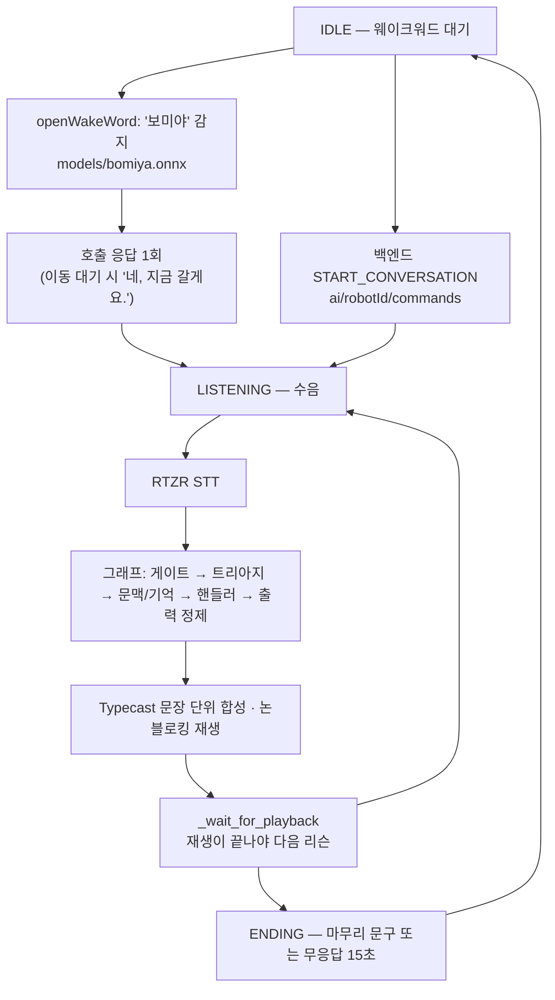

# BOMI AI Chat

BOMI 로봇의 음성 대화를 처리하는 Python 패키지다. 젯슨 한 대에서 도는 세
프로세스(`ai_chat`·`bridge`·`ai_vision`) 중 대화를 맡는 쪽이며, 마이크 입력을
RTZR STT로 변환하고 Gemini 2.5 Flash Lite로 답변을 만들어 Typecast 음성으로
재생한다.

현재 런타임은 Gemini 단일 API 체제다. Ollama나 Jetson 로컬 LLM은 사용하지
않는다.

## 목차

| 절 | 내용 |
|---|---|
| [현재 동작](#현재-동작) | 그래프 런타임(기본)과 레거시 파이프라인의 차이 |
| [웨이크워드](#웨이크워드) | "보미야" 감지 방식과 조정 지점 |
| [MQTT 대화 계약](#mqtt-대화-계약) | 백엔드가 시작시키는 대화의 이행 책임 |
| [디렉터리 구조](#디렉터리-구조) | 모듈 배치와 소유 범위 |
| [요구 사항](#요구-사항) · [설치](#설치) | 파이썬·오디오·자격증명, aarch64 주의 |
| [환경변수](#환경변수) | 최소 기동 세트와 전체 표 |
| [실행](#실행) | CLI 옵션, 로그 위치 |
| [로컬 저장소와 보호자 알림 큐](#로컬-저장소와-보호자-알림-큐) | 무엇이 로컬에 사는가, 발신 큐 |
| [성능 저하 사다리](#성능-저하-사다리) | 느려질 때 무엇을 먼저 포기하나 |
| [에코 억제와 barge-in](#에코-억제와-barge-in) | 설계와 현재 배선 상태의 구분 |
| [주입 시계와 SimClock](#주입-시계와-simclock) | 시간 의존 로직의 검증 방법 |
| [테스트](#테스트) · [범위](#범위) | 검증 명령, 구현됨 / 실기 미검증 / FUTURE |

## 현재 동작

**실행 경로가 둘이다.** 기본은 그래프 런타임(`USE_GRAPH_RUNTIME` 기본 `true`)이고,
`--legacy` 또는 `USE_GRAPH_RUNTIME=false` 로만 옛 파이프라인이 돈다.

### 그래프 런타임 (기본)



1. openWakeWord가 "보미야"를 로컬에서 감지한다(모델 다운로드·네트워크 없음).
2. 감지 즉시 회전 탐색 UDP 신호를 로봇 내부로 보내고, MQTT로
   `WAKE_WORD_DETECTED`를 발행한 뒤 고정 응답을 말한다.
3. 세션이 열리면 웨이크워드 없이 발화를 계속 받는다. 무응답이
   `CONVERSATION_IDLE_TIMEOUT_SEC`(15초)를 넘거나 마무리 문구가 나오면 종료한다.
4. RTZR STT가 음성을 텍스트로 바꾼다.
5. 그래프가 게이트 → 트리아지(안전) → 문맥·기억 조회 → 핸들러 → 출력 정제를 거친다.
   **의료·날씨 판정은 로컬 결정 규칙이며 모델을 쓰지 않는다.**
6. Typecast가 문장 단위로 합성하고, 재생은 논블로킹이되 다음 리슨은 재생이
   끝날 때까지 열리지 않는다(현재는 반이중 — [에코 절](#에코-억제와-barge-in) 참고).

백그라운드로 침묵 틱·현관 감시·발신 큐 flush·추출 flush가 함께 돈다.
백엔드가 보낸 `START_CONVERSATION`은 웨이크워드 없이도 대화를 시작한다.

### 레거시 파이프라인 (`--legacy`)

녹음 → RTZR STT → 의료·날씨 규칙 라우팅 → Gemini → Typecast 재생의 한 줄 흐름이다.

| 항목 | 그래프 (기본) | `--legacy` |
|---|---|---|
| 선택 | `USE_GRAPH_RUNTIME=true` 이고 `--legacy` 없음 | `--legacy` 또는 `USE_GRAPH_RUNTIME=false` |
| 게이트·트리아지·침묵 사다리·현관·기억 | 있음 | **전부 없음** |
| 백그라운드 작업 | 스케줄러 + 현관·AI 명령·주행 결과 구독 | 없음 |
| 재생 | 논블로킹 + 재생 완료 대기 | 블로킹 |
| 시연 사용 | 예 | **아니오** |

레거시 경로는 실기에서 문제가 났을 때 코드 수정 없이 되돌릴 수단으로만 남겨 뒀다.
시연 환경에서는 쓰지 않는다.

외부 연동 실패는 단계별로 기록한다. TTS 또는 스피커 재생이 실패해도 생성된
텍스트 답변은 보존된다. `--once` 없이 실행하면 실패한 차례 이후에도 다음
대화를 계속 받는다.

## 웨이크워드

"보미야" 감지는 openWakeWord + onnxruntime으로 로컬에서만 돈다. 임계값 하나로
켜고 끄지 않고 **최근 `WAKEWORD_WINDOW` 프레임 중 `WAKEWORD_MIN_HITS` 개 이상**이
임계값을 넘어야 감지로 본다. 진짜 발화는 점수가 띄엄띄엄 높게 뜨고(0.7→0.4→0.9)
스치는 오탐은 한 프레임만 튀기 때문이다.

| 상수 (`policy.py`) | 값 | 올리면 / 내리면 |
|---|---:|---|
| `WAKEWORD_THRESHOLD` | 0.4 | 올리면 오탐이 줄고 미탐이 는다 |
| `WAKEWORD_WINDOW` | 4 | 판정에 쓰는 최근 프레임 수 |
| `WAKEWORD_MIN_HITS` | 2 | 올리면 확실해지지만 반응이 늦다 |
| `WAKEWORD_FRAME_SAMPLES` | 1280 | 모델이 한 번에 먹는 샘플 수 |

모델 경로는 `WAKEWORD_MODEL_PATH`(기본 `models/bomiya.onnx`)이고, 개발 노트북에서는
`WAKEWORD_ENABLED=false`로 끌 수 있다. 끄면 매 발화를 그냥 처리하는 경로로 떨어진다.

감지 로그는 점수와 적중 수를 함께 남긴다(`wakeword score=… threshold=… hits=n/m`).
임계값 근처에서 아깝게 떨어지는지, 아니면 점수 자체가 낮아 마이크 픽업(거리·방향)
문제인지를 이 로그로 가른다.

## MQTT 대화 계약

백엔드는 `SPEAK`를 발행하지 않는다. 로봇이 말하게 만드는 유일한 명령은
`START_CONVERSATION`이며, 이동은 `bridge`가 따로 담당한다.

| 방향 | 토픽 | 메시지 | 로봇의 책임 |
|---|---|---|---|
| BE → AI | `bomi/v1/ai/{robotId}/commands` | `START_CONVERSATION` | **10초 안에** `CONVERSATION_STARTED` 발행 |
| AI → BE | `robot/{robotId}/events` | `CONVERSATION_STARTED` | 최상위 `scenarioId`·`conversationId`·`commandId` 필수 |
| AI → BE | `robot/{robotId}/events` | `CONVERSATION_ENDED` | `outcome` = `COMPLETED`/`NO_RESPONSE`/`CANCELLED`/`FAILED` |
| AI → BE | `robot/{robotId}/events` | `WAKE_WORD_DETECTED` | 웨이크워드 감지 직후 발행 |

`intent`는 `WELLNESS_CHECK`·`MEDICATION_REMINDER`·`HOMECOMING_GREETING` 셋뿐이다.
파싱·중복 제거·만료 확인과 `CONVERSATION_STARTED` 발행까지는 paho 콜백 스레드에서
끝내고, 실제 대화 진행만 메인 루프로 넘긴다 — **마이크는 한 스레드만 쥘 수 있기
때문이다.** 계약 전문은 저장소 루트 `CLAUDE.md` §2와
[`docs/mqtt/시나리오 계약 v1.md`](<../../docs/mqtt/시나리오 계약 v1.md>)에 있다.

MQTT 관련 코드(`door/mqtt.py`, `robot_events.py`, `ai_commands.py`,
`navigation_watch.py`)는 **paho 1.x 콜백 규약**으로 쓰였다(`pyproject.toml`의
`paho-mqtt>=1.6,<2`). 같은 젯슨에서 도는 `ros2_ws`의 `bridge`는 paho 2.x API
(`CallbackAPIVersion.VERSION2`)를 쓰므로, **두 프로세스가 같은 venv를 공유하면 안 된다.**

## 디렉터리 구조

```text
src/bomi_ai_chat/
├─ bootstrap.py 그래프 런타임 본체 (약 1,200줄). 조립·세션 루프·백엔드 대화 실행
├─ main.py      CLI 옵션(--once/-v/--legacy), 로깅 설정, 경로 선택
├─ pipeline.py  레거시 파이프라인의 한 차례 및 반복 대화 조율
│
├─ graph/       대화 런타임 판단·생성 노드 (약 5,500줄)
│               build·context·handlers·ingress·triage·gate·output·turn
├─ jobs/        주기 작업 (약 1,800줄) — 침묵 틱, 현관 감시, outbox flush, 일일 요약
├─ prompts/     프롬프트 템플릿과 조립기
├─ state.py     ConvState 스키마와 SpeechProposal
├─ policy.py    대화 정책 상수 (우선순위 행렬, 쿨다운, TTL, 사다리 임계치)
├─ config.py    환경변수 로딩과 기능별 검증
├─ clock.py     주입 가능한 시계. 실제 시계를 읽는 유일한 파일
├─ degradation.py 느린 턴이 이어질 때 무엇을 먼저 포기할지의 사다리
├─ turn_timer.py  한 턴의 왕복 시간 측정
├─ conversation_control.py 세션 상태 전이표, 호출 응답 문구, 마무리 판정
│
├─ audio_io/    laptop/robot 오디오 어댑터, sounddevice 백엔드, 웨이크워드, 빔 제어
├─ audio/       에코 억제·비블로킹 재생·barge-in 판단 (audio_io 위의 '판단' 계층)
├─ stt/         RTZR 인증·업로드·제한 폴링
├─ tts/         Typecast WAV 생성
├─ llm/         Gemini 일반 대화, 의료 도구 호출, 의료·날씨 의도 규칙
├─ weather/     기상청 단기예보 조회
├─ db/          direct/SSH PostgreSQL 연결과 의료 조회
├─ http.py      재시도·백오프를 공유하는 HTTP 호출 래퍼
│
├─ ai_commands.py    백엔드 START_CONVERSATION 구독과 CONVERSATION_* 발행
├─ contracts/        MQTT 봉투 파싱·생성 (ai_commands, door)
├─ robot_events.py   robot/{id}/events 발행자 (웨이크워드, 대화 상태)
├─ navigation_watch.py bridge 의 NAVIGATION_RESULT 를 엿들어 도착을 감지
├─ door/             현관 이벤트 구독과 재실 판정
├─ homecoming_gate.py 귀가 인사 중 웨이크워드 차단 게이트
├─ entrance_cheer.py  현관 도착 환영 발화
├─ search_signal.py   회전 탐색·추종 UDP 신호 발신 (ROS 2 core 로)
├─ display_status.py  bomi_display 가 읽는 상태 파일 기록
├─ backend_client/    백엔드 REST (문맥·사실·대화·현관·세션)
├─ localstore/  로봇 로컬 SQLite (운영 상태, 발화 제안 큐, 발신 큐, 캐시 오디오)
└─ notify/      보호자 알림 채널 어댑터 (채널 교체는 여기 한 곳)

tests/         네트워크·DB·오디오 장치 없이 실행하는 단위 테스트
tests/manual/  운영자가 직접 실행하는 외부 연동 점검
evals/         의도 라우터 고정 회귀셋과 평가 스크립트
models/        웨이크워드 모델(bomiya.onnx)
```

`graph/`와 `jobs/`는 뼈대가 아니라 **런타임 본체다.** 게이트, 안전 트리아지,
침묵 사다리, 문맥 슬롯, 계약 주도 대화, 출력 정제가 모두 여기서 돈다.

대화 설계의 권위 문서는 저장소 루트
[`임시보류_claude.md`](../../임시보류_claude.md)이다. 루트
[`CLAUDE.md`](../../CLAUDE.md)는 현재 시연 통합 스프린트 계약으로 바뀌어 있고,
MQTT 계약과 실기 함정은 그쪽이 정본이다. 한글 설계 근거는
[`docs/design/돌봄봇 설계.md`](<../../docs/design/돌봄봇 설계.md>)에 있다.

### config.py 와 policy.py 를 합치지 않는다

성격과 수명이 다르다.

| 파일 | 무엇이 들어가나 | 언제 바뀌나 |
|---|---|---|
| `config.py` | 환경변수 로딩과 검증 (API 키, DB 주소, 장치 선택자) | 배포 환경을 옮길 때 |
| `policy.py` | 정책 상수 (우선순위 행렬, 쿨다운, TTL, 침묵 사다리 임계치) | "로봇이 너무 잔소리한다" 같은 제품 판단이 바뀔 때 |

모든 임계치는 `policy.py`에 두고 함수 본문에 박지 않는다. 상수마다 "올리면/내리면"
어떻게 되는지 주석으로 적는다(`임시보류_claude.md` §21).

## 요구 사항

- Python 3.10 이상 3.13 미만
- PortAudio 호환 마이크와 스피커
- RTZR, SSAFY GMS Gemini, Typecast 자격증명
- 날씨 기능 사용 시 기상청 API 키
- 의료 조회 사용 시 현재 스키마의 PostgreSQL 데이터베이스
  - `hospital`, `pharmacy`, `drug_permit` 테이블
  - 의약품 유사 검색을 위한 `pg_trgm`의 `word_similarity`

의료·날씨 의도 판정은 로컬 결정 규칙이라 모델 다운로드나 네트워크가 필요 없다.
제거한 SentenceTransformer 라우터와 비교 평가할 때만 `router-eval` 선택 의존성을
설치하고 `evals/evaluate_router.py --legacy-model`을 실행한다.

## 설치

명령은 저장소의 `robot/ai_chat`에서 실행한다.

### Windows PowerShell

```powershell
cd robot\ai_chat
py -3.10 -m venv venv
.\venv\Scripts\Activate.ps1
python -m pip install --upgrade pip
python -m pip install -e ".[dev,mqtt]"
Copy-Item .env.example .env
```

### Ubuntu 22.04 / Jetson

```bash
cd robot/ai_chat
sudo apt-get update
sudo apt-get install -y python3.10-venv libportaudio2
python3.10 -m venv venv
source venv/bin/activate
python -m pip install --upgrade pip
python -m pip install -e ".[dev,mqtt]"
cp .env.example .env
```

### Jetson(aarch64) 설치 주의

Jetson 의 CPU 는 ARM 64비트(aarch64)이고 개발 PC 는 x86 이다. **컴파일된 프로그램은
두 아키텍처 사이에서 호환되지 않는다.** 실무적으로 두 가지 결과가 따라온다.

- pip 는 보통 미리 컴파일된 **휠(wheel)** 을 설치한다. ARM 휠이 없으면 소스에서
  컴파일하는데, 느리고 빌드 의존성이 없으면 그냥 실패한다.
- 네이티브 확장은 패키지 매니저 한 줄이 아니라 `make && make install` 이 필요할 수 있다.

그래서 **`pip install -e .` 을 실기(Jetson)에서 반드시 한 번 돌린다.** "내 노트북에서는
됐는데"를 늦게 발견하면 비싸다. 이 저장소에서 특히 확인할 것:

| 패키지 | 확인 이유 |
|---|---|
| `psycopg2-binary` | aarch64 휠이 없으면 `libpq-dev` + 소스 빌드로 넘어간다 |
| `sounddevice` | `libportaudio2` 시스템 패키지가 먼저 있어야 한다 |
| `numpy`, `noisereduce` | 소스 빌드로 떨어지면 빌드가 오래 걸린다 |
| `onnxruntime` | 웨이크워드 추론 담당. ARM 휠로 설치되는지 장치에서 확인한다 |
| `openwakeword` | `models/bomiya.onnx` 를 로드한다. onnxruntime 이 먼저 있어야 한다 |

`sentence-transformers`는 운영 의존성이 아니다. 비교 평가용 `router-eval` 옵션을
Jetson에 설치하면 torch가 필요하므로, 평가는 개발 PC에서 수행한다.

설치가 끝나면 임포트까지 확인한다. 설치 성공과 임포트 성공은 다른 문제다.

```bash
python -c "import bomi_ai_chat, langgraph, apscheduler; print('ok')"
```

설치 로그는 남겨둔다. aarch64 에서 어떤 패키지가 소스 빌드로 떨어졌는지가
이후 배포 시간을 결정한다.

## 환경변수

`.env.example`을 복사한 `.env`에 실제 값을 넣는다. 다른 파일을 사용하려면
`AI_CHAT_ENV_FILE`에 경로를 지정한다.

> **젯슨에 `.env`를 반입할 때는 `dos2unix`를 먼저 돌린다.** CRLF가 남으면 API 키
> 끝에 `\r`이 붙어 인증이 조용히 실패한다(루트 `CLAUDE.md` §6).

### 최소 기동 세트

그래프 경로가 실제로 뜨는 데 필요한 최소 집합이다. **이 중 하나라도 빠지면
기동에 실패한다.**

```dotenv
RTZR_CLIENT_ID=...
RTZR_CLIENT_SECRET=...
GEMINI_API_KEY=...
TYPECAST_API_KEY=...
SENIOR_ID=...          # 없으면 RuntimeError. 아래 설명 참고
AUDIO_MODE=robot       # robot 모드는 입출력 장치도 함께 지정한다
```

### 기본 대화

| 변수 | 필요 조건 | 기본값/설명 |
|---|---|---|
| `RTZR_CLIENT_ID` | 시작 시 필수 | RTZR STT 클라이언트 ID |
| `RTZR_CLIENT_SECRET` | 시작 시 필수 | RTZR STT 클라이언트 시크릿 |
| `GEMINI_API_KEY` | 시작 시 필수 | SSAFY GMS Gemini API 키 |
| `TYPECAST_API_KEY` | 시작 시 필수 | Typecast API 키 |
| `TYPECAST_VOICE_ID` | 선택 | 코드에 정의된 BOMI 기본 음성 |
| `KMA_API_KEY` | 날씨 조회 시 필수 | 기상청 단기예보 서비스 키 |
| `SENIOR_ID` | **그래프 경로 기동 시 필수** | 없으면 `RuntimeError`로 기동 실패한다. LangGraph checkpointer의 `thread_id`이자 모든 로컬 상태의 키다. 임의 기본값을 쓰면 그 값으로 기록이 쌓이고 진짜 id로 바꾸는 순간 상태가 통째로 사라지므로, 일부러 요란하게 실패시킨다 |
| `USE_GRAPH_RUNTIME` | 선택 | 기본 `true`. `false`면 레거시 파이프라인으로 떨어지며 게이트·트리아지·침묵 감시가 사라진다 |

### 오디오

| 변수 | 기본값 | 설명 |
|---|---:|---|
| `AUDIO_MODE` | `laptop` | `laptop` 또는 `robot` |
| `AUDIO_INPUT_DEVICE` | robot `reSpeaker` / laptop OS 기본 | PortAudio 입력 인덱스 또는 장치명 일부 |
| `AUDIO_OUTPUT_DEVICE` | OS 기본 장치 | PortAudio 출력 인덱스 또는 장치명 일부 |
| `AUDIO_SAMPLE_RATE` | `16000` | 녹음 샘플레이트 |
| `AUDIO_CHANNELS` | robot `2` / laptop `1` | 녹음 채널 수 |
| `AUDIO_CHUNK_SECONDS` | `0.5` | 음량을 확인하는 청크 길이 |
| `AUDIO_SILENCE_THRESHOLD` | `300` | 이 값 미만을 무음으로 판단 |
| `AUDIO_SILENCE_LIMIT_SECONDS` | `3` | 연속 무음 후 녹음 종료 시간 |
| `AUDIO_MAX_SECONDS` | `15` | 한 차례의 최대 녹음 시간 |

`AUDIO_INPUT_DEVICE`와 `AUDIO_CHANNELS`의 기본값이 모드마다 다른 것은 의도한
것이다. 이 프로젝트는 ReSpeaker XVF3800을 마이크로 쓰고, USB 재연결로 인덱스가
바뀌어도 따라가도록 이름으로 자동 검색한다(좌=처리된 빔, 우=원본이라 2채널로 연다).
그 편의가 맞는 것은 로봇 위에서뿐이다 — laptop 모드에서 `reSpeaker`를 찾으면
노트북에는 그 장치가 없어 첫 명령에서 `RuntimeError`로 막힌다.

`laptop`은 장치 선택자를 비워두면 운영체제 기본값을 사용한다. `robot`은
잘못된 기본 장치로 실행되는 것을 막기 위해 입력과 출력 장치를 모두
명시해야 한다.

### 웨이크워드

| 변수 | 기본값 | 설명 |
|---|---:|---|
| `WAKEWORD_ENABLED` | `true` | 끄면 매 발화를 그냥 처리하는 경로로 떨어진다 |
| `WAKEWORD_MODEL_PATH` | `models/bomiya.onnx` | openWakeWord 모델 경로 |

### STT 보정

| 변수 | 기본값 | 설명 |
|---|---:|---|
| `STT_KEYWORDS` | `보미,순자,관절염약,혈압약,무릎,허리` | 인식 부스팅 키워드. **어르신이 바뀌면 반드시 덮어쓴다.** 빈 문자열이면 부스팅을 끈다 |
| `STT_DISFLUENCY_FILTER` | `false` | 간투사 제거 |

### 로컬 저장소와 백엔드

| 변수 | 기본값 | 설명 |
|---|---:|---|
| `LOCALSTORE_DIR` | `var/localstore` | 로컬 SQLite와 로그가 여기 쌓인다 |
| `BACKEND_BASE_URL` | `http://localhost:8080` | 백엔드 REST 주소 |
| `BACKEND_TIMEOUT_SECONDS` | `1.5` | 백엔드 호출 제한시간 |
| `BACKEND_SHARED_SECRET` | 없음 | 백엔드 필터 공유 시크릿 |
| `ROBOT_ID` | 없음 | REST 온보딩의 robot 테이블 UUID |
| `ROBOT_DEVICE_ID` | 없음 | MQTT deviceId(예 `bomi-AA001`). **`ROBOT_ID`와 다른 값이다 — 혼용 금지** |
| `T3_CONSENT_ENABLED` | `true` | 동의 확인 운영 킬스위치 |
| `EXTRACTION_ENABLED` | `true` | 대화 추출 운영 킬스위치 |

### MQTT

| 변수 | 기본값 | 설명 |
|---|---:|---|
| `MQTT_ENABLED` | `false` | 켜야 현관 구독과 이벤트 발행이 붙는다 |
| `MQTT_BROKER_URL` | 없음 | `mqtt://host:1883`(평문) 또는 `mqtts://host:8883`(TLS) |
| `MQTT_DOOR_TOPIC` | `bomi/v1/iot/+/events` | 현관 이벤트 구독 토픽 |
| `MQTT_CLIENT_ID` | `bomi-robot-ai-chat` | 클라이언트 ID |
| `MQTT_USERNAME` / `MQTT_PASSWORD` | 없음 | 브로커가 요구할 때만 |

### 시연 시나리오 스위치

`config.py`가 아니라 각 모듈이 직접 읽는 값들이다. 기본값 그대로 두면 개발
노트북에서 아무 영향이 없고, 시연 env에서만 켠다.

| 변수 | 읽는 곳 | 기본값 | 설명 |
|---|---|---:|---|
| `WAKE_MOVEMENT_WAIT_ENABLED` | `config.py` | `false` | 켜면 웨이크 직후 "네, 지금 갈게요."만 말하고 도착 신호를 최대 45초 기다린다. 로봇·브릿지 없는 환경에서 켜면 매 호출이 45초씩 느려진다 |
| `WAKE_REQUIRE_DOOR_EVENT` | `bootstrap.py` | `true` | `DOOR_OPENED` 전의 "보미야"를 무시한다. 문 구독자가 없으면 게이트를 걸지 않는다 |
| `WAKE_BLOCK_DURING_HOMECOMING` | `homecoming_gate.py` | `true` | 귀가 인사 진행 중 웨이크워드 차단 |
| `HOMECOMING_FOLLOW_AMBIENT_PHASE` | `bootstrap.py` | `false` | 귀가 인사 뒤 추종·온습도 단계 활성화 |
| `HOMECOMING_FOLLOW_SECONDS` | `bootstrap.py` | `20` | 추종 지속 시간(초) |
| `HOMECOMING_AMBIENT_ENABLED` | `ai_commands.py` | `false` | 온습도 코멘트 활성화 |
| `HOMECOMING_HOT_THRESHOLD_C` | `ai_commands.py` | `30` | 더위 판정 임계 |
| `ENTRANCE_CHEER_ENABLED` | `entrance_cheer.py` | `1` | 현관 도착 환영 발화 |
| `SEARCH_SIGNAL_ENABLED` | `search_signal.py` | `1` | 회전 탐색·추종 UDP 신호 발신 |
| `BEAM_FIX_ENABLED` | `audio_io/beam_control.py` | `0` | ReSpeaker 빔 고정 |
| `BOMI_DISPLAY_STATUS_FILE` | `display_status.py` | 없음 | LCD가 읽을 상태 파일 경로 |

대상 장치에서 PortAudio 목록을 확인한다.

```bash
python -c "import sounddevice as sd; print(sd.query_devices())"
```

확인한 인덱스 또는 고유한 장치명 일부를 `.env`에 넣는다.

```dotenv
AUDIO_MODE=robot
AUDIO_INPUT_DEVICE=reSpeaker
AUDIO_OUTPUT_DEVICE=USB Audio
```

인덱스보다 장치명 일부가 안전하다. 인덱스는 재부팅과 USB 재연결로 바뀐다.

특정 Jetson 장치명은 저장소에 고정하지 않는다. 실제 마이크·스피커와
ALSA/PortAudio 구성을 대상 장치에서 확인해야 한다.

> **젯슨의 오디오 장치 인덱스는 재부팅마다 바뀐다.** 실기에서 24↔25가 뒤바뀌는
> 것을 확인했고, `AUDIO_INPUT_DEVICE=1` 은 젯슨에서 HDMI 다. 부팅 후에는 인덱스를
> 다시 확인하거나(`tests/manual/mic_level_check.py`) 장치명 일부를 쓴다
> (루트 `CLAUDE.md` §6).

### 외부 호출

| 변수 | 기본값 | 설명 |
|---|---:|---|
| `HTTP_TIMEOUT_SECONDS` | `10` | 개별 HTTP 요청 제한시간 |
| `HTTP_MAX_ATTEMPTS` | `3` | 일시 장애를 포함한 최대 시도 횟수 |
| `HTTP_BACKOFF_SECONDS` | `0.5` | 첫 재시도 대기시간 |
| `HTTP_MAX_BACKOFF_SECONDS` | `2` | 재시도 대기시간 상한 |
| `STT_POLL_INTERVAL_SECONDS` | `0.5` | RTZR 결과 확인 간격 |
| `STT_POLL_TIMEOUT_SECONDS` | `60` | RTZR 전체 폴링 제한시간 |
| `STT_TOKEN_TTL_SECONDS` | `3000` | RTZR 인증 토큰 재사용 시간 |

### 의료 데이터베이스

의료 요청이 실제 DB 조회 단계에 도달할 때 연결 설정을 검증한다.

| 변수 | 필요 조건 | 기본값/설명 |
|---|---|---|
| `DB_CONNECTION_MODE` | 항상 | `ssh`; 로컬/직접 연결은 `direct` |
| `DATABASE_URL` | direct 선택 방식 | 전체 PostgreSQL URL |
| `DB_HOST` | direct 개별 설정 | `localhost` |
| `DB_PORT` | direct 개별 설정 | `5432` |
| `DB_NAME` | URL 미사용 또는 ssh | 필수 |
| `DB_USER` | URL 미사용 또는 ssh | 필수 |
| `DB_PASSWORD` | URL 미사용 또는 ssh | 필수 |
| `EC2_HOST` | ssh | SSH 서버 주소 |
| `EC2_SSH_USER` | ssh | `ec2-user` |
| `SSH_KEY_PATH` | ssh | SSH 개인키 경로 |
| `REMOTE_DB_HOST` | ssh | `localhost` |
| `REMOTE_DB_PORT` | ssh | `5432` |

direct 모드는 `DATABASE_URL` 하나를 사용하거나 `DB_HOST`부터
`DB_PASSWORD`까지 개별 값을 사용한다. ssh 모드는 SSH 터널을 연 뒤 로컬
포트로 PostgreSQL에 연결한다.

## 실행

```bash
python -m bomi_ai_chat            # Ctrl+C 까지 반복
python -m bomi_ai_chat --once     # 한 차례만
bomi-ai-chat --once               # editable 설치 후 생성되는 명령도 동일
```

| 옵션 | 동작 |
|---|---|
| `--once` | 한 번만 대화한 뒤 종료한다. 재생 스레드가 daemon이라 그냥 끝내면 한 마디도 안 들리므로, 종료 전에 재생이 끝나기를 `policy.SPEECH_DRAIN_SEC`(20초)까지 기다린다 |
| `-v`, `--verbose` | DEBUG까지 화면에 찍는다. 실기 점검에서 판정 이유를 볼 때 쓴다. 로그 파일에는 `-v` 없이도 항상 DEBUG가 남는다 |
| `--legacy` | 그래프를 건너뛰고 옛 파이프라인으로 돈다. `USE_GRAPH_RUNTIME=false`와 같다. 게이트·침묵 사다리·트리아지·현관이 전부 꺼진다 |

### 로그

```text
{LOCALSTORE_DIR}/logs/ai_chat.log   # 기본 var/localstore/logs/ai_chat.log
```

20 MB × 5회전이고 **파일은 항상 DEBUG**다. 되돌릴 수 없는 것은 남기지 않은
로그이기 때문이다. 장애 조사는 이 파일부터 본다 — "turn latency 1.83s",
"occupancy UNKNOWN -> HOME", "degrading to level 1" 같은 판단 근거가 여기 있다.

### 기동 실패는 두 지점에서 난다

| 지점 | 무엇이 없을 때 | 증상 |
|---|---|---|
| 오디오 어댑터 **이전** | RTZR·Gemini·Typecast 키, robot 모드의 입출력 장치 | `설정 오류: …` 메시지와 함께 종료 |
| 오디오 어댑터 **이후** | `SENIOR_ID` | `RuntimeError: SENIOR_ID is not configured …` |

두 번째가 늦게 터지는 것은 알아 두는 편이 낫다. 오디오 장치가 열린 뒤라
"마이크는 잡혔는데 왜 죽지"로 보이지만 원인은 `.env` 한 줄이다.

## 로컬 저장소와 보호자 알림 큐

### 무엇이 로컬에 사는가

로봇은 **운영 상태**만 로컬에 둔다. **사실(fact)** 은 백엔드 Postgres 가 권위다.

| 계층 | 소유 | 내용 |
|---|---|---|
| 사실 | 백엔드 Postgres | 프로필, 기억, 복약, 돌봄 기록, 동의 |
| 운영 상태 | **로봇 로컬 SQLite** | 발화 제안 큐, `silence_level`, `occupancy`, `last_spoke_at`, LangGraph checkpointer, 캐시 TTS 오디오, 보호자 알림 발신 큐 |

복약 스케줄의 진실이 두 곳에 있으면 품질 문제가 아니라 안전 버그다. 그래서 핸들러와
그래프 노드는 `sqlite3` 를 직접 만지지 않고 `localstore/` 를 통한다.

### DB 파일이 두 개인 이유

저장 매체가 microSD 라서 쓰기 내구성을 의도적으로 완화했다. 크래시 시 마지막 몇 초의
운영 상태를 잃는데, 그건 괜찮다. 그런데 **큐에 든 응급 알림은 잃으면 안 된다.**
SQLite 의 `synchronous` 는 DB 단위 설정이라 한 파일에서 테이블별로 나눌 수 없으므로
파일을 나눴다.

| 파일 | synchronous | 내용 |
|---|---|---|
| `runtime.sqlite` | `NORMAL` | 운영 상태, 제안 큐, checkpointer, 캐시 오디오 등록부 |
| `outbox.sqlite` | **`FULL`** | 보호자 알림 발신 큐 |

둘 다 WAL 모드다. 작은 쓰기 개수가 줄고, 읽기가 쓰기를 막지 않는다(재생 스레드와
스케줄러 틱이 동시에 접근한다).

### 보호자 알림은 항상 큐를 거친다

**전송보다 저장이 먼저다.** 끊긴 연결로 발사한 T1 알림은 그냥 사라지고, 하필 그
순간이 알림이 가장 중요한 순간일 수 있다.

```python
from bomi_ai_chat.localstore import outbox

outbox.enqueue("T1", {"reason": "no_response"})   # 동기 쓰기. 여기서 반환되면 살아남는다
```

전송은 `jobs.ticks.outbox_flush` 가 주기적으로 시도한다. 실패하면 백오프를 걸어
재시도하고, 늦게 도착한 알림은 **'지연됨'으로 표시**해서 보낸다 — 보호자가 "지금
벌어지는 일"과 "와이파이가 끊긴 두 시간 전 일"을 구분해야 한다.

**T1 은 시도 횟수로 포기하지 않는다.** T2·T3 는 `policy.OUTBOX_MAX_ATTEMPTS` 를
넘기면 포기하지만(어제의 요약을 영원히 재시도할 이유는 없다), 생명 안전 알림은 그
목록에 없다.

**채널은 로봇이 고르지 않는다.** 스케줄러가 `outbox_flush` 에 등록하는 어댑터는
`BackendGuardianNotifier` 이며, 로봇은 백엔드로 전달만 하고 실제 채널(웹앱 푸시·SMS)은
서버가 정한다 — 푸시 자격증명을 로봇에 두지 않기 위해서다.
`LoggingGuardianNotifier` 는 어댑터를 넘기지 않고 `outbox_flush()` 를 직접 부를 때의
기본값으로만 남아 있다(테스트와 수동 점검).

서버가 "동의가 없어 보내지 않는다"고 답하는 것은 실패가 아니라 거절이며 재시도하지
않는다. 재시도 대상은 네트워크 단절뿐이다.

### 일일 백업

카드는 언젠가 죽는다. 하루 한 번 복사해두면 잃는 것이 최대 하루치가 된다.

```bash
python -m bomi_ai_chat.localstore.dump /mnt/usb/bomi-backup
```

파일 복사(`cp`)를 쓰지 않는 이유는 WAL 때문이다. 방금 커밋된 내용이 아직 `-wal`
파일에만 있을 수 있어서, `.sqlite` 만 복사하면 최근 쓰기가 빠지거나 손상된 사본이
된다. 이 스크립트는 SQLite 백업 API 를 써서 프로세스를 멈추지 않고 일관된 사본을
만든다. cron 이나 systemd timer 로 하루 한 번 돌린다.

## 성능 저하 사다리

네트워크나 기기가 힘들어질 때 무엇을 먼저 포기할지를 미리 정해 뒀다. 장애
상황에서 즉흥적으로 정하지 않기 위해서다. **안전 경로(침묵 사다리, 트리아지,
outbox)는 이 목록에 일부러 없다 — 그것은 절대 저하시키지 않는다.**

한 턴의 왕복이 `TURN_LATENCY_BUDGET_SEC`(2.0초)를 넘는 일이 연속
`DEGRADE_AFTER_SLOW_TURNS`(3)회면 한 칸 내려가고, 빠른 턴이 연속
`RECOVER_AFTER_FAST_TURNS`(10)회여야 한 칸 올라온다. 내리는 것보다 올리는 것을
크게 둔 이유는 경계에서 오르내리면 "오늘따라 로봇이 이상하다"는 인상만 남기 때문이다.

| 순서 | 포기하는 것 | 체감 |
|---:|---|---|
| 1 | 기억 top-k 6 → 2 | 맥락이 얕아진다 |
| 2 | 문서 RAG 중단 | 복지제도 조회가 안 된다 |
| 3 | 잡담 중단 | 말수가 줄어든다 |
| 4 | 프로브 단순화 | 생성 대신 캐시된 음성을 쓴다 |

**시연 중 로봇이 갑자기 말수가 줄면 이것부터 의심한다.** 로그에
`degrading to level N`이 남는다.

## 에코 억제와 barge-in

### ⚠️ 실기 검증이 남아 있습니다

판단 로직(에코 가드, 맞장구 판별, 재생 취소, 잔여분 재큐)은 하드웨어 없이 구현·검증했고
`tests/test_echo_and_bargein.py` 의 자동 테스트 17건이 고정하고 있습니다. 하지만
**임계치 두 개는 추정치이고 실측이 필요합니다.**

| 상수 | 현재값 | 상태 |
|---|---|---|
| `ECHO_GUARD_SEC` | 0.3 | 추정치 — 실측 필요 |
| `ECHO_VAD_THRESHOLD_MULTIPLIER` | 2.5 | 추정치 — 실측 필요 |

**이 값들을 실측하기 전에 능동 발화(206)를 실기에서 테스트하지 마십시오.** 에코를 안
잡은 상태에서는 모든 버그 리포트가 실제로는 에코이고, 게이트 버그로 오진하게 됩니다.

남은 항목 전체: [`docs/hardware/오디오 에코 바지인 검증.md`](<../../docs/hardware/오디오 에코 바지인 검증.md>)

### 지금 라이브에서 도는 것 — 반이중 대기

매 턴이 끝나면 `_wait_for_playback` 이 `echo_guard.is_playing` 을 0.05초마다
폴링하며 **재생이 끝날 때까지 다음 리슨을 열지 않습니다**(상한 30초). 재생 중
마이크를 열면 로봇이 자기 목소리를 어르신 발화로 주워 담기 때문이고, 이 현상은
2026-08 실기 점검에서 실제로 재현됐습니다.

그래서 **현재 구성에서는 barge-in 이 원리적으로 일어나지 않습니다.** 아래 두 겹은
그 대기를 없애고 EchoGuard 를 캡처에 연결했을 때 성립하는 설계입니다.

### 두 겹으로 막는 설계 — 아직 캡처에 연결하지 않았습니다

1. 재생 직후 `ECHO_GUARD_SEC` 동안은 입력을 아예 버린다
2. 재생이 이어지는 동안에는 VAD 임계치를 올린다 — **막지는 않는다**

2번이 핵심입니다. "재생 중에는 듣지 않는다"가 아니라 **"재생 중에는 더 크게 말해야
들린다"** 입니다. 완전히 막으면 barge-in 이 원리적으로 불가능해지고, 청력이 떨어진
어르신은 로봇이 말하는 중인 줄 모르고 말을 시작합니다.

이 두 겹을 담은 `EchoAwareVad` 는 **구현·테스트만 돼 있고 어느 운영 코드도
인스턴스화하지 않습니다.** 아래 barge-in 설명도 같은 성격입니다 — 로직은 있고
호출 경로가 아직 없습니다. "구현됨"과 "동작 중"을 여기서 구분해 두는 이유는,
에코를 이미 막고 있다고 믿으면 모든 버그 리포트를 게이트 버그로 오진하기
때문입니다.

### 진행 상황의 권위는 재생 핸들입니다

`speaking`·`spoken_prefix` 는 주인이 둘입니다 — 재생 스레드와 checkpoint 된 state.
`임시보류_claude.md` §13 이 "시스템에서 동기화 버그가 가장 나기 쉬운 지점"이라고 못박은 곳입니다.

경계를 이렇게 고정했습니다:

- **재생 핸들(`SpeechPlayback`) = 진행 상황의 권위**
- **`ConvState` = 그 순간의 스냅샷**

barge-in 이 나면 `note_interaction` 은 state 가 아니라 **핸들에게** 몇 문장까지
말했는지 묻습니다. state 값은 그래프 실행 시점에 찍힌 것이라 이미 낡았을 수 있고,
낡은 값을 믿으면 이미 말한 문장을 다시 말합니다.

### critical 프로브는 재개하지 않습니다

생존 확인 프로브 중에 어르신이 끼어들면 **끼어든 것 자체가 답입니다.** 나머지를
일부러 버리고 침묵 사다리만 리셋합니다. 재개하면 방금 대답한 사람에게
"괜찮으세요?"를 다시 묻는 로봇이 됩니다.

## 주입 시계와 SimClock

이 패키지에서 **실제 시계를 읽는 파일은 `clock.py` 하나뿐이다.** 다른 곳에서
`time.time()` 이나 `datetime.now()` 를 호출하지 않는다(`임시보류_claude.md` §15, §23).

### 왜 이 제약이 있나

침묵 사다리는 "3시간 무응답 → 45분 → 20분" 단위로 동작하고 일일 요약은 하루 단위다.
실제 시계로 검증하면 테스트 한 번에 몇 시간에서 하루가 걸려서 개발도 시연도 불가능하다.
시계를 주입할 수 있으면 하루가 10초에 흐르고, 둘 다 평범한 단위 테스트가 된다.

나중에 넣는 건 훨씬 어렵다. 그때는 이미 수십 곳에서 시계를 직접 읽고 있다.

### 쓰는 방법

시간을 읽어야 하면 `clock` 싱글톤을 import 한다.

```python
from bomi_ai_chat.clock import clock

elapsed = clock.now() - state["last_spoke_at"]   # POSIX 초(float), UTC
today = clock.now_dt()                            # tz-aware datetime
```

### 압축 시계 (시연)

`speed` 배율로 가상 시간을 빠르게 흘린다. 8640 이면 하루가 10초다.

```python
from bomi_ai_chat.clock import SimClock, clock, install_clock

previous = install_clock(SimClock(start=clock.now(), speed=8640))
# ... 이제 clock.now() 는 실제 10초에 하루씩 전진한다
install_clock(previous)   # 끝나면 실제 시계를 복원한다
```

### 점프 (단위 테스트)

`advance()` 는 기다림 없이 검증하고 싶은 시점으로 즉시 점프한다. 테스트에서는
`speed` 보다 이 방식이 낫다. 실제 경과 시간에 의존하지 않아 결과가 흔들리지 않는다.

```python
sim = SimClock(start=1_700_000_000.0)
previous = install_clock(sim)
try:
    sim.advance(3 * 3600)      # 3시간 뒤로 점프. sleep 없음
    # 침묵 사다리 1단계 판정을 여기서 확인한다
finally:
    install_clock(previous)    # 전역 상태이므로 복원은 필수다
```

### 주의사항

- **APScheduler 는 여전히 실제 시간에 발동한다.** SimClock 을 빠르게 해도 스케줄
  작업이 빨라지지 않는다. 압축 시계 검증은 `jobs/ticks.py` 의 틱 함수를 직접 호출한다.
  그래서 주기 작업은 스케줄러 경로와 수동 틱 경로를 처음부터 함께 설계한다.
- `clock` 은 모듈 전역이다. 테스트가 교체했으면 **반드시 복원한다.** 안 하면 이후
  테스트가 가짜 시계를 물려받는다.
- 다른 기계에서 온 타임스탬프(현관 라즈베리파이)를 그대로 섞지 않는다. 도착 시점에
  `clock.now()` 로 정규화한다. 그러지 않으면 한 계산에 두 개의 시간축이 섞인다.

## 테스트

기본 검증은 실제 네트워크, DB, 마이크, 스피커를 사용하지 않는다.

```bash
python -m pytest
python -m ruff check src tests
```

`tests/manual/` 은 `pyproject.toml` 의 `norecursedirs = ["manual"]` 로 수집
대상에서 통째로 빠지므로 별도 마커 필터가 필요 없다. (`integration`·`manual`
마커는 선언만 있고 실제로 다는 테스트가 없어 `-m` 필터는 아무것도 걸러내지 않는다.)

**젯슨에서는 `env -u PYTHONPATH` 를 앞에 붙인다.** ROS 2 환경이 주입한
`PYTHONPATH` 의 lark·numpy 가 pytest 수집 단계에서 인터프리터를 죽인다. 반대로
로봇을 *구동* 할 때는 `PYTHONPATH` 를 유지해야 한다 — 진입점마다 구분한다
(루트 `CLAUDE.md` §6).

```bash
env -u PYTHONPATH python -m pytest
```

실제 연동은 필요한 항목만 운영자가 실행한다. 명령과 주의사항은
[`tests/manual/README.md`](tests/manual/README.md)를 참고한다. 실행하지 않은
외부 점검은 통과로 기록하지 않는다.

의도 라우터를 바꿀 때는 [`evals/router-evaluation.md`](evals/router-evaluation.md)
의 고정 회귀셋으로 다시 잰다.

## 의료 안내 안전 정책

- 지역명이나 정확한 시설명이 없는 병원·약국 요청은 DB를 조회하지 않고
  위치를 다시 묻는다.
- 부분 일치 시설은 주소나 전화번호를 안내하기 전에 시설명을 확인한다.
- 보정된 약 이름은 상세 성분을 안내하기 전에 사용자 확인을 받는다.
- DB 결과가 없을 때 Gemini의 사전지식으로 의료 정보를 보충하지 않는다.
- 검색 결과 없음과 DB 장애를 서로 다른 상태로 처리한다.

## 범위

### 구현됨

- "보미야" 웨이크워드 로컬 감지와 세션 대화
- 그래프 런타임: 게이트, 안전 트리아지, 문맥 슬롯, 출력 정제
- 침묵 사다리와 주기 틱(현관 감시, outbox flush, 일일 요약)
- MQTT 대화 계약(`START_CONVERSATION` → `CONVERSATION_STARTED`/`ENDED`)과
  웨이크워드·주행 결과 연동
- 백엔드 REST 기반 장기 기억·사실 조회와 로컬 SQLite 운영 상태
- 보호자 알림 발신 큐와 백엔드 전달 어댑터
- RTZR STT → Gemini 일반/의료 응답 → Typecast TTS
- 기상청 지원 도시 날씨
- direct/SSH PostgreSQL 의료 조회
- 위치·부분 일치·약 이름 보정 안전장치
- laptop/robot PortAudio 어댑터
- 외부 장치 없이 실행하는 단위 테스트

### 구현됐지만 실기 미검증

- `wake.interrupt_check` — 웨이크워드 대기 중 백엔드 대화 시작. 로직은 테스트로
  고정했지만 실제 `sd.InputStream` 콜백 스레드 동작은 젯슨에서 아직 확인하지 못했다
- 에코 가드·barge-in 판단 계층 — 라이브 캡처에 연결돼 있지 않다(위 절 참고)

### FUTURE

- ROS 2 커스텀 메시지 기반 연동 (현재는 UDP 신호로 회전 탐색·추종만 제어)
- GPS 기반 실제 거리순 의료기관 검색
- 스트리밍 STT·LLM·TTS
- 다중 사용자·동시 요청 처리

공공 의료데이터 수집은 현재 AI Chat 런타임의 책임이 아니다. 데이터 갱신이
필요하면 별도 적재 파이프라인과 소유권을 먼저 정의한다.
