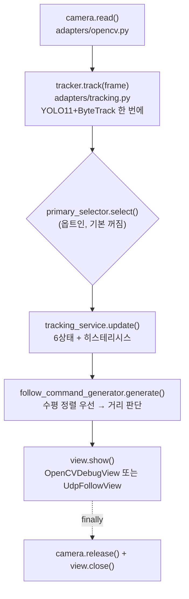
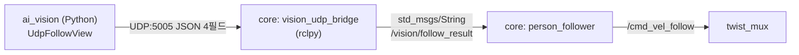

# BOMI AI Vision 아키텍처

## 1. 문서 목적

이 문서는 BOMI AI Vision 프로젝트의 코드 구조, 계층별 책임과 의존성 규칙을 정의한다.

프로젝트의 주요 아키텍처 목표는 다음과 같다.

* AI 비전 핵심 로직을 YOLO, OpenCV, ROS2 같은 외부 기술과 분리한다.
* 영상 입력 방식을 변경해도 핵심 분석 로직을 재사용할 수 있게 한다.
* 사람 탐지, 추적, 상태 판단과 결과 출력을 개별적으로 테스트할 수 있게 한다.
* 기능을 추가할 때 기존 책임을 침범하지 않도록 명확한 경계를 제공한다.
* Jetson Orin Nano 최적화나 ROS2 연동을 나중에 추가해도 핵심 로직 변경을 최소화한다.
* 읽기 쉽고 수정하기 쉬운 구조를 유지한다.

이 문서는 구체적인 모델과 수면 분석 방법을 확정하는 문서가 아니다.

기능 요구사항은 `docs/vision-requirements.md`, 상태 전환 규칙은 `docs/state-machine.md`를 기준으로 한다.

### 1.1 이 문서를 읽는 법 — 설계 목표와 현재 구조를 구분한다

이 문서는 코드가 거의 없던 시점에 목표 구조를 규정하며 쓰였고, 그 목표 중 **경계 규칙은 실제로 지켜졌다.** `domain/` 5개 파일 중 외부 라이브러리를 import하는 파일이 0개이고, `cv2`/`numpy`는 `adapters/opencv.py` 한 곳, `ultralytics`는 어댑터 두 곳의 지연 import뿐이다. 설계 문서가 실제로 코드를 규율한 사례다.

반면 **디렉터리 이름·파일 이름·결과 모델은 상당수가 그대로 실현되지 않았다.** 30개 절 중 여럿이 "예상 구성 요소"를 기술하는데, 시간이 지나면서 그것이 현재 구조로 오독되기 시작했다. 그래서 각 절에 구현 상태를 표기했다.

| 표기 | 뜻 | 해당 절 |
|---|---|---|
| (구현됨) | 코드가 실제로 이 규칙을 따른다 | §2, §4, §6.3, §10, §11, §22, §23 |
| (설계만) | 아직 코드에 대응물이 없다 | §7, §12, §13, §14.2, §17, §18 일부, §19.3, §21, §25 |
| (채택되지 않음) | 다른 형태로 대체됐다 | §9(탐지 분리), §15(ROS 2 직접 연동) |

**구현 사실의 기준은 `README.md`와 소스다.** 이 문서와 코드가 어긋나면 임의로 맞추지 말고 충돌을 기록한다.

### 1.2 지금 반드시 지켜야 할 규칙 네 개

30개 절 중 **실제로 코드를 규율하고 있는 규칙은 넷**이다. 시간이 없다면 이것만 읽어도 된다.

| 규칙 | 절 |
|---|---|
| 의존성은 항상 안쪽(`adapters` → `application` → `domain`)으로만 향한다 | §2.2 |
| 외부 라이브러리 객체를 `application`·`domain`으로 전달하지 않는다 | §6.3 |
| 계층별 import 금지 목록을 지킨다 | §22 |
| 의존성은 생성자로 주입한다 (DI 프레임워크 없이) | §23 |

여기에 이 패키지 고유의 안전 규칙 하나가 더해진다 — **"여러 명이면 대상을 정하지 않는다"가 세 곳에 나뉘어 박혀 있고, 하나만 풀면 나머지가 무의미해진다**(§4.5).

---

## 2. 아키텍처 기본 원칙

### 2.1 관심사를 분리한다

프로젝트는 다음 관심사를 서로 분리한다.

* 핵심 데이터와 상태 정의
* 사람 탐지
* 사람 추적
* 사람 수 및 추적 상태 판단
* 사용자 상태 분석
* 전체 처리 흐름 조합
* 영상 파일 및 카메라 입력
* 외부 AI 라이브러리 연결
* ROS2 연결
* 디버그 화면과 결과 저장
* 설정 로딩
* 로그 및 오류 변환

하나의 클래스나 함수가 여러 계층의 역할을 동시에 수행하지 않도록 한다.

---

### 2.2 의존성은 안쪽을 향한다

프로젝트의 의존성 방향은 다음과 같다.

```text
adapters
    ↓
application
    ↓
domain
```

외부 프레임워크와 라이브러리는 바깥쪽 계층에서만 사용한다.

안쪽 계층은 바깥쪽 계층을 알지 못한다.

예를 들어 `domain` 계층은 다음 모듈을 import하면 안 된다.

* OpenCV
* Ultralytics
* PyTorch
* TensorRT
* ROS2
* FastAPI
* Spring 관련 클라이언트
* 특정 카메라 SDK

---

### 2.3 핵심 로직은 외부 환경 없이 테스트할 수 있어야 한다

다음 기능은 실제 카메라, YOLO 모델, GPU 및 ROS2 없이 단위 테스트할 수 있어야 한다.

* 바운딩 박스 좌표 계산
* 사람 수 검증
* 사람 추적 상태 전환
* 다중 인물 확인
* 한 명 복귀 안정화
* 일시적 탐지 실패 처리
* 상호작용 허용 정책
* 설정값 검증
* 외부 결과를 내부 데이터 구조로 변환하는 순수 로직

---

### 2.4 구현되지 않은 미래 기능을 미리 추상화하지 않는다

현재 확정되지 않은 다음 기능을 위한 복잡한 구조를 미리 만들지 않는다.

* 얼굴인식
* Person Re-ID
* 다중 보호대상자
* 여러 카메라 간 추적
* 침대 인식
* 특정 공간 자동 인식
* 별도 수면 분류 모델
* 의료적 수면 분석

해당 기능이 실제 실행 계획에 포함됐을 때 필요한 최소 구조를 추가한다.

---

## 3. 프로젝트 구조

### 3.0 현재 구조 (2026-08 실측)

```text
robot/ai_vision/
├── AGENTS.md · ARCHITECTURE.md · CLAUDE.md · README.md
├── Makefile · pyproject.toml
├── config/            (비어 있음 — YAML 설정 계층 미구현, §7 참고)
├── docs/
│   ├── code-style.md · state-machine.md · vision-requirements.md
│   ├── decisions/     (비어 있음 — §27이 요구하는 결정 기록 0건)
│   └── plans/{active(비어 있음), completed(6건)}
├── scripts/           check_korean_docstrings.py · check_virtualenv.py
├── src/bomi_vision/   18파일, 약 2,150줄
│   ├── domain/        detection.py · follow.py · position.py · tracking.py (+__init__)
│   ├── adapters/      detection.py · opencv.py · tracking.py · udp.py (+__init__)
│   ├── application.py tracking.py position.py follow.py primary_person.py
│   └── main.py        udp_main.py   (진입점 2개)
├── tests/             unit/ 10파일 · integration/ 1파일 · fixtures/ · test_primary_person.py
├── evals/             (비어 있음)
└── artifacts/         (비어 있음)
```

세 가지가 아래 §3.1의 목표 구조와 다르다.

* `src/bomi_vision/application/`과 `src/bomi_vision/config/` 디렉터리는 **없다.** 조립은 `application.py` 단일 파일이고, 판단 로직은 최상위 평면 파일이며, 설정은 argparse 인자와 모듈 상수로 주입한다.
* `adapters/` 아래에 `detection/`·`tracking/`·`input/`·`output/`·`ros2/` 하위 디렉터리가 없다. 어댑터는 평면 4파일이고 ROS 2 연동은 이 패키지 밖(`core` 패키지)에 있다.
* `config/`·`evals/`·`artifacts/`·`docs/decisions/`·`docs/plans/active/`는 `.gitkeep`만 있는 빈 디렉터리다. §7·§19.3·§21·§27이 이들의 용도를 규정하지만 아직 사용된 적이 없다.

패키지 루트의 `codex-changes.diff`(약 54 KB)는 빌드·실행과 무관한 잔여물인데 git에 추적된 채 남아 있다. §21이 "실행 산출물을 소스와 분리한다"고 규정하는 원칙이 이 한 파일에서 깨져 있으므로 정리 대상으로 기록해 둔다.

### 3.1 권장 목표 구조

아래는 기능이 늘었을 때의 목표 구조이며 **현재 트리가 아니다.**

```text
bomi-ai-vision/
├── AGENTS.md
├── ARCHITECTURE.md
├── README.md
├── pyproject.toml
├── Makefile
│
├── config/
│   ├── vision.default.yaml
│   └── vision.demo.yaml
│
├── docs/
│   ├── code-style.md
│   ├── vision-requirements.md
│   ├── state-machine.md
│   ├── decisions/
│   └── plans/
│       ├── active/
│       └── completed/
│
├── src/
│   └── bomi_vision/
│       ├── __init__.py
│       ├── domain/
│       ├── application/
│       ├── adapters/
│       └── config/
│
├── scripts/
│
├── tests/
│   ├── unit/
│   ├── integration/
│   └── fixtures/
│
├── evals/
│
└── artifacts/
```

하위 디렉터리는 실제 기능 구현 시점에 필요한 범위만 생성한다.

빈 추상화 파일이나 사용되지 않는 패키지를 미리 대량으로 만들지 않는다.

---

## 4. `domain` 계층

### 4.1 책임

`domain` 계층은 AI 비전 프로젝트에서 사용하는 핵심 데이터와 상태를 정의한다.

예상되는 구성 요소는 다음과 같다.

* 바운딩 박스
* 사람 탐지 결과
* 추적 중인 사람
* 사람 추적 상태
* 사용자 상태
* 화면상 방향
* 비전 파이프라인 최종 결과
* 도메인 예외
* 탐지기와 추적기의 추상 인터페이스

### 4.2 허용되는 의존성

`domain` 계층은 다음에만 의존하는 것을 원칙으로 한다.

* Python 표준 라이브러리
* 프로젝트 내부의 다른 `domain` 모듈
* 필요한 경우 가벼운 타입 전용 라이브러리

### 4.3 금지되는 의존성

`domain` 계층은 다음에 직접 의존하지 않는다.

* `numpy.ndarray`
* OpenCV 객체
* Ultralytics 결과 객체
* PyTorch Tensor
* TensorRT 객체
* ROS2 메시지
* YAML 파서
* 파일 시스템
* 네트워크

단, 프레임 데이터 타입이 초기 구현에서 불가피하게 NumPy 배열을 사용할 경우 해당 타입은 application 또는 adapter 경계에서 다룬다.

### 4.4 실제 구성 (구현됨)

`domain/`은 4개 모듈 + `__init__.py`이고, 이 중 외부 라이브러리를 import하는 파일은 **0개**다.

| 모듈 | 내용 |
|---|---|
| `domain/detection.py` | `PersonDetection` — 좌표와 confidence. 클래스 ID 필드는 없다(사람만 남기므로) |
| `domain/tracking.py` | `TrackedPerson`, `TrackingResultStatus`(6종), `TrackingResult` |
| `domain/position.py` | `UserPosition`, `VisionResultStatus`(3종), `VisionPositionResult` |
| `domain/follow.py` | `FollowCommand`(4종), `FollowCommandResult` |

`BoundingBox`라는 별도 타입은 만들지 않았다. `TrackedPerson`과 `PersonDetection`이 `x1`·`y1`·`x2`·`y2`를 직접 들고, `TrackedPerson.to_detection()`이 둘을 잇는다. 좌표를 감싸는 타입을 하나 더 두면 계층이 늘 뿐 얻는 것이 없다는 판단이었다(`AGENTS.md` §4.6 KISS).

### 4.5 이 계층이 지키는 안전 불변식

`domain`은 데이터 정의만 하는 곳이 아니다. **이 프로젝트에서 가장 중요한 안전 규칙 "여러 명이면 대상을 정하지 않는다"가 세 곳에 나뉘어 박혀 있고, 그중 둘이 여기 있다.**

| 자리 | 어떻게 막는가 |
|---|---|
| `position.py`의 위치 계산 | 두 명 이상이면 위치 계산 자체를 하지 않고 `MULTIPLE_PEOPLE` 상태로 반환한다 |
| `domain/tracking.py`의 `TrackingResult.__post_init__` | `TRACKING`이 아닌 상태에 `track_id`나 `position`이 실려 있으면 `ValueError`를 던진다 |
| `follow.py`의 명령 생성 | `TRACKING`이 아닌 다섯 상태와 위치·Track ID 결손을 전부 `stop`으로 떨어뜨린다 |

세 곳은 한 규칙의 세 얼굴이다. 하나만 풀면 나머지 둘이 무의미해지므로, 다중 인물 처리를 바꾸려는 변경은 반드시 셋을 함께 검토한다. 참고로 `bool`을 `int`로 취급하지 않기 위해 소스 여러 곳에서 `isinstance(x, bool)` 선차단을 일관되게 쓴다 — 검증 실패를 조용히 통과시키지 않기 위한 이 프로젝트의 관행이다.

### 4.6 예시 형태

```python
from dataclasses import dataclass


@dataclass(frozen=True)
class TrackedPerson:
    """현재 프레임에서 추적된 한 사람의 위치와 추적 정보를 표현한다."""

    track_id: int
    confidence: float
    x1: float
    y1: float
    x2: float
    y2: float
```

`frozen=True` dataclass와 `__post_init__` 검증이 이 계층의 표준 형태다.

---

## 5. `application` 계층

### 5.1 책임

`application` 계층은 여러 핵심 기능을 조합해 하나의 비전 처리 흐름을 구성한다.

주요 책임은 다음과 같다.

* 프레임 처리 순서 제어
* 탐지기 호출
* 추적기 호출
* 유효한 사람 수 계산
* 추적 상태 머신 갱신
* 사용자 상태 분석 호출
* 최종 결과 생성
* 외부 오류를 안전한 결과로 변환

### 5.2 하지 않는 일

`application` 계층은 다음을 직접 수행하지 않는다.

* YOLO 모델 생성
* ByteTrack 라이브러리 세부 설정
* 웹캠 열기
* 영상 파일 읽기
* OpenCV 화면 출력
* ROS2 Topic 구독 또는 발행
* TensorRT 엔진 로딩
* 파일 저장
* 네트워크 요청

### 5.3 구성 요소

**현재 구현 (`application/` 패키지는 아직 없다):**

```text
src/bomi_vision/
├── application.py      run_person_tracking() — 조립 함수 하나
├── tracking.py         UserTrackingService
├── position.py         calculate_vision_position()
├── follow.py           FollowCommandGenerator
└── primary_person.py   PrimaryPersonSelector (옵트인 전처리)
```

**목표 구성 요소 (아직 만들지 않았다):**

```text
application/
├── vision_pipeline.py
├── person_state_service.py
├── interaction_policy.py
└── result_factory.py
```

실제 파일은 구현 필요성이 생겼을 때 추가한다. 파일이 늘어 경계가 흐려지기 전에는 최상위 평면 파일을 유지한다(`AGENTS.md` §4.6 YAGNI).

### 5.4 처리 흐름

**현재 흐름 (구현됨):**



디버그 창에는 걸러지기 **전** 목록을 넘긴다. 누가 후보에서 빠졌는지 사람이 눈으로 확인할 수 있게 하기 위해서다.

**목표 흐름 (아래 8단계 중 5~7번째가 미구현):**

```text
영상 프레임
    ↓
사람 탐지
    ↓
사람 추적
    ↓
유효한 사람 수 계산
    ↓
사람 추적 상태 갱신
    ↓
사용자 상태 분석          ← 미구현
    ↓
상호작용 및 이동 허용 정책 계산   ← 미구현
    ↓
VisionResult 반환         ← 미구현 (§14 참고)
```

두 흐름의 차이가 그대로 미구현 목록이다. 탐지와 추적이 한 단계로 합쳐진 것(§9)과 마지막 세 단계가 없는 것이 전부다.

---

## 6. `adapters` 계층

### 6.1 책임

`adapters` 계층은 프로젝트의 내부 인터페이스와 외부 기술을 연결한다.

외부 라이브러리의 데이터 구조를 내부 데이터 구조로 변환하는 책임도 갖는다.

### 6.2 adapter 종류

**현재 구현 — 평면 4파일이다.** 하위 디렉터리는 만들지 않았다.

| 파일 | 클래스 | 역할 |
|---|---|---|
| `adapters/opencv.py` | `OpenCVCamera`, `OpenCVDebugView` | 프레임 입력, 디버그 화면 |
| `adapters/tracking.py` | `UltralyticsByteTracker` | YOLO11+ByteTrack 통합 추적 호출과 결과 변환 |
| `adapters/detection.py` | `UltralyticsPersonDetector` | **런타임 경로에 없다**(§9 참고). 변환 함수만 테스트가 쓴다 |
| `adapters/udp.py` | `UdpFollowView` | **이 모듈의 유일한 외부 출력.** UDP JSON 4필드 송신 + 선택적 디버그 화면 |

`UdpFollowView`가 `OpenCVDebugView`를 상속한다는 점이 설계상 눈여겨볼 자리다. 출력 어댑터를 하나로 두고 "창을 열지 말지"만 인자로 받게 해서, `main.py`와 `udp_main.py`가 같은 조립 코드를 쓸 수 있게 했다.

**목표 구조 (아직 만들지 않았다):**

```text
adapters/
├── detection/
│   └── ultralytics_detector.py
├── tracking/
│   └── bytetrack_tracker.py
├── input/
│   ├── video_file_source.py
│   └── webcam_source.py
├── output/
│   ├── opencv_debug_view.py
│   └── result_writer.py
└── ros2/
    └── vision_node.py
```

**`ros2/` 폴더는 만들지 않기로 결정됐다.** ROS 2 연동 경계를 이 패키지 안이 아니라 UDP 바깥에 두기로 했기 때문이다(§15 참고). 나머지 하위 디렉터리는 어댑터가 늘어 평면 구조가 읽기 어려워질 때 생성한다.

### 6.3 외부 객체 노출 금지

다음 객체가 application 또는 domain 계층으로 직접 전달되면 안 된다.

* Ultralytics `Results`
* Ultralytics `Boxes`
* PyTorch Tensor
* OpenCV `VideoCapture`
* ROS2 메시지 객체

adapter 계층에서 프로젝트 내부 객체로 변환한다.

예시:

```text
Ultralytics Results
    ↓ adapter 변환
list[PersonDetection]
```

### 6.4 예외 변환

외부 라이브러리의 예외는 가능한 경우 프로젝트가 이해할 수 있는 예외로 변환한다.

예:

```text
FileNotFoundError
Ultralytics 내부 오류
CUDA 오류
    ↓
ModelLoadError 또는 InferenceError
```

예외를 변환할 때 원래 예외를 `from error`로 연결한다.

---

## 7. 설정 계층 (설계만 — 전 과정 미구현)

> **구현 상태: 미구현.** YAML 파일도, 설정 로더도, 설정 객체도 없다. `config/`는 `.gitkeep`만 있는 빈 디렉터리이고 저장소 어디에도 YAML 파서 import가 없다(`grep -rn "yaml" src` 결과는 `bytetrack.yaml`이라는 Ultralytics 트래커 **이름** 두 건뿐이다). §7.4의 `vision.demo.yaml` 시연 설정 개념도 없다.
>
> **현재 실제 설정 주입 방법**은 `main.build_parser()`의 argparse 인자 12개와 모듈 상수다. 값 검증은 `parse_confidence` 같은 타입 함수가 파싱 시점에 수행하고, 상수의 선정 이유는 `main.py` 상단 주석에 남아 있다. 실기 값은 launch 파일과 실행 스크립트가 명령행으로 덮어쓴다.
>
> 아래는 설정 항목이 늘어 argparse로 감당하기 어려워질 때의 목표 형태다.

### 7.1 책임

설정 계층은 실행 환경에 따라 달라지는 값을 코드에서 분리한다.

관리 대상은 다음과 같다.

* 모델 경로
* 모델 입력 크기
* confidence 임계값
* 실행 장치
* 추적 설정
* 상태 확인 기준
* 카메라 번호
* 입력 영상 경로
* 디버그 출력 여부
* 로그 수준
* 향후 ROS2 Topic 이름

### 7.2 기본 구조

```text
config/
├── vision.default.yaml
└── vision.demo.yaml
```

Python 설정 객체는 다음 위치 중 하나에 둘 수 있다.

```text
src/bomi_vision/config/
```

### 7.3 설정 처리 흐름

```text
YAML 또는 명령행 인자
    ↓
설정 로더
    ↓
타입이 명확한 설정 객체
    ↓
유효성 검증
    ↓
application 및 adapter에 주입
```

핵심 로직이 YAML 파일을 직접 읽지 않도록 한다.

### 7.4 환경별 설정

기본 설정과 시연 설정은 분리할 수 있다.

* `vision.default.yaml`: 일반 개발 기본값
* `vision.demo.yaml`: 짧은 상태 전환과 디버그 출력을 위한 시연용 설정

시연용 값을 운영 기본값처럼 사용하지 않는다.

---

## 8. 영상 입력 구조

### 8.1 공통 원칙

영상 입력 방식은 핵심 비전 파이프라인과 분리한다.

다음 입력 방식이 동일한 파이프라인을 사용할 수 있어야 한다.

* 영상 파일
* USB 웹캠
* 노트북 카메라
* 향후 ROS2 이미지 Topic

### 8.2 입력 adapter의 책임

* 프레임 읽기
* 입력 소스 종료 여부 판단
* 프레임 시각 또는 시퀀스 관리
* 프레임 크기 제공
* 입력 오류 처리

### 8.3 입력 adapter가 하지 않는 일

* YOLO 추론
* 사람 상태 판단
* 수면 상태 판단
* 상호작용 허용 결정
* 화면 표시

---

## 9. 탐지 구조 (채택되지 않음 — 통합 추적으로 대체됨)

> **탐지 단계는 런타임 경로에 없다.** 파이프라인은 Ultralytics 통합 추적(`model.track(frame, tracker=..., persist=True)`)을 한 번 호출해 탐지와 추적을 동시에 얻는다. `UltralyticsPersonDetector`는 `adapters/detection.py`에 정의만 남아 있고 인스턴스화되는 곳이 0건이다. 그 파일에서 실제로 쓰이는 것은 변환·검증 함수(`validate_confidence` 등)뿐이다.
>
> 이 문서를 읽고 "탐지 → 추적 2단"으로 이해하면 틀린다. 아래 §9.1~§9.3은 탐지를 별도 컴포넌트로 분리하게 될 때의 설계이며, 실제 어댑터가 지키는 규칙(§9.2 책임, §9.3 금지)은 추적 어댑터가 그대로 이어받았다.

### 9.1 내부 탐지 인터페이스

탐지 기능은 특정 YOLO 버전에 직접 고정하지 않는다.

개념적으로 다음 인터페이스를 사용할 수 있다.

```python
from typing import Protocol


class PersonDetector(Protocol):
    """영상 프레임에서 사람 탐지 결과를 반환하는 인터페이스다."""

    def detect(self, frame: object) -> list[PersonDetection]:
        """입력 프레임에서 유효한 사람 탐지 결과를 반환한다."""
```

실제 프레임 타입은 구현 단계에서 결정하되 외부 결과 타입은 반환하지 않는다.

### 9.2 YOLO adapter 책임

* 모델 로딩
* 사람 클래스 필터링
* confidence 적용
* 추론 실행
* 외부 좌표와 타입 변환
* 모델 오류 변환
* 추론시간 측정

### 9.3 탐지 adapter가 하지 않는 일

* 보호대상자 선택
* 다중 인물 상태 결정
* Track ID 관리
* 능동 대화 허용 판단

---

## 10. 추적 구조

### 10.1 내부 추적 인터페이스 (구현됨)

추적기는 탐지 결과 또는 영상 프레임을 받아 내부 추적 결과를 반환한다.

**결정됨: Ultralytics 통합 방식을 쓴다.** `UltralyticsByteTracker.track(frame)`이 프레임을 받아 `list[TrackedPerson]`을 돌려준다. 별도 ByteTrack 사용 방식은 채택하지 않았다. 외부 객체(Ultralytics `Results`/`Boxes`)는 어댑터 밖으로 나가지 않으며, Ultralytics 타입은 Protocol로만 표현해 도메인 누출을 막는다.

`ultralytics` import는 `__init__` 안에서 지연 수행한다. 무거운 의존성을 CLI 파싱과 단위 테스트 경로에서 배제하기 위해서다.

### 10.2 ByteTrack adapter 책임

* ByteTrack 설정 적용
* Track ID 생성과 유지
* 외부 추적 결과 변환
* Track ID가 없는 결과 처리
* 추적기 초기화와 재설정

### 10.3 추적기가 하지 않는 일

* Track ID를 사용자 신원으로 해석
* 다중 인물 중 보호대상자 선택
* 모터 제어
* 사용자 수면 판단

---

## 11. 상태 머신 구조

### 11.1 위치 (구현됨)

사람 추적 상태 머신은 외부 모델과 분리된 핵심 로직으로 구현한다.

**현재 배치는 두 곳으로 나뉘어 있다.**

| 파일 | 내용 |
|---|---|
| `domain/tracking.py` | 계약 — `TrackingResultStatus`(6상태), `TrackedPerson`, `TrackingResult`와 그 생성자 불변식 |
| `tracking.py` (최상위) | 전환 로직 — `UserTrackingService`, 히스테리시스 카운터 3개 |

계약이 `domain/`에 있고 전환 로직이 최상위 평면 파일에 있는 이유는, 계약은 외부 라이브러리 없이 다른 계층이 공유해야 하고 전환 로직은 아직 패키지를 나눌 만큼 크지 않아서다. 책임이 커지면 `application/` 패키지로 승격한다.

상태 머신은 Python 표준 타입만 입력받는다 — `update_state()`는 정수 하나, `update()`는 추적 목록과 프레임 크기다.

**여기에 없는 것 하나가 설계 결정이다.** 대표 인물 선택(`primary_person.py`)은 상태 머신 안이 아니라 **앞**에 놓았다. 상태 머신 안에서 여러 명 중 하나를 고르면 위치 계산 차단·`TrackingResult` 불변식·로봇 쪽 정지라는 세 안전망을 동시에 고쳐야 하지만, 앞에서 목록을 줄이면 하류는 "원래 한 명이었다"고 보므로 불변식이 하나도 깨지지 않는다. 근거는 `primary_person.py` 모듈 docstring에 있다.

### 11.2 입력

예상 입력은 다음과 같다.

* 현재 유효한 사람 수
* 현재 프레임 시각
* 이전 상태
* 필요한 경우 Track ID 유효성
* 설정된 확인 및 복귀 기준

### 11.3 출력

* 새로운 사람 추적 상태
* 보호대상자 선택 가능 여부
* 상태 변경 여부
* 상태 판단 이유

### 11.4 시간 의존성 분리

테스트 가능성을 위해 상태 머신 내부에서 `time.time()`이나 `time.monotonic()`을 직접 호출하지 않는 것을 권장한다.

현재 시각이나 경과시간을 외부에서 주입한다.

예:

```python
def update(
    self,
    person_count: int,
    observed_at_seconds: float,
) -> PersonStateResult:
    """현재 사람 수와 관찰 시각을 기반으로 추적 상태를 갱신한다."""
```

프레임 수 기준만 사용하는 초기 구현에서는 시각 입력을 생략할 수 있다. **현재 구현이 그 경우다** — 상태 머신에 시각 입력이 없고 전환 기준은 전부 프레임 수다. 그래서 `docs/state-machine.md` §25의 "지속시간" 계열 설정값은 존재하지 않는다.

---

## 12. 사용자 상태 분석 구조 (설계만 — 미구현)

> **구현 상태: 미구현.** 이 절과 §13·§14.2의 사용자 상태·상호작용 정책·`VisionResult`는 2026-08 기준 코드에 존재하지 않는다. `grep -rn "RESTING\|AWAKE\|interaction_allowed" src` 결과는 0건이다. 현재 구현된 상태 머신은 사람 추적 상태 6종뿐이고(§11), 외부로 나가는 결과는 UDP JSON 4필드다(§14.1).

### 12.1 목적과 미확정 범위

사용자 상태 기능의 목적은 확정됐지만 구체적인 분석 방법은 아직 확정되지 않았다.

확정된 목적:

* 쉬거나 잠든 가능성이 있는 사용자에게 능동적으로 말을 걸지 않는다.

미확정 방법:

* 바운딩 박스 비율
* Pose
* 움직임 분석
* ROI
* 별도 분류 모델

### 12.2 아키텍처 원칙

사용자 상태 분석은 교체 가능한 컴포넌트로 구현한다.

예상 입력:

* 현재 보호대상자 정보
* 필요한 프레임 이력
* 자세 분석 결과
* 움직임 분석 결과

예상 출력:

* `UNKNOWN`
* `AWAKE`
* `RESTING`
* `SLEEPING_ESTIMATED`
* confidence
* 판단 이유

### 12.3 구현 제한

구체적인 분석 방식이 확정되기 전에는 다음 구조를 미리 만들지 않는다.

* 침대 전용 모델
* Pose 전용 복잡한 계층
* Optical Flow 전용 추상화
* 다수의 수면 분류 전략 클래스

실행 계획에서 선택된 방법에 필요한 최소 구조만 만든다.

---

## 13. 상호작용 정책 구조 (설계만 — 미구현)

> **구현 상태: 미구현.** `interaction_allowed`라는 값도, 그것을 계산하는 컴포넌트도 없다. 다만 취지("불확실하면 허용하지 않는다")는 다른 형태로 이미 구현돼 있다 — `follow.py`가 `TRACKING`이 아닌 모든 상태와 위치·Track ID 결손을 `stop`으로 떨어뜨린다.

사용자 상태 분석과 능동 대화 허용 결정은 구분한다.

예:

```text
사용자 상태 분석
    ↓
AWAKE / RESTING / SLEEPING_ESTIMATED / UNKNOWN
    ↓
상호작용 정책
    ↓
interaction_allowed
```

상호작용 정책은 최소한 다음 정보를 확인한다.

* 사람 추적 상태
* 사용자 상태
* 분석 confidence
* 영상 최신성
* 처리 오류 여부

AI 비전에서 계산하는 `interaction_allowed`는 능동적으로 먼저 말을 걸어도 되는지에 대한 값이다.

사용자가 먼저 로봇을 호출했을 때 응답할지는 대화 시스템이 결정한다.

---

## 14. 결과 모델

최종 비전 결과는 외부 라이브러리와 무관한 프로젝트 내부 데이터 구조로 정의한다.

### 14.1 현재 결과 모델 (구현됨)

| 타입 | 필드 | 비고 |
|---|---|---|
| `TrackingResult` (`domain/tracking.py`) | `status`(6종), `person_count`, `track_id`, `position` | **`TRACKING`일 때만 `track_id`·`position`을 허용**하는 안전 불변식을 생성자가 `ValueError`로 강제한다. 상태와 사람 수의 조합도 함께 검증한다 |
| `FollowCommandResult` (`domain/follow.py`) | `command`(`stop`/`turn_left`/`turn_right`/`move_forward`), `reason`, `track_id` | `reason`은 영문 스네이크 토큰 13종 |
| `TrackedPerson` (`domain/tracking.py`) | `track_id`, `confidence`, `x1`, `y1`, `x2`, `y2` | 어댑터가 돌려주는 프레임 단위 관찰값 |
| `UserPosition` (`domain/position.py`) | `center_x`, `center_y`, `offset_x`, `offset_y`, `height_ratio` | 픽셀 좌표와 정규화 값. 실제 거리가 아니다. **외부로 나가지 않는다** |
| `VisionPositionResult` (`domain/position.py`) | `status`(`VisionResultStatus` 3종), `person_count`, `position` | 위치 계산 단계의 중간 결과. 한 명일 때만 `position`을 제공하는 불변식을 생성자가 강제한다 |

외부로 나가는 형태는 UDP JSON 4필드다 — `{"status","command","track_id","reason"}`. 위치값은 전송하지 않는다. 거리 판단을 로봇 쪽 LiDAR에 넘기기로 경계를 그었기 때문이다.

enum이 두 개라는 점을 헷갈리지 않는다. `VisionResultStatus`(`not_found`/`user_detected`/`multiple_people`)는 **위치 계산 단계 내부**의 상태이고, `TrackingResultStatus`(6종)는 **추적 상태 머신의 상태**이자 UDP `status`로 나가는 외부 계약이다. 수신측과 맞출 때 보는 것은 언제나 후자다.

### 14.2 목표 결과 모델 (미구현)

사용자 상태 분석이 도입되면 아래 형태를 검토한다. **아직 존재하지 않는 클래스다.**

```python
from dataclasses import dataclass


@dataclass(frozen=True)
class VisionResult:
    """한 프레임의 AI 비전 처리 결과를 외부 시스템에 전달하기 위해 표현한다."""

    person_count: int
    person_state: PersonState
    user_state: UserState
    target: TrackedPerson | None
    interaction_allowed: bool
    movement_allowed: bool
    confidence: float
    reason: str
```

실제 필드는 구현 단계에서 확정한다.

최종 결과에 다음 객체를 직접 포함하지 않는다.

* Ultralytics Results
* PyTorch Tensor
* ROS2 메시지
* OpenCV VideoCapture
* 모델 인스턴스

---

## 15. 외부 연동 경계

### 15.1 채택된 경계 — UDP JSON (구현됨)

**`ai_vision`은 ROS 2에 접속하지 않는다.** `rclpy` import가 0건이고, ROS 2 환경 없이 노트북에서 그대로 돌아간다. 경계는 UDP이고 ROS 2 노드는 `robot/ros2_ws/src/core`의 `vision_udp_bridge`가 소유한다.



전송 페이로드는 필드 4개다.

```json
{"status":"tracking","command":"move_forward","track_id":7,"reason":"user_far_and_centered"}
```

| 필드 | 값 |
|---|---|
| `status` | `TrackingResultStatus`의 소문자 값 6종 |
| `command` | `stop` / `turn_left` / `turn_right` / `move_forward` |
| `track_id` | `tracking`일 때만 정수, 그 외에는 `null` |
| `reason` | 판단 이유 토큰 13종 |

종료 시에는 정지 패킷(`reason: "udp_sender_shutdown"`)을 한 번 보낸다. 필드 이름과 값은 두 저장소 라인이 공유하는 계약이므로 한쪽만 바꾸면 조용히 깨진다.

이 경계를 고른 이유는 세 가지다. 첫째, `ai_vision`이 ROS 2 배포판·빌드 체계와 무관해져 노트북 개발과 단위 테스트가 그대로 성립한다. 둘째, `ultralytics`·`torch` 의존성이 ROS 2 워크스페이스 안으로 들어오지 않는다. 셋째, 두 프로세스를 따로 죽이고 살릴 수 있어 실기에서 비전만 재시작하기 쉽다. 대가는 메시지 타입 안정성과 QoS를 포기했다는 점이다 — 손실 허용 스트림이라 감당 가능하다고 판단했다.

### 15.2 ROS 2 직접 연동 (채택되지 않음)

> 아래는 ROS 2 노드를 이 패키지 안에 두려 했을 때의 설계다. §15.1로 대체됐으므로 **현재 구조가 아니다.** 나중에 커스텀 메시지가 필요해지면 이 절이 출발점이 된다.

ROS2 연동은 adapter 계층에서 수행한다.

예상 흐름:

```text
ROS2 Image 메시지
    ↓
ROS2 입력 adapter
    ↓
내부 프레임 형식
    ↓
VisionPipeline
    ↓
VisionResult
    ↓
ROS2 출력 adapter
    ↓
비전 상태 메시지
```

ROS2 노드는 다음 기능만 담당한다.

* Topic 구독
* 메시지 변환
* 파이프라인 호출
* 결과 메시지 변환 및 발행
* ROS2 파라미터 연결
* ROS2 로그 및 생명주기 관리

ROS2 노드 안에 다음 로직을 직접 구현하지 않는다.

* 사람 수 상태 전환
* 다중 인물 확인
* 수면 및 휴식 판단
* 보호대상자 선택 정책
* 상호작용 허용 정책

ROS2 연동이 확정되기 전에는 Topic 이름과 메시지 구조를 코드에 미리 고정하지 않는다.

---

## 16. 외부 시스템과의 책임 경계

### 16.1 AI 비전이 제공하는 정보

현재 UDP 경계 너머로 실제 나가는 것은 굵게 표시한 세 가지뿐이다.

* **추적 상태** (`status`)
* **추종 희망 명령** (`command`) — 목록에 없던 항목이며 아래 "이동 허용 여부"를 대신한다
* **판단 이유** (`reason`)
* 대표 Track ID (`track_id`) — `tracking`일 때만
* 사람 수 — 내부 계약에는 있으나 전송하지 않는다
* 보호대상자 화면 위치 — 내부 계약에는 있으나 전송하지 않는다(거리 판단은 LiDAR 소관)
* 사용자 상태, 능동 대화 허용 여부, confidence, 오류 정보 — 미구현

### 16.2 AI 비전이 하지 않는 일

* 실제 모터 속도 결정
* 장애물 회피
* 비상 정지 우선순위 결정
* 주행 경로 생성
* TTS 문장 생성
* 대화 시작 시간 결정
* 사용자의 음성 호출 처리
* Spring 서버의 비즈니스 로직 처리

최종 로봇 행동은 주행, 안전 제어 및 대화 시스템이 결정한다.

---

## 17. 디버그 및 시각화 구조

디버그 화면 생성은 핵심 분석 로직과 분리한다.

디버그 adapter는 다음 정보를 화면에 표시할 수 있다.

* 사람 바운딩 박스
* Track ID
* confidence
* 사람 수
* 사람 추적 상태
* 사용자 상태
* 능동 대화 허용 여부
* 추론시간과 FPS

핵심 결과 객체를 변경하기 위해 화면 표시 코드를 수정할 필요가 없어야 한다.

> **현재 구현.** `OpenCVDebugView`가 박스·Track ID·confidence·사람 수·추적 상태·추종 명령을 그린다. 사용자 상태와 능동 대화 허용 여부는 값 자체가 없어 표시하지 않고, 추론시간·FPS 측정도 없다.
>
> 두 가지를 알아 둔다. 첫째, 화면에는 대표 인물 선택으로 **걸러지기 전** 목록을 넘긴다 — 누가 후보에서 빠졌는지 사람이 눈으로 확인하기 위해서다. 둘째, **헤드리스(SSH) 환경에서는 창을 열면 안 된다.** `udp_main`의 `--no-window`가 그것을 끄며, 붙이지 않으면 OpenCV Qt 플러그인 로딩에서 프로세스가 즉시 죽는다. `UdpFollowView`가 `OpenCVDebugView`를 상속하고 `show_window` 인자로 분기하는 구조가 이 요구에서 나왔다.

운영 환경에서는 디버그 출력과 영상 저장을 비활성화할 수 있어야 한다.

---

## 18. 오류 처리 구조

### 18.1 오류 분류

프로젝트에서 예상되는 오류는 다음과 같이 구분할 수 있다.

* 설정 오류
* 모델 로딩 오류
* 영상 입력 오류
* 추론 오류
* 추적 오류
* 결과 변환 오류
* 외부 연동 오류

### 18.2 오류 전파 원칙

* 하위 adapter는 가능한 경우 구체적인 프로젝트 예외를 발생시킨다.
* application 계층은 계속 처리 가능한 오류인지 판단한다.
* 복구 불가능한 초기화 오류는 명확하게 실패시킨다.
* 프레임 단위 처리 오류는 로그를 남기고 안전한 결과로 변환할 수 있다.
* 오류를 조용히 무시하지 않는다.

### 18.3 안전 결과

프레임 처리 결과를 신뢰할 수 없으면 기본적으로 다음 정책을 사용한다.

```text
user_state = UNKNOWN
interaction_allowed = false
movement_allowed = false
```

> **현재 구현은 같은 취지를 다른 값으로 표현한다.** 위 세 필드는 존재하지 않고, 대신 `FollowCommandResult(command=stop, reason=..., track_id=None)`이 나간다. 신뢰할 수 없는 경우는 `invalid_tracking_result`, `position_missing`, `track_id_missing` 세 이유로 구분된다. **다만 카메라 읽기 실패는 여기 해당하지 않는다** — 안전 결과로 변환되지 않고 루프가 그대로 종료된다. 연속 프레임 실패 카운트와 안전 상태 전환은 미구현이다(`docs/vision-requirements.md` §9).

사람 추적 상태의 오류 표현 방식은 구현 시 별도 `ERROR` 상태 추가 여부를 검토한다.

기존 `NOT_DETECTED`와 오류를 구분해야 할 필요가 확인되기 전에는 불필요하게 상태를 추가하지 않는다.

---

## 19. 테스트 구조

### 19.1 단위 테스트

```text
tests/unit/
```

대상:

* 데이터 모델 검증
* 좌표 계산
* 상태 머신
* 설정값 검증
* 상호작용 정책
* 외부 결과 변환의 순수 로직

### 19.2 통합 테스트

```text
tests/integration/
```

대상:

* 가짜 탐지기와 추적기를 이용한 전체 파이프라인
* 저장된 작은 테스트 영상 처리
* 외부 adapter와 내부 결과 변환
* 오류 발생 시 안전 결과 생성

현재 `tests/integration/`에는 `test_position_pipeline.py` 1파일이 있고, 가짜 카메라·추적기로 파이프라인 연결을 검증한다. 저장된 영상 처리와 오류 안전 결과 생성은 아직 다루지 않는다. `Makefile`의 `test-integration` 타깃은 "초기 구조에는 통합 테스트가 없으므로 exit 5만 허용한다"는 낡은 주석과 래퍼를 그대로 달고 있다 — 통합 테스트가 생긴 지금은 그 래퍼가 실패를 가릴 수 있으므로 정리 대상이다.

### 19.3 평가 (설계만 — 미착수)

```text
evals/
```

> **현재 `evals/`는 `.gitkeep`만 있는 빈 디렉터리다.** 실제 영상 기반 품질 측정은 한 번도 수행되지 않았고, `docs/vision-requirements.md` §13의 정확도성 수용 기준 상당수가 이 디렉터리를 전제한다. 지금 "충족"으로 표기된 항목은 전부 단위 테스트 수준의 충족이라는 뜻이다.

실제 시나리오 기반 품질 검증에 사용한다.

예:

* 사람이 없는 영상
* 한 명이 이동하는 영상
* 잠시 가려지는 영상
* 두 명이 등장하는 영상
* 다중 인물 후 한 명이 남는 영상

평가는 단위 테스트와 다르다.

단위 테스트는 코드 규칙의 정확성을 검증하고, 평가는 실제 영상에서 기능 품질을 측정한다.

---

## 20. 스크립트 구조

개발 및 검증용 실행 코드는 `scripts/`에 둔다.

**현재 스크립트는 두 개이고, 둘 다 실행 진입점이 아니라 검사 도구다.**

```text
scripts/
├── check_korean_docstrings.py   한국어 docstring 규칙 기계 검사 (make check-docstrings)
└── check_virtualenv.py          프로젝트 venv 활성화 여부 확인 (모든 make 타깃의 선행 의존)
```

**실행 진입점은 스크립트가 아니라 패키지 모듈로 갔다** — `python -m bomi_vision.main`(디버그 창)과 `python -m bomi_vision.udp_main`(UDP 송신, 콘솔 스크립트 `bomi-vision-udp`). 그래서 §20이 예상했던 `run_video.py`·`run_webcam.py`는 만들지 않았다. `benchmark_model.py`는 §10.4 성능 측정이 미착수라 필요해지지 않았다.

두 진입점의 조립 코드가 거의 그대로 중복돼 있다는 점은 기록해 둔다. §26이 정한 아키텍처 변경 기준("동일한 변환 코드가 여러 곳에 중복됨")에 해당하지만, 지금은 `udp_main`이 `main.build_parser()`와 `build_primary_person_selector()`를 재사용해 차이를 출력 어댑터 하나로 좁혀 두었다.

스크립트는 얇은 진입점으로 유지한다.

스크립트 안에 핵심 상태 판단이나 모델 결과 변환 로직을 중복 구현하지 않는다.

---

## 21. Artifacts 관리

실행 중 생성되는 결과는 소스 코드와 분리한다.

```text
artifacts/
├── reports/
├── benchmark/
├── debug/
└── outputs/
```

> **현재 `artifacts/`는 `.gitkeep`만 있는 빈 디렉터리다.** 하위 네 폴더도 없다. 그리고 이 절의 원칙이 실제로 깨진 자리가 하나 있다 — 패키지 루트에 `codex-changes.diff`(약 54 KB)가 git에 추적된 채 남아 있다. 빌드·실행과 무관한 실행 잔여물이므로 정리 대상이다.

기본적으로 Git에 포함하지 않는다.

예상 결과:

* 성능 측정 결과
* 디버그 이미지
* 처리된 영상
* 테스트 보고서
* 로그 파일

모델 파일도 크기가 크다면 Git 저장소에 직접 포함하지 않는다.

---

## 22. 계층별 import 규칙 (구현됨 — 실제로 지켜지고 있다)

> **이 절이 이 문서에서 가장 잘 지켜진 규칙이다.** 실측 결과: `domain/` 5개 파일 중 외부 라이브러리를 import하는 파일 0개, `cv2`/`numpy`는 `adapters/opencv.py` 한 곳, `ultralytics`는 어댑터 두 곳의 지연 import뿐, `rclpy`는 0건. 자동 검사(§25)는 없고 관행으로 유지된다.
>
> 관련 관행 두 가지를 여기 기록한다. 첫째, `ultralytics`는 클래스 `__init__` 안에서 지연 import한다 — 무거운 의존성을 CLI 파싱과 단위 테스트 경로에서 배제하기 위해서다. 둘째, Ultralytics 객체는 `typing.Protocol` 4종으로 타입만 표현해 실제 타입이 도메인으로 새지 않게 한다(`adapters/detection.py`, `adapters/tracking.py`).
>
> `__all__` 정책도 함께 적어 둔다. `src/bomi_vision/__init__.py`는 `__version__`만 노출하고 도메인 타입을 재수출하지 않는다. 반면 `domain/__init__.py`는 도메인 타입을 모아 노출해 `from bomi_vision.domain import ...` 한 줄로 쓰게 한다. **의도된 배치다** — 패키지 최상위를 얇게 유지해 import 경로가 계층을 드러내게 하기 위해서다.

### `domain`

허용:

```text
Python 표준 라이브러리
domain 내부 모듈
```

금지:

```text
application
adapters
OpenCV
Ultralytics
ROS2
```

### `application`

허용:

```text
domain
application 내부 모듈
domain에 정의된 인터페이스
```

금지 원칙:

```text
ROS2 노드 직접 사용
OpenCV VideoCapture 직접 사용
Ultralytics Results 직접 노출
```

필요한 외부 기능은 주입받는다.

### `adapters`

허용:

```text
domain
application
외부 라이브러리
```

adapter끼리 불필요하게 서로 의존하지 않는다.

예를 들어 ROS2 adapter가 Ultralytics adapter 내부 구현에 직접 접근하지 않고 application 파이프라인을 호출하도록 한다.

---

## 23. 의존성 주입 원칙

핵심 application 객체는 필요한 기능을 생성자 등으로 전달받는 방식을 우선한다.

예:

```python
class VisionPipeline:
    """탐지기와 추적 상태 관리자를 조합해 최종 비전 결과를 생성한다."""

    def __init__(
        self,
        detector: PersonDetector,
        state_manager: PersonStateManager,
    ) -> None:
        self._detector = detector
        self._state_manager = state_manager
```

이 방식은 다음 장점이 있다.

* 테스트에서 가짜 탐지기로 교체 가능
* YOLO 모델 교체 가능
* 외부 라이브러리 의존성 축소
* 각 컴포넌트의 책임 명확화

단순한 초기 구현에 과도한 DI 프레임워크를 사용하지 않는다.

Python 생성자 주입으로 충분하다.

---

## 24. 동시성 및 실시간 처리 원칙 (설계만 — 미구현)

> **현재 구현은 단일 스레드 순차 처리이고 프레임 레이트 상한이 없다.** `run_person_tracking`은 `camera.read()` → `track()` → 상태 갱신 → 명령 → 출력을 한 루프에서 최대 속도로 돈다. 최신 프레임 우선 처리도, 프레임 드롭도 없다.
>
> 이것이 실기에서 실제 문제가 됐다. 젯슨에서 이 프로세스가 전 코어를 90%까지 채워 Nav2의 20 Hz 제어 루프와 lifecycle·costmap 서비스 호출이 데드라인을 놓쳤다(2026-08-09: amcl 활성화 실패, 경로 계획 실패). **대응은 코드가 아니라 실행 계층으로 들어갔다** — `robot/scripts/run-homecoming-follow.sh`가 `taskset`으로 이 프로세스를 마지막 두 코어에 가둔다. 프레임 레이트 상한이나 CPU 예산을 코드에 넣을지는 §29.2의 열린 항목이다.

카메라 입력 속도가 추론 속도보다 빠를 수 있다.

이 경우 오래된 프레임을 모두 순서대로 처리해 지연이 계속 쌓이는 구조를 피한다.

권장 방식:

```text
영상 입력
    ↓
최신 프레임 보관
    ↓
추론 가능 시 최신 프레임 처리
    ↓
처리 중 도착한 오래된 프레임은 필요에 따라 대체
```

초기 로컬 영상 테스트에서는 단순한 순차 처리로 시작할 수 있다.

실시간 카메라 또는 ROS2 연동 단계에서 다음을 검토한다.

* 최신 프레임 우선 처리
* 제한된 큐 크기
* 추론 중복 실행 방지
* 프레임 시각 검증
* 처리 FPS와 입력 FPS 분리

동시성 로직은 adapter 또는 실행 계층에 두고 상태 머신 내부에 넣지 않는다.

---

## 25. 아키텍처 검증

아키텍처 규칙은 문서에만 의존하지 않고 가능한 범위에서 자동 검증한다.

검토 가능한 방법:

* Ruff import 규칙
* 별도 import 검사 스크립트
* `import-linter`
* 단위 테스트
* Codex 완료 체크리스트

최소한 다음 위반을 검사한다.

* domain에서 OpenCV import
* domain에서 Ultralytics import
* domain에서 ROS2 import
* 상태 머신에서 외부 모델 객체 사용
* scripts에 핵심 정책 중복 구현
* ROS2 노드에 상태 전환 로직 직접 구현

> **현재 상태: 자동 계층 검사는 도입되지 않았다.** `import-linter`도, Ruff의 import 금지 규칙도 설정돼 있지 않다. 실제 도입된 자동 검사는 이 절이 언급하지 않는 두 개 — `scripts/check_korean_docstrings.py`와 `scripts/check_virtualenv.py`다. 계층 규칙은 코드 리뷰와 관행으로만 유지되고 있으며(실제로 지켜지고 있다), 자동화는 여전히 열린 항목이다.

자동 검사 도입은 프로젝트 초기 골격 이후 실행 계획으로 추가할 수 있다.

---

## 26. 아키텍처 변경 기준

다음 상황에서는 아키텍처 변경을 검토한다.

* 새로운 기능이 기존 계층에 자연스럽게 들어가지 않음
* 동일한 외부 라이브러리 변환 코드가 여러 곳에 중복됨
* 단위 테스트를 위해 지나치게 많은 외부 환경이 필요함
* 모델 교체가 상태 로직 수정으로 이어짐
* ROS2 연동 코드가 핵심 파이프라인에 침투함
* 한 클래스가 여러 책임을 갖게 됨
* 순환 import가 발생함

단순히 파일이 길어졌다는 이유만으로 새 계층을 추가하지 않는다.

책임과 변경 이유가 명확할 때 구조를 변경한다.

---

## 27. 아키텍처 결정 기록

중요한 구조 변경은 `docs/decisions/`에 기록한다.

> **현재 `docs/decisions/`는 비어 있다(0건).** 그런데 §29가 미확정으로 남겨둔 항목 여럿은 이미 코드로 결정됐다 — 결정은 있었는데 기록이 없는 상태다. 아래 §29.1의 표가 그 결정들을 사후에 모은 것이며, 각 항목의 검토 선택지와 장단점은 여전히 기록되지 않았다. 다음에 이 중 하나를 되돌리려는 사람은 근거를 코드 주석과 실기 기록에서 다시 찾아야 한다.

기록 대상 예시:

* YOLO와 ByteTrack 통합 방식
* 프레임 수와 시간 중 상태 기준 선택
* 사용자 상태 분석 방식 선택
* ROS2 메시지 구조
* TensorRT 적용 방식
* Pose 모델 사용 여부

결정 기록에는 다음 내용을 포함한다.

* 문제 상황
* 검토한 선택지
* 최종 결정
* 결정 이유
* 장단점
* 향후 영향

---

## 28. 현재 확정된 아키텍처

다음 내용은 현재 확정된 원칙이다.

* 핵심 상태 로직과 외부 AI 라이브러리를 분리한다.
* YOLO와 ByteTrack은 adapter를 통해 연결한다. 통합 추적 한 번 호출로 얻는다(§29.1).
* 사람 추적 상태 머신은 외부 모델 없이 테스트 가능하게 작성한다.
* 입력 방식이 달라져도 같은 비전 파이프라인을 재사용한다. 현재 구현된 입력은 카메라 하나뿐이고, ROS 2 이미지 입력과 영상 파일 입력은 아직 없다.
* AI 비전은 모터와 TTS를 직접 제어하지 않는다. ROS 2에도 접속하지 않으며 경계는 UDP다(§15.1).
* 외부 라이브러리 객체를 최종 결과에 노출하지 않는다.
* 설정값을 코드 여러 곳에 하드코딩하지 않는다.
* 확정되지 않은 미래 기능을 위해 복잡한 추상화를 미리 만들지 않는다.
* 오류와 불확실한 결과는 안전한 정책으로 변환한다.

---

## 29. 확정·미확정 아키텍처 항목

### 29.1 코드로 확정된 항목

결정 기록(`docs/decisions/`)이 비어 있어 여기 사후 정리한다. 이 중 하나를 되돌리려면 근거를 먼저 읽는다.

| 항목 | 결정 | 근거 위치 |
|---|---|---|
| Ultralytics 통합 추적 | 사용한다. `model.track(frame, tracker="bytetrack.yaml", persist=True)` 단일 호출 | `adapters/tracking.py` |
| 탐지·추적 분리 | 분리하지 않는다. 추적 어댑터 하나만 파이프라인에 있고 탐지 어댑터는 미사용 | `application.py`, `adapters/detection.py` (§9) |
| YOLO 모델 | `yolo11n.pt` (노트북 MVP 기준) | `main.py` `DEFAULT_MODEL` |
| 상태 전환 기준 | 프레임 수. 상태 머신에 시각 입력이 없다 | `tracking.py` (§11.4) |
| ROS 2 패키지 배치 | `ai_vision`은 ROS에 접속하지 않는다. 경계는 UDP이고 ROS 노드는 `core` 패키지 소유 | `adapters/udp.py`, `core/core/vision_udp_bridge.py` (§15.1) |
| ROS 2 커스텀 메시지 | 정의하지 않는다. UDP JSON 4필드와 `std_msgs/String` 중계로 대체 | 위와 동일 |
| 대표 인물 선택의 위치 | 상태 머신 **앞**의 전처리. 옵트인, 기본 꺼짐 | `primary_person.py` (§11.1) |

### 29.2 아직 미확정인 항목

다음 항목은 구현 및 성능 테스트 이후 결정한다.

* 사용자 상태 분석 구조
* TensorRT 엔진 관리 방식
* 실시간 프레임 처리 동시성 구조 (실기에서 CPU 점유가 실제 문제였고, 현재 대응은 코드가 아니라 실행 스크립트의 `taskset`이다 — `docs/vision-requirements.md` §10.4)
* 별도의 `ERROR` 상태 추가 여부
* YAML 설정 계층 도입 시점 (§7)
* `main.py`와 `udp_main.py`의 조립 코드 중복을 해소할지 (§20, §26)

미확정 사항은 활성 실행 계획에서 결정되기 전까지 임의로 구현하지 않는다.

---

## 30. 변경 절차

아키텍처를 변경할 때는 다음 순서를 따른다.

1. 변경이 필요한 구체적인 문제를 확인한다.
2. 기존 `ARCHITECTURE.md` 규칙으로 해결할 수 있는지 검토한다.
3. 기능 요구사항과 상태 머신 문서를 확인한다.
4. 중요한 변경이면 `docs/decisions/`에 결정 기록을 작성한다.
5. 이 문서를 수정한다.
6. 활성 실행 계획을 수정한다.
7. 코드를 변경한다.
8. 단위 테스트와 통합 테스트를 실행한다.
9. 기존 의존성 규칙이 유지되는지 확인한다.

코드 구조를 먼저 변경한 뒤 문서를 현재 코드에 맞추는 방식은 피한다.
