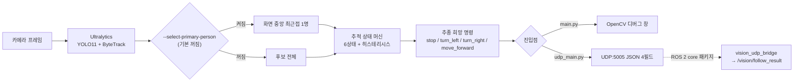

# BOMI AI Vision

돌봄 로봇의 사람 탐지·추적 결과를 외부 시스템에 제공하기 위한 Python 프로젝트다. 장기 목표에는 사용자 상태(휴식·수면 가능성) 분석도 있지만 아직 구현하지 않았다. AI 비전 모듈은 모터, TTS, 대화를 직접 실행하지 않는다.

## 현재 구현 범위

현재 노트북 카메라 영상에서 YOLO11과 ByteTrack으로 사람을 탐지·추적하고 Track ID, 바운딩 박스, 신뢰도와 화면 기준 위치를 표시할 수 있다. 사람 수와 이전 상태로 다중 인물 확인과 한 명 복귀 안정화를 포함한 사람 추적 상태 머신을 갱신하고, 정상 추적일 때의 위치를 바탕으로 후속 주행 제어 모듈에 전달할 추종 희망 방향도 생성한다. 매 프레임의 판단 결과는 UDP JSON으로 실제 로봇에 전송한다. **사용자 상태 분석과 ROS2 직접 연동은 아직 구현하지 않았다.**

전체 흐름은 다음과 같다. 진입점이 둘이고, 실기에서 도는 것은 오른쪽 아래의 `udp_main`이다.



## 디렉터리 구조

```text
src/bomi_vision/           패키지 소스 (18파일, 약 2,150줄)
  ├─ domain/               외부 라이브러리에 의존하지 않는 데이터·계약 정의 (5파일)
  ├─ adapters/             OpenCV·Ultralytics·UDP 연결 (5파일)
  ├─ application.py        파이프라인 조립 (카메라→추적→상태→명령→출력)
  ├─ tracking.py           사람 추적 상태 머신 (6상태)
  ├─ position.py           화면상 위치 계산
  ├─ follow.py             추종 희망 명령 판단
  ├─ primary_person.py     상태 머신 앞에서 후보를 한 명으로 줄이는 전처리 (기본 꺼짐)
  ├─ main.py               디버그 창 CLI (`python -m bomi_vision.main`)
  └─ udp_main.py           UDP 송신 CLI (`bomi-vision-udp`) — 실기 진입점
scripts/                   개발 환경 검사 도구 (venv 검사, 한국어 docstring 검사)
tests/unit/                단위 테스트
tests/integration/         통합 테스트 (가짜 카메라·추적기로 파이프라인 연결 검증)
tests/test_primary_person.py  대표 인물 선택 테스트 (`-m unit` 필터에 잡히지 않음)
docs/                      요구사항, 설계, 작업 계획
config/, evals/, artifacts/  현재 비어 있음 (`.gitkeep`만 있음)
```

## 빠른 시작

지원 Python 버전은 3.10 이상 3.13 미만이다. 저장소를 복제한 뒤 프로젝트 루트에서 `venv`를 최초 한 번 생성하고 활성화한다. 기존 `venv`가 있다면 삭제하거나 다시 만들지 않고 그대로 활성화한다.

Windows PowerShell:

```powershell
py -3.12 -m venv venv
.\venv\Scripts\Activate.ps1
python -m pip install --upgrade pip
python -m pip install -e ".[dev]"
```

Git Bash:

```bash
py -3.12 -m venv venv
source venv/Scripts/activate
python -m pip install --upgrade pip
python -m pip install -e ".[dev]"
```

Linux 또는 Jetson:

```bash
python3 -m venv venv
source venv/bin/activate
python -m pip install --upgrade pip
python -m pip install -e ".[dev]"
```

설치 후 다음 명령으로 실제 패키지 import를 확인할 수 있다.

```bash
python -c "import bomi_vision; print(bomi_vision.__version__)"
```

## 개발 명령

활성화된 프로젝트 `venv`에서 실행한다.

```bash
make help
make check-env
make setup
make format
make format-check
make lint
make type-check
make check-docstrings
make test-unit
make test-integration
make test
make coverage
make check
make clean
```

GNU Make를 사용할 수 없는 Windows 환경에서는 Makefile에 표시된 `python -m ruff`, `python -m mypy`, `python -m pytest` 명령을 직접 실행할 수 있다. pytest는 editable install된 패키지를 검사하므로 테스트 전에 `python -m pip install -e ".[dev]"`가 필요하다. 테스트는 프로젝트 루트에서 실행한다. `conftest.py`가 없어 일부 테스트가 `from scripts...` 형태로 import하므로 현재 작업 디렉터리가 `sys.path`에 들어가야 한다.

명령 목록에 두 가지 주의사항이 붙는다.

- `make test-unit`은 `pytest tests/unit -m unit`이라 `tests/test_primary_person.py`(20건)와 `tests/unit/test_package_import.py`(마커 없음)를 **수집하지 않는다.** 전부 돌리려면 `make test`를 쓴다.
- `make check-docstrings`는 **현재 34건의 위반으로 실패한다.** 대부분 `tests/test_primary_person.py`의 테스트 함수·가짜 클래스 docstring 누락이다. `make check`가 이를 선행 의존으로 걸므로 `make check`도 함께 실패한다. 새 작업에서는 "내 변경이 새 위반을 추가하지 않았는가"를 기준으로 삼고, 기존 34건은 별도 작업으로 정리한다.

## 실시간 사람 추적

가상환경을 활성화한 뒤 개발 의존성을 포함해 설치한다.

```bash
python -m pip install -e ".[dev]"
```

프로젝트 표준 명령을 사용할 수도 있다.

```bash
make setup
```

기본 카메라와 설정으로 실행한다.

```bash
python -m bomi_vision.main
```

Windows Git Bash에서도 같은 명령을 사용하며 옵션은 한 줄로 지정할 수 있다.

```bash
python -m bomi_vision.main --model yolo11n.pt --camera 0 --confidence 0.8
```

`--confidence`의 코드 기본값은 `0.8`이다. 도움말 문자열이 `default: 0.5`로 잘못 출력되는 것은 알려진 결함이며 값 자체는 `0.8`이다. 실기에서는 이 값이 너무 높아 카메라·조명 조건에서 사람을 거의 잡지 못했고, 그래서 로봇 launch는 `0.5`, 시연 스크립트는 `0.30`을 쓴다.

처음 실행하면 Ultralytics가 모델 가중치를 내려받을 수 있으며 인터넷 연결이 필요하다. 운영체제에서 노트북 카메라 접근 권한도 허용해야 한다. 화면에 추적된 모든 사람의 Track ID, 박스와 신뢰도가 표시되며 `q` 키를 누르면 종료한다. 기본 카메라가 열리지 않으면 `--camera 1`처럼 다른 인덱스를 지정한다.

한 명의 사람이 탐지되면 바운딩 박스 중심을 기준으로 화면 내 위치를 계산한다. `offset_x`는 화면 왼쪽 -1.0, 중앙 0.0, 오른쪽 1.0을 의미하고 `offset_y`는 화면 위쪽 -1.0, 중앙 0.0, 아래쪽 1.0을 의미한다. `height_ratio`는 박스 높이가 화면 높이에서 차지하는 비율이며 실제 거리나 미터 단위 값이 아니다.

ByteTrack은 연속 프레임의 같은 객체에 Track ID를 유지한다. 이 ID는 현재 영상 흐름에서 객체를 구분하는 임시 값이며 실제 사용자 ID나 신원을 의미하지 않는다. 추적기나 모델을 다시 시작하거나 사람이 화면을 벗어났다가 돌아오면 달라질 수 있다.

### 사람 추적 상태

[상태 머신 문서](docs/state-machine.md)가 정의한 여섯 가지 상태를 사람 수와 이전 상태로 판단한다. 한 프레임의 관찰만으로 상태를 확정하지 않으므로 같은 사람 수라도 이전 상태에 따라 결과가 다르다.

- `not_detected`: 유효한 사람이 없고 일시 누락 허용 범위도 지났다.
- `tracking`: 한 명을 정상 추적하며 이 상태에서만 대표 Track ID와 위치를 제공한다.
- `temporarily_lost`: 직전까지 추적하던 사람이 잠시 보이지 않아 복귀를 기다린다.
- `multiple_pending`: 두 명 이상이 검출됐지만 순간 오탐일 수 있어 확인 중이다.
- `multiple_persons`: 다중 인물이 확인 기준 이상 지속돼 보호대상자를 특정할 수 없다.
- `single_recovery`: 다시 한 명이 됐지만 기존 보호대상자인지 확인하기 위해 안정화 중이다.

상태 이름은 코드의 `TrackingResultStatus` 값과 같은 소문자다. 이 문자열이 그대로 UDP 페이로드로 나가므로 대소문자를 바꾸면 수신측이 깨진다. 전환은 다음과 같다.

| 현재 | 0명 | 1명 | 2명 이상 |
|---|---|---|---|
| `not_detected` | 유지 | `tracking` | `multiple_pending` |
| `tracking` | `temporarily_lost` | 유지 | `multiple_pending` |
| `temporarily_lost` | 허용 프레임 초과 시 `not_detected` | `tracking` | `multiple_pending` |
| `multiple_pending` | 직전 단일 추적 이력 있으면 `temporarily_lost`, 없으면 `not_detected` | `tracking` | 확인 프레임 충족 시 `multiple_persons` |
| `multiple_persons` | `not_detected` | `single_recovery` | 유지 |
| `single_recovery` | `not_detected` | 안정화 완료 시 `tracking` | `multiple_persons` (pending 건너뜀) |

`tracking`이 아닌 다섯 상태에서는 특정 사용자를 임의로 선택하지 않으며 대표 Track ID와 위치를 제공하지 않는다. 상태 전환 기준은 다음 옵션으로 조정한다.

```bash
python -m bomi_vision.main --lost-tolerance-frames 3 --multiple-confirm-frames 5 --single-recovery-frames 10
```

- `--lost-tolerance-frames`(기본 3): 이 프레임 수를 초과해 아무도 보이지 않으면 `not_detected`로 전환한다.
- `--multiple-confirm-frames`(기본 5): 두 명 이상이 이 프레임 수만큼 지속되면 `multiple_persons`로 확정한다.
- `--single-recovery-frames`(기본 10): 한 명 상태가 이 프레임 수만큼 유지되면 `tracking`으로 복귀한다.

기본값은 30 FPS를 가정한 초기값이며 실제 카메라와 영상으로 검증한 뒤 조정해야 한다.

### 추종 희망 명령

추종 희망 명령은 실제 모터 명령이나 선속도·각속도가 아니다. 비전 모듈이 현재 프레임의 정상적인 한 명 추적 결과만 사용해 후속 주행 제어 모듈에 원하는 방향을 전달하는 값이다.

- `turn_left`: 사용자가 화면 중앙 허용 범위보다 왼쪽에 있어 좌회전을 희망한다.
- `turn_right`: 사용자가 화면 중앙 허용 범위보다 오른쪽에 있어 우회전을 희망한다.
- `move_forward`: 사용자가 중앙에 있고 화면에서 작게 보여 전진을 희망한다.
- `stop`: 사용자가 충분히 가깝거나 추적 결과를 신뢰할 수 없어 정지를 희망한다.

좌우 정렬을 거리 판단보다 먼저 수행한다. 중앙에 정렬됐을 때만 바운딩 박스의 `height_ratio`로 전진 여부를 판단하며, 가까운 사용자에게 후진 명령을 생성하지 않는다. `tracking`이 아닌 모든 상태, 대표 위치 또는 Track ID 누락과 유효하지 않은 위치에서는 항상 `stop`이다. 이전 프레임 위치로 이동을 계속하지 않는다.

코드 기본값은 수평 중앙 허용 범위 `0.15`, 전진 정지 높이 비율 `0.45`다. 다음 옵션으로 조정할 수 있지만 실제 카메라 시야각, 설치 높이와 사용자 크기에 맞춘 장비 검증이 필요하다.

```bash
python -m bomi_vision.main --horizontal-dead-zone 0.15 --forward-threshold 0.45
```

### 실기에서 쓰는 값은 코드 기본값과 다르다

코드 기본값은 노트북 웹캠으로 동작을 확인하기 위한 시작값이다. 젯슨 실기에서는 카메라가 낮게 달려 있고 GPU 프레임 레이트가 낮아 전부 다른 값을 쓴다. 그 차이 자체가 정보이므로 함께 적는다.

| 옵션 | 코드 기본값 | 로봇 launch | 시연 스크립트 | 실기에서 바꾼 이유 |
|---|---|---|---|---|
| `--confidence` | `0.8` | `0.5` | `0.30` | 실기 조명·카메라에서 0.8은 사람을 거의 잡지 못한다 |
| `--horizontal-dead-zone` | `0.15` | `0.3` | `0.40` | 좌우 보정이 비례제어가 아니라 고정 속도 on/off라 좁으면 중앙을 지날 때마다 반대로 꺾어 지그재그가 된다 |
| `--forward-threshold` | `0.45` | `1.0` | `0.90` | 카메라가 낮아 박스 높이가 거리의 척도가 되지 못한다. 0.45는 몇 m 밖에서도 넘겨 로봇이 출발조차 하지 않았다. 실질적인 정지 거리는 LiDAR의 `person_stop_distance_m`가 정한다 |
| `--lost-tolerance-frames` | `3` | `12` | `12` | 기본 3은 30 FPS 기준 0.1초를 의도한 값인데 GPU에서 24 FPS가 나와 순간 미검출마다 상태가 뒤집힌다. 12는 약 0.5초 |

근거는 `robot/ros2_ws/src/core/launch/bomi_wake_search.launch.py`의 인자 설명과 `robot/scripts/run-homecoming-follow.sh`에 주석으로 남아 있다.

LiDAR 장애물 감지, 비상 정지와 최종 주행 명령의 결합은 후속 주행 제어 모듈의 책임이다.

좌우 좌표는 미러 화면이 아닌 카메라에서 읽은 원본 프레임을 기준으로 한다. 원본 프레임의 왼쪽은 `offset_x < 0`, 중앙은 `offset_x ≈ 0`, 오른쪽은 `offset_x > 0`이다. 탐지, 위치 계산과 디버그 화면은 모두 좌우 반전하지 않은 같은 프레임을 사용한다.

### 여러 명일 때 한 명을 고르기 (기본 꺼짐)

기본 동작은 "여러 명이면 정지"다. `--select-primary-person`을 켜면 상태 머신에 넘기기 **전에** 후보를 한 명으로 줄인다. 상태 머신 앞에서 거르는 이유는, 뒤에서 고르려면 "여러 명일 때 대상을 정하지 않는다"는 같은 규칙이 세 곳(위치 계산 차단, `TrackingResult` 생성자 불변식, 로봇 쪽 `person_follower` 정지)에 박혀 있는 것을 동시에 헐겁게 만들어야 하기 때문이다. 앞에서 줄이면 하류는 "원래 한 명이었다"고 보므로 안전 불변식이 하나도 깨지지 않는다.

선택 기준은 신뢰도가 아니라 **화면 중앙 최근접**이다. YOLO의 confidence는 "사람일 확률"이지 "이 사람이 부른 사람일 확률"이 아니고, 이 로봇은 소리 방향으로 이미 몸을 돌린 뒤라 화면 중앙에 있는 사람이 부른 사람일 확률이 가장 높다. 동률이면 상자가 큰(= 가까운) 쪽, 그다음 Track ID 순이다.

한 번 고른 대상은 화면에 남아 있는 동안 **붙잡는다**(히스테리시스). 매 프레임 다시 고르면 대상이 두 사람 사이를 오가고 로봇이 좌우로 떨기 때문이다. 조건을 통과한 후보가 하나도 없으면 잠금을 풀고 원본 목록을 그대로 넘겨 "여러 명이면 정지" 규칙이 살아난다.

```bash
python -m bomi_vision.main --select-primary-person \
  --primary-min-confidence 0.5 --primary-min-height-ratio 0.0
```

- `--primary-min-confidence`(기본 0.5): 후보로 인정할 최소 신뢰도. **선택 기준이 아니라 배제 필터다.**
- `--primary-min-height-ratio`(기본 0.0 = 거리 제한 없음): 올리면 멀리 있는 행인이 후보에서 빠진다.

실기 launch와 시연 스크립트는 이 옵션을 항상 켠다.

## 실제 로봇으로 UDP 전송

실기에서 젯슨을 향해 도는 진입점은 이쪽이다. 매 프레임 판단 결과를 UDP JSON으로 보내면 ROS 2 쪽 `vision_udp_bridge`가 그대로 `/vision/follow_result`에 발행하고, `person_follower`가 그것을 읽어 속도 명령을 만든다.

```bash
python -m bomi_vision.udp_main --host 127.0.0.1 --port 5005 --no-window
```

editable 설치 후에는 콘솔 스크립트로도 같은 일을 한다. 콘솔 스크립트가 등록된 진입점은 이것 하나뿐이다.

```bash
bomi-vision-udp --host 127.0.0.1 --no-window
```

- `--host`: 젯슨 IP 또는 호스트명. 환경변수 `BOMI_ROBOT_HOST`로도 지정한다. **둘 다 없으면 실행을 거부한다.**
- `--port`: 기본 5005 (수신측 `vision_udp_bridge`의 `bind_port` 기본값과 같다).
- `--no-window`: 디버그 창 없이 전송만 한다. **SSH 등 헤드리스 환경에서는 반드시 붙인다** — 창을 열려다 OpenCV Qt 플러그인 로딩에서 즉시 죽는다.

`main.py`의 다른 인자는 그대로 쓸 수 있다. `udp_main`이 `main.build_parser()`를 그대로 확장하기 때문이다.

전송 페이로드는 필드 4개짜리 압축 JSON이다. **이것이 이 모듈의 유일한 외부 계약이다.**

```json
{"status":"tracking","command":"move_forward","track_id":7,"reason":"user_far_and_centered"}
```

| 필드 | 값 |
|---|---|
| `status` | 추적 상태 6종 중 하나 (`not_detected` `tracking` `temporarily_lost` `multiple_pending` `multiple_persons` `single_recovery`) |
| `command` | `stop` / `turn_left` / `turn_right` / `move_forward` |
| `track_id` | `tracking`일 때만 정수, 그 외에는 항상 `null` |
| `reason` | 판단 이유를 나타내는 영문 스네이크 토큰 |

`reason` 토큰은 다음 13종이다 — `tracking_not_available`, `temporarily_lost`, `multiple_people_pending`, `multiple_people_detected`, `single_recovery_stabilizing`, `invalid_tracking_result`, `position_missing`, `track_id_missing`, `user_left_of_center`, `user_right_of_center`, `user_far_and_centered`, `safe_follow_distance_reached`, `udp_sender_shutdown`.

프로세스가 정상 종료될 때는 정지 패킷을 한 번 보낸다.

```json
{"status":"not_detected","command":"stop","track_id":null,"reason":"udp_sender_shutdown"}
```

위치값(`offset_x`, `height_ratio`)은 UDP로 나가지 않는다. 거리 판단은 로봇 쪽 LiDAR 몫이다.

### CPU 점유 주의

처리 루프에는 프레임 레이트 상한이 없다. 젯슨에서 그대로 두면 전 코어를 90%까지 채우고, 그러면 Nav2의 20 Hz 제어 루프와 lifecycle·costmap 서비스 호출이 데드라인을 놓쳐 주행이 실패한다(2026-08-09 실기에서 amcl 활성화 실패와 경로 계획 실패로 드러났다). 시연 스크립트(`robot/scripts/run-homecoming-follow.sh`)가 이 프로세스를 `taskset`으로 마지막 두 코어에 가두고 나머지를 Nav2에 남기는 것이 그 대응이다.

## 문제 해결

- `Failed to open camera index 0.`이 표시되면 카메라 권한과 다른 프로그램의 카메라 사용 여부를 확인하고 `--camera 1`을 시도한다.
- 모델 다운로드가 실패하면 인터넷 연결과 방화벽을 확인한 뒤 다시 실행하거나 내려받은 모델 파일을 `--model`로 지정한다. 젯슨이 오프라인이면 첫 실행이 반드시 실패하므로, 반입 전에 가중치 파일을 함께 옮기고 `--model`로 그 경로를 지정한다.
- **SSH로 접속한 헤드리스 환경에서 `--no-window` 없이 실행하면 OpenCV Qt 플러그인 로딩에서 즉시 죽는다.** 젯슨에서 가장 자주 밟는 함정이며 2026-08-08 실기에서 ai_vision 즉시 종료로 나타났다. 실기 launch가 항상 `--no-window`를 붙이는 이유다.
- 화면이 나타나지 않으면 데스크톱 GUI 환경에서 실행 중인지, `opencv-python`이 정상 설치됐는지 확인한다.
- 다른 카메라를 사용하려면 `--camera 1`, `--camera 2`처럼 운영체제에 등록된 인덱스를 지정한다.

## 주요 문서

- [아키텍처](ARCHITECTURE.md)
- [코드 작성 규칙](docs/code-style.md)
- [비전 요구사항](docs/vision-requirements.md)
- [상태 머신](docs/state-machine.md)
- [초기 구조 작업 기록](docs/plans/completed/project-scaffold.md)

설계 문서 세 개(`ARCHITECTURE.md`, `docs/vision-requirements.md`, `docs/state-machine.md`)는 **목표 상태를 기술하며 아직 구현되지 않은 설계를 상당량 포함한다.** 특히 `AWAKE`/`RESTING`/`SLEEPING_ESTIMATED` 사용자 상태 머신, `interaction_allowed`·`movement_allowed` 출력, YAML 설정 계층, ROS 2 노드는 현재 코드에 존재하지 않는다. **구현 사실의 기준은 이 README와 소스이며**, 각 문서는 자기 안에서 구현 상태를 절 단위로 표기한다.

## 후속 작업

LiDAR 장애물 감지와 최종 주행 명령 통합, 시간 기준 상태 전환, Re-ID와 사용자 상태 분석은 별도 이슈와 실행 계획에서 단계적으로 구현한다.

정리 대상으로 기록해 둔다. 패키지 루트의 `codex-changes.diff`(약 54 KB)는 빌드·실행과 무관한 잔여물인데 git에 추적된 채 남아 있다.
