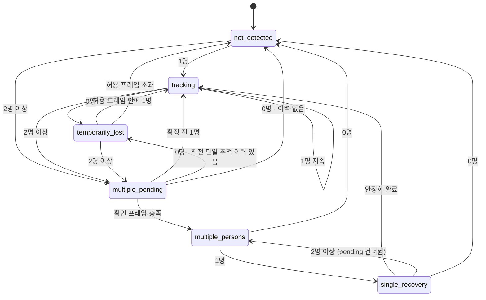

# BOMI AI Vision 상태 머신

## 1. 문서 목적

이 문서는 BOMI AI Vision 모듈에서 사용하는 상태와 상태 전환 규칙을 정의한다.

프레임마다 출력되는 사람 탐지 결과를 그대로 외부 시스템에 전달하면 다음과 같은 문제가 발생할 수 있다.

* 한 프레임의 탐지 실패로 보호대상자를 즉시 잃어버린 것으로 판단할 수 있다.
* 순간적인 중복 탐지로 다중 인물 상태가 반복될 수 있다.
* 사람이 다시 한 명으로 줄어든 직후 잘못된 대상을 추적할 수 있다.
* 자세나 움직임이 잠깐 변했다는 이유로 상호작용 가능 상태가 계속 흔들릴 수 있다.

따라서 AI 비전 모듈은 단일 프레임 결과가 아니라 이전 상태와 일정 시간 동안의 관찰 결과를 함께 사용해 최종 상태를 결정한다.

이 문서는 다음 두 종류의 상태를 다루며, **둘의 구현 상태가 다르다.**

1. 사람 탐지 및 추적 상태 — **구현됨.** `src/bomi_vision/tracking.py`와 `src/bomi_vision/domain/tracking.py`가 이 문서의 §3~§13을 그대로 따르며, 각 전환 메서드가 여기 절 번호를 주석으로 인용한다. §4.4·§5.4·§6.5·§7.5·§8.4·§9.5의 전환표는 코드와 일치한다.
2. 상호작용 제한을 위한 사용자 상태 — **미구현(설계만).** §14~§21이 정의하는 `AWAKE`/`RESTING`/`SLEEPING_ESTIMATED`와 `interaction_allowed`·`movement_allowed`는 2026-08 기준 코드에 존재하지 않는다(`grep -rn "RESTING\|AWAKE" src` → 0건). 자세·움직임 분석 방식이 결정되기 전까지 목표 상태로만 읽는다.

각 상태 절의 "상태 정책" 항목 중 "능동 대화", "이동 허용", "사용자 상태" 세 줄도 2번에 속하므로 아직 코드에 대응물이 없다. `TrackingResult`의 필드는 `status`·`person_count`·`track_id`·`position` 넷뿐이다. 현재 코드에서 그 취지를 담당하는 것은 `follow.py`의 정지 폴백이다 — `TRACKING`이 아닌 다섯 상태와 위치·Track ID 결손은 전부 `stop` 명령이 된다.

현재 확정되지 않은 자세 분석 기술이나 수면 판단 방식은 이 문서에서 강제하지 않는다.

---

## 2. 기본 원칙

### 2.1 단일 프레임으로 상태를 확정하지 않는다

다음과 같은 상태는 한 프레임만으로 즉시 확정하지 않는다.

* 다중 인물 상태
* 추적 실패 상태
* 다중 인물 상태 해제
* 수면 또는 휴식 추정 상태
* 깨어 있는 상태로의 복귀

상태 전환에는 다음 중 하나 이상을 사용한다.

* 연속 프레임 수
* 지속시간
* 이전 상태
* confidence
* 히스테리시스

---

### 2.2 불확실한 상태에서는 보수적으로 처리한다

AI 비전 모듈이 보호대상자를 확실하게 판단하지 못하면 능동 대화를 허용하지 않는다.

다음 상황은 기본적으로 불확실한 상태로 처리한다.

* 사람이 검출되지 않음
* 사람이 일시적으로 사라짐
* 두 명 이상이 검출됨
* 다중 인물 상태에서 한 명으로 복귀 중
* 자세를 판단할 수 없음
* 영상 입력이 유효하지 않음
* 내부 처리 오류 발생

---

### 2.3 상태와 행동을 분리한다

AI 비전 상태 머신은 관찰 결과와 정책 상태를 반환한다.

다음 동작은 직접 실행하지 않는다.

* 모터 정지
* 로봇 회전
* 사용자 추적 시작
* TTS 실행
* 능동 대화 시작

AI 비전은 외부 시스템이 사용할 수 있도록 다음과 같은 결과만 제공한다.

* 현재 사람 추적 상태
* 현재 사용자 상태
* 보호대상자 선택 가능 여부
* 능동 대화 허용 여부
* 이동 허용 여부
* 상태 판단 이유

---

## 3. 사람 추적 상태 (구현됨)

사람 탐지 및 추적에는 다음 상태를 사용한다. 코드에서는 `domain/tracking.py`의 `TrackingResultStatus`이며, enum 멤버 이름은 대문자지만 **직렬화 값은 소문자**다. UDP로 나가는 것은 값이므로 수신측(`vision_udp_bridge` → `person_follower`)과 맞출 때는 오른쪽 열을 본다.

| 이 문서의 표기 | 코드의 값 (외부 계약) |
|---|---|
| `NOT_DETECTED` | `not_detected` |
| `TRACKING` | `tracking` |
| `TEMPORARILY_LOST` | `temporarily_lost` |
| `MULTIPLE_PENDING` | `multiple_pending` |
| `MULTIPLE_PERSONS` | `multiple_persons` |
| `SINGLE_RECOVERY` | `single_recovery` |

전체 전환을 한눈에 보면 다음과 같다. 상태별 상세는 §4~§9에 있다.



### 3.1 상태 정책의 실제 구현체

"이 상태에서는 보호대상자를 선택하지 않는다"는 정책은 문장이 아니라 **생성자 불변식으로 강제된다.** `TrackingResult`는 `TRACKING`일 때만 `track_id`와 `position`을 허용하고, 그 밖의 상태에 둘 중 하나라도 실려 있으면 `ValueError`를 던진다. 상태와 사람 수의 조합도 함께 검증한다. 이 불변식을 완화하면 안전 규칙 전체가 헐거워지므로 바꾸기 전에 §7.3·§9.3을 다시 읽는다.

---

## 4. `NOT_DETECTED`

### 4.1 의미

현재 영상에서 유효한 사람을 찾지 못했고, 일시적 추적 실패 허용 범위도 초과한 상태다.

보호대상자의 위치와 Track ID를 사용할 수 없다.

### 4.2 진입 조건

다음 조건 중 하나를 만족하면 진입할 수 있다.

* 초기 상태에서 유효한 사람이 검출되지 않음
* `TEMPORARILY_LOST` 상태가 허용시간을 초과함
* 영상 입력 오류가 지속되어 사람 추적을 계속할 수 없음
* 추적 결과가 장시간 유효하지 않음

### 4.3 상태 정책

* 보호대상자 선택: 불가능
* 능동 대화: 허용하지 않음
* 이동 허용: 외부 안전 정책에 따라 제한
* 위치 정보: 제공하지 않음
* Track ID: 제공하지 않음
* 사용자 상태: `UNKNOWN`

### 4.4 전환 가능 상태

| 조건            | 다음 상태              |
| ------------- | ------------------ |
| 유효한 사람 한 명 검출 | `TRACKING`         |
| 두 명 이상 검출     | `MULTIPLE_PENDING` |
| 사람 미검출 지속     | `NOT_DETECTED`     |

---

## 5. `TRACKING`

### 5.1 의미

유효한 사람 한 명이 검출됐으며, 현재 보호대상자로 사용할 수 있는 상태다.

MVP 운영 전제에 따라 한 명의 유효한 사람을 보호대상자로 간주한다.

### 5.2 진입 조건

다음 조건 중 하나를 만족하면 진입할 수 있다.

* `NOT_DETECTED` 상태에서 한 명이 검출됨
* `TEMPORARILY_LOST` 상태에서 기존 대상이 다시 검출됨
* `SINGLE_RECOVERY` 상태에서 한 명 상태가 안정화됨
* 초기 프레임에서 한 명이 정상 검출됨

### 5.3 상태 정책

* 보호대상자 선택: 가능
* Track ID: 유효한 경우 제공
* 위치 정보: 제공 가능
* 능동 대화: 사용자 상태가 `AWAKE`일 때만 후보가 됨
* 이동 허용: 정상 추적 조건에서는 허용 가능

`TRACKING` 상태라고 해서 능동 대화가 항상 허용되는 것은 아니다.

다음 조건도 함께 확인해야 한다.

* 사용자 상태가 `AWAKE`
* confidence가 최소 기준 이상
* 영상 데이터가 최신 상태
* 내부 처리 오류가 없음

### 5.4 전환 가능 상태

| 조건           | 다음 상태              |
| ------------ | ------------------ |
| 한 명 정상 검출 지속 | `TRACKING`         |
| 사람 미검출 시작    | `TEMPORARILY_LOST` |
| 두 명 이상 검출    | `MULTIPLE_PENDING` |

---

## 6. `TEMPORARILY_LOST`

### 6.1 의미

직전까지 한 명의 보호대상자를 추적하고 있었지만 현재 프레임에서 일시적으로 탐지하지 못한 상태다.

순간적인 가림이나 모델의 탐지 실패로 전체 추적 상태가 즉시 초기화되는 것을 방지하기 위해 사용한다.

### 6.2 발생 가능한 상황

* 사람 앞을 다른 물체가 잠시 가림
* 조명이 순간적으로 변함
* 사람이 화면 가장자리로 이동함
* 모델 confidence가 잠시 기준 아래로 내려감
* 한두 프레임에서 탐지 결과가 누락됨

### 6.3 진입 조건

* 이전 상태가 `TRACKING`
* 현재 유효한 사람이 0명
* 아직 추적 실패 허용시간 또는 허용 프레임을 초과하지 않음

### 6.4 상태 정책

* 보호대상자 선택: 일시적으로 불가능
* 이전 Track ID: 내부적으로 보관 가능
* 능동 대화: 허용하지 않음
* 이동 허용: 외부 시스템이 감속 또는 정지 판단에 사용
* 사용자 상태: `UNKNOWN`

이전 위치를 그대로 새로운 현재 위치처럼 제공하면 안 된다.

필요한 경우 이전 위치임을 명확히 구분해 제공한다.

### 6.5 전환 가능 상태

| 조건                  | 다음 상태              |
| ------------------- | ------------------ |
| 한 명이 허용시간 안에 다시 검출됨 | `TRACKING`         |
| 미검출이 허용 범위를 초과함     | `NOT_DETECTED`     |
| 두 명 이상 검출           | `MULTIPLE_PENDING` |

경계 조건 하나를 값에서 읽을 수 없다. 초과 판정이 `>` 비교라 **누락 프레임이 허용값을 넘어선 다음 프레임에 `NOT_DETECTED`가 된다.** `--lost-tolerance-frames 1`이면 첫 0명 프레임은 `TEMPORARILY_LOST`, 두 번째 0명 프레임에서 `NOT_DETECTED`다. `0`으로 두면 첫 0명 프레임에서 곧바로 대상을 폐기한다.

---

## 7. `MULTIPLE_PENDING`

### 7.1 의미

현재 프레임에서 두 명 이상의 사람이 검출됐지만, 일시적인 중복 탐지 또는 순간적인 방문자 등장일 수 있어 다중 인물 상태를 확인 중인 상태다.

### 7.2 진입 조건

다음 상태에서 두 명 이상이 검출되면 진입할 수 있다.

* `NOT_DETECTED`
* `TRACKING`
* `TEMPORARILY_LOST`
* `SINGLE_RECOVERY`

### 7.3 상태 정책

* 보호대상자 선택: 불가능
* 능동 대화: 허용하지 않음
* 이동 허용: 허용하지 않는 것을 기본 정책으로 함
* Track ID: 보호대상자 ID로 사용하지 않음
* 사용자 상태: `UNKNOWN`

다중 인물 확인이 완료되기 전이라도 특정 사람을 보호대상자로 임의 선택하지 않는다.

### 7.4 확인 기준 (확정됨)

**연속 검출 프레임 수로 확정했다.** 상태 머신에 시각 입력이 없으므로 지속시간 기준은 쓰지 않는다. 기본값은 `--multiple-confirm-frames 5`(30 FPS 기준 약 0.17초)이며 실제 카메라로 조정한다.

한 가지 동작이 값에서 바로 읽히지 않는다. **`multiple_confirm_frames=1`이어도 첫 프레임은 확정하지 않는다.** 다중 인물 진입 시 카운터를 1로 세팅하고 무조건 `MULTIPLE_PENDING`을 반환하므로, 확정은 두 번째 프레임부터다. 한 프레임의 중복 탐지로 보호대상자를 잃지 않기 위한 의도이며 회귀 테스트가 이를 고정한다(`tests/unit/test_tracking.py`).

### 7.5 전환 가능 상태

| 조건                  | 다음 상태                                                 |
| ------------------- | ----------------------------------------------------- |
| 두 명 이상이 확인 기준까지 지속됨 | `MULTIPLE_PERSONS`                                    |
| 확인 기준 전에 다시 한 명이 됨  | `TRACKING`                                            |
| 확인 기준 전에 모든 사람이 사라짐 | 이전 상태와 관찰 이력에 따라 `TEMPORARILY_LOST` 또는 `NOT_DETECTED` |

다중 인물 진입 전 한 명을 정상 추적하고 있었다면, 짧은 다중 인물 검출 후 0명이 된 경우 `TEMPORARILY_LOST`로 처리할 수 있다.

---

## 8. `MULTIPLE_PERSONS`

### 8.1 의미

두 명 이상의 유효한 사람이 설정된 확인 기준 이상 지속돼 보호대상자를 특정할 수 없는 상태다.

### 8.2 진입 조건

* 현재 상태가 `MULTIPLE_PENDING`
* 두 명 이상 검출이 설정된 기준 이상 지속됨

### 8.3 상태 정책

* 보호대상자 선택: 불가능
* 능동 대화: 허용하지 않음
* 이동 허용: 허용하지 않음
* 위치 정보: 보호대상자 위치로 제공하지 않음
* 사용자 상태: `UNKNOWN`

다음 기준으로 한 사람을 임의 선택하면 안 된다.

* 가장 큰 바운딩 박스
* 카메라와 가장 가까워 보이는 사람
* 가장 높은 confidence
* 가장 오래 유지된 Track ID
* 화면 중심과 가장 가까운 사람

해당 기준을 사용하려면 별도의 신원 확인 요구사항과 설계 결정이 필요하다.

> **예외 하나가 실제로 도입돼 있다.** `--select-primary-person`(기본 꺼짐)을 켜면 "화면 중심과 가장 가까운 사람"으로 후보를 한 명으로 줄인다. 다만 그 선택은 **이 상태 머신 안이 아니라 앞에서** 일어난다(`primary_person.py`). 상태 머신은 이미 걸러진 목록을 받으므로 여기 적힌 금지 규칙과 §3.1의 생성자 불변식은 하나도 완화되지 않는다. 조건을 통과한 후보가 없으면 원본 목록을 그대로 넘겨 `MULTIPLE_PENDING` 경로가 살아난다. 신뢰도가 아니라 중앙 근접을 쓰는 이유는 로봇이 소리 방향으로 이미 몸을 돌린 뒤라는 전제 때문이며, 근거는 `primary_person.py` 모듈 docstring에 있다.

### 8.4 전환 가능 상태

| 조건         | 다음 상태              |
| ---------- | ------------------ |
| 두 명 이상 지속  | `MULTIPLE_PERSONS` |
| 한 명만 검출됨   | `SINGLE_RECOVERY`  |
| 모든 사람이 사라짐 | `NOT_DETECTED`     |

---

## 9. `SINGLE_RECOVERY`

### 9.1 의미

다중 인물 상태에서 다시 한 명만 검출됐지만, 해당 사람이 기존 보호대상자인지 확정할 수 없어 안정화를 확인하는 상태다.

### 9.2 진입 조건

* 이전 상태가 `MULTIPLE_PERSONS`
* 현재 유효한 사람이 정확히 한 명

### 9.3 상태 정책

* 보호대상자 선택: 아직 불가능
* 능동 대화: 허용하지 않음
* 이동 허용: 허용하지 않음
* 위치 정보: 디버깅 정보로는 사용할 수 있지만 보호대상자 위치로 확정하지 않음
* 사용자 상태: `UNKNOWN`

### 9.4 복귀 기준

한 명 상태가 설정된 연속 프레임 수 또는 지속시간 동안 안정적으로 유지되면 `TRACKING`으로 복귀한다.

복귀 기준은 설정값으로 관리한다.

### 9.5 전환 가능 상태

| 조건                     | 다음 상태              |
| ---------------------- | ------------------ |
| 한 명이 복귀 기준까지 안정적으로 유지됨 | `TRACKING`         |
| 두 명 이상이 다시 검출됨         | `MULTIPLE_PERSONS` |
| 모든 사람이 사라짐             | `NOT_DETECTED`     |

두 번째 행은 **`MULTIPLE_PENDING`을 건너뛴다.** 이미 한 번 확정된 다중 인물이 다시 관찰된 것이므로 확인 단계를 반복하지 않는다. 다른 상태에서 2명 이상이 되면 항상 `MULTIPLE_PENDING`을 거치는 것과 다른 유일한 자리다.

또한 §9.2의 진입 자체가 첫 프레임을 확정하지 않는다. 다중 인물이 해제된 직후의 한 명이 기존 보호대상자인지 알 수 없으므로, 복귀 기준값과 무관하게 첫 프레임은 언제나 `SINGLE_RECOVERY`다.

---

## 10. 사람 추적 상태 전환 요약

```text
초기 상태
   │
   ├─ 0명 ───────────────────────────────→ NOT_DETECTED
   │
   ├─ 1명 ───────────────────────────────→ TRACKING
   │
   └─ 2명 이상 ─────────────────────────→ MULTIPLE_PENDING
```

```text
TRACKING
   │
   ├─ 1명 지속 ─────────────────────────→ TRACKING
   ├─ 0명 ───────────────────────────────→ TEMPORARILY_LOST
   └─ 2명 이상 ─────────────────────────→ MULTIPLE_PENDING
```

```text
TEMPORARILY_LOST
   │
   ├─ 허용시간 안에 1명 복귀 ───────────→ TRACKING
   ├─ 미검출 시간 초과 ─────────────────→ NOT_DETECTED
   └─ 2명 이상 ─────────────────────────→ MULTIPLE_PENDING
```

```text
MULTIPLE_PENDING
   │
   ├─ 다중 인물 확인 완료 ──────────────→ MULTIPLE_PERSONS
   ├─ 확인 전에 1명으로 복귀 ──────────→ TRACKING
   └─ 0명 ───────────────────────────────→ TEMPORARILY_LOST 또는 NOT_DETECTED
```

```text
MULTIPLE_PERSONS
   │
   ├─ 2명 이상 지속 ────────────────────→ MULTIPLE_PERSONS
   ├─ 1명으로 감소 ─────────────────────→ SINGLE_RECOVERY
   └─ 0명 ───────────────────────────────→ NOT_DETECTED
```

```text
SINGLE_RECOVERY
   │
   ├─ 1명 안정화 완료 ──────────────────→ TRACKING
   ├─ 2명 이상 재검출 ──────────────────→ MULTIPLE_PERSONS
   └─ 0명 ───────────────────────────────→ NOT_DETECTED
```

---

## 11. 초기 상태

사람 추적 상태 머신의 기본 초기 상태는 `NOT_DETECTED`로 한다.

초기 프레임이 입력되기 전까지는 다음 값을 사용한다. 앞의 세 항목은 구현돼 있고, 뒤의 세 항목은 §14~§21과 함께 아직 코드에 없다.

* 보호대상자: 없음 — 구현됨
* Track ID: 없음 — 구현됨
* 사람 수: 0 — 구현됨
* 사용자 상태: `UNKNOWN` — 미구현
* 능동 대화 허용: `false` — 미구현
* 이동 허용: `false` — 미구현

세 개의 히스테리시스 카운터(일시 누락, 다중 인물 확인, 한 명 복귀 안정화)도 모두 0에서 시작한다. 이 카운터가 인스턴스 상태이므로 `UserTrackingService`를 프레임마다 새로 만들면 안 되고, 여러 영상 흐름에서 공유해서도 안 된다.

첫 번째 유효한 프레임이 입력된 뒤 관찰 결과에 따라 상태를 갱신한다.

---

## 12. 사람 수 입력 검증

상태 머신에 전달하는 사람 수는 0 이상의 정수여야 한다.

다음 입력은 잘못된 입력으로 처리한다.

* 음수
* 정수가 아닌 값
* `None`
* 유효하지 않은 탐지 결과에서 계산한 값

잘못된 입력을 임의로 0명으로 변환하지 않는다.

오류를 명확하게 발생시키거나 상위 파이프라인에서 안전한 오류 상태로 변환한다.

---

## 13. Track ID 처리 원칙

ByteTrack의 Track ID는 동일한 영상 흐름에서 사람을 연속적으로 추적하기 위한 임시 값이다.

다음 원칙을 따른다.

* Track ID는 실제 사용자 신원이 아니다.
* 모델이나 추적기가 재시작되면 Track ID가 변경될 수 있다.
* 사람이 화면을 벗어났다가 다시 들어오면 다른 Track ID를 받을 수 있다.
* 다중 인물 상황에서는 기존 Track ID만으로 보호대상자를 선택하지 않는다.
* Track ID가 없는 초기 탐지 결과는 보호대상자 확정에 사용하지 않을 수 있다.

Track ID 유지 여부는 추적 품질을 평가하는 참고 정보로 사용한다.

---

## 14. 사용자 상태 (미구현 — 설계만)

> **여기부터 §21까지는 목표 상태다.** `grep -rn "RESTING\|AWAKE\|SLEEPING" src tests scripts` 결과는 0건이고, 이 상태들을 계산하거나 저장하는 코드가 없다. 앞의 §3~§13(사람 추적)과 같은 어조로 쓰여 있지만 구현 상태는 정반대이므로, 코드를 읽기 전에 이 배지를 먼저 본다. 현재 코드에서 "불확실하면 말 걸지 않는다"는 취지를 대신 담당하는 것은 `follow.py`의 정지 폴백이다.

사용자의 휴식 또는 수면 가능성과 관련된 상태는 다음과 같이 정의한다.

```text
UNKNOWN
AWAKE
RESTING
SLEEPING_ESTIMATED
```

현재 구체적인 자세 분석 기술과 임계값은 확정되지 않았다.

따라서 이 문서에서는 상태의 의미와 상호작용 정책만 정의한다.

---

## 15. 사용자 상태 `UNKNOWN`

### 15.1 의미

사용자의 상태를 판단할 수 있는 정보가 부족하거나 신뢰할 수 없는 상태다.

### 15.2 진입 가능한 상황

* 사람 추적 상태가 `TRACKING`이 아님
* 자세 분석 결과가 없음
* 신체가 심하게 가려짐
* 분석 confidence가 최소 기준보다 낮음
* 영상 데이터가 오래됨
* 분석 과정에서 오류가 발생함
* 다중 인물이 검출됨

### 15.3 정책

* 능동 대화: 허용하지 않음

불확실한 상태에서 사용자가 깨어 있다고 가정하지 않는다.

---

## 16. 사용자 상태 `AWAKE`

### 16.1 의미

보호대상자가 깨어 있고 능동 대화를 시도할 수 있는 후보 상태로 판단된 상태다.

실제 능동 대화 허용 여부는 사람 추적 상태와 다른 안전 조건까지 함께 확인해야 한다.

### 16.2 정책

* 능동 대화: 조건부 허용
* 필수 사람 추적 상태: `TRACKING`

### 16.3 주의사항

`AWAKE` 상태는 의료적인 의식 수준을 의미하지 않는다.

비전에서 관찰된 자세와 움직임을 기반으로 로봇이 말을 걸어도 될 가능성이 있다고 판단한 서비스 상태다.

---

## 17. 사용자 상태 `RESTING`

### 17.1 의미

보호대상자가 누워 있거나 휴식 중일 가능성이 있어 능동 대화를 제한해야 하는 상태다.

실제로 잠들었는지는 확정하지 않는다.

### 17.2 정책

* 능동 대화: 허용하지 않음

---

## 18. 사용자 상태 `SLEEPING_ESTIMATED`

### 18.1 의미

관찰된 자세와 움직임이 일정 시간 유지돼 수면 중일 가능성이 높다고 추정한 상태다.

의료적인 수면 판정은 아니다.

### 18.2 정책

* 능동 대화: 허용하지 않음

### 18.3 주의사항

구체적인 진입 조건은 자세 및 움직임 분석 방법이 결정된 뒤 추가한다.

Codex는 활성 실행 계획에 수면 상태 구현이 포함되기 전까지 임의로 전환 조건을 구현하지 않는다.

---

## 19. 사용자 상태 전환 원칙

현재 확정된 전환 원칙은 다음과 같다.

| 현재 조건                    | 사용자 상태               |
| ------------------------ | -------------------- |
| 사람 추적 상태가 `TRACKING`이 아님 | `UNKNOWN`            |
| 자세 또는 움직임 판단 불가능         | `UNKNOWN`            |
| 깨어 있는 상태라고 충분히 판단됨       | `AWAKE`              |
| 쉬거나 누워 있을 가능성이 높음        | `RESTING`            |
| 수면 중일 가능성이 일정 시간 이상 유지됨  | `SLEEPING_ESTIMATED` |

정확한 전환시간, confidence 및 자세 기준은 이후 기술 검증 후 확정한다.

---

## 20. 능동 대화 허용 상태 (미구현 — 설계만)

> **`interaction_allowed`라는 값은 코드에 없다.** 이 판정을 하는 함수도 없다. 다만 취지("불확실하면 허용하지 않는다")는 이미 다른 형태로 구현돼 있다 — `follow.py`가 `TRACKING`이 아닌 다섯 상태를 전부 `stop`으로 바꾸므로, 아래 표의 "금지" 행과 결과적으로 같은 보수성을 갖는다. 사용자 상태 축(`AWAKE`/`RESTING`/…)만 없는 셈이다.

능동 대화는 다음 조건을 모두 만족할 때만 허용한다.

```text
person_state == TRACKING
user_state == AWAKE
결과 confidence가 최소 기준 이상
영상 데이터가 최신 상태
내부 처리 오류가 없음
```

하나라도 만족하지 않으면 능동 대화를 허용하지 않는다.

### 상태별 기본 정책

| 사람 추적 상태           | 사용자 상태               | 능동 대화  |
| ------------------ | -------------------- | ------ |
| `TRACKING`         | `AWAKE`              | 조건부 허용 |
| `TRACKING`         | `RESTING`            | 금지     |
| `TRACKING`         | `SLEEPING_ESTIMATED` | 금지     |
| `TRACKING`         | `UNKNOWN`            | 금지     |
| `NOT_DETECTED`     | 모든 상태                | 금지     |
| `TEMPORARILY_LOST` | 모든 상태                | 금지     |
| `MULTIPLE_PENDING` | 모든 상태                | 금지     |
| `MULTIPLE_PERSONS` | 모든 상태                | 금지     |
| `SINGLE_RECOVERY`  | 모든 상태                | 금지     |

사용자가 먼저 음성으로 로봇을 호출한 경우의 응답 여부는 이 상태 머신이 아니라 대화 시스템의 정책으로 처리한다.

---

## 21. 이동 허용 상태 (다른 형태로 구현됨)

> **`movement_allowed`라는 필드는 없다.** 같은 정보를 `FollowCommand`가 대신 실어 나른다 — `TRACKING` 외 다섯 상태는 전부 `stop`이고, `TRACKING`일 때만 `turn_left`/`turn_right`/`move_forward`가 나온다. 아래 표의 `true`/`false`와 일대일로 대응하지만, 외부 시스템이 받는 것은 boolean이 아니라 방향 명령이다. 수신측을 만들 때는 이 표가 아니라 `README.md`의 UDP 계약을 본다.

AI 비전 모듈은 실제 모터를 제어하지 않지만 외부 주행 시스템이 참고할 수 있는 이동 허용 상태를 제공할 수 있다.

현재 기본 정책은 다음과 같다.

| 사람 추적 상태           | 이동 허용 기본값 |
| ------------------ | --------- |
| `TRACKING`         | `true`    |
| `NOT_DETECTED`     | `false`   |
| `TEMPORARILY_LOST` | `false`   |
| `MULTIPLE_PENDING` | `false`   |
| `MULTIPLE_PERSONS` | `false`   |
| `SINGLE_RECOVERY`  | `false`   |

실제 로봇의 최종 이동 여부는 LiDAR, 장애물 감지, 비상 정지 및 주행 제어 시스템이 결정한다.

`movement_allowed=true`는 안전한 주행을 보장하는 값이 아니라 AI 비전 관점에서 보호대상자 추적이 가능한 상태임을 의미한다.

---

## 22. 상태 변경 이유

모든 상태 결과에는 가능하면 사람이 이해할 수 있는 상태 변경 이유를 포함한다.

예시:

```text
한 명의 보호대상자를 정상적으로 추적하고 있습니다.
사람이 일시적으로 탐지되지 않아 복귀를 기다리고 있습니다.
두 명 이상의 사람이 검출되어 다중 인물 상태를 확인하고 있습니다.
다중 인물이 지속되어 보호대상자를 특정할 수 없습니다.
한 명으로 줄었지만 정상 추적 복귀를 위해 안정화 중입니다.
사용자의 상태를 판단할 정보가 부족합니다.
사용자가 쉬고 있을 가능성이 있어 능동 대화를 제한합니다.
```

상태 변경 이유는 디버깅, 로그, ROS2 메시지 및 대시보드에서 사용할 수 있다.

### 22.1 현재 구현 — 사람용 문장이 아니라 기계용 토큰

위 예시는 사람이 읽을 로그를 상정했지만, **구현된 `reason`은 한국어 문장이 아니라 영문 스네이크 토큰이고 UDP로 그대로 나가는 외부 계약이다.** 둘은 용도가 다르다 — 위는 사람이 읽는 설명, 아래는 수신측이 분기할 수 있는 값이다. 값을 바꾸면 수신측이 깨지므로 임의로 번역하거나 표현을 다듬지 않는다.

| `reason` | 언제 |
|---|---|
| `tracking_not_available` | `not_detected` |
| `temporarily_lost` | `temporarily_lost` |
| `multiple_people_pending` | `multiple_pending` |
| `multiple_people_detected` | `multiple_persons` |
| `single_recovery_stabilizing` | `single_recovery` |
| `invalid_tracking_result` | 상태 조합이 유효하지 않거나 위치값이 허용 범위를 벗어남 |
| `position_missing` | `tracking`인데 위치가 없음 |
| `track_id_missing` | `tracking`인데 Track ID가 없음 |
| `user_left_of_center` | 중앙 허용 범위보다 왼쪽 → `turn_left` |
| `user_right_of_center` | 중앙 허용 범위보다 오른쪽 → `turn_right` |
| `user_far_and_centered` | 중앙 정렬 + 화면에서 작게 보임 → `move_forward` |
| `safe_follow_distance_reached` | 중앙 정렬 + 충분히 가까움 → `stop` |
| `udp_sender_shutdown` | 프로세스 종료 시 마지막 정지 패킷 |

---

## 23. 상태 전환 로그 (미구현)

> **상태 전이 로그는 없다.** `tracking.py`는 로거를 사용하지 않는다. 현재 관찰 수단은 UDP 페이로드의 `status`/`reason`과 디버그 창뿐이다. 아래는 로깅을 도입할 때의 규칙이다.

상태가 변경될 때는 이전 상태와 새로운 상태를 로그로 기록한다.

예시:

```text
보호대상자 추적 상태가 변경되었습니다: TRACKING -> MULTIPLE_PENDING
보호대상자 추적 상태가 변경되었습니다: MULTIPLE_PERSONS -> SINGLE_RECOVERY
사용자 상태가 변경되었습니다: AWAKE -> RESTING
```

프레임마다 동일한 상태를 반복해서 `info` 로그로 기록하지 않는다.

상태가 유지되는 동안의 세부값은 `debug` 로그로 기록한다.

---

## 24. 상태 머신 테스트 요구사항 (충족됨)

사람 추적 상태 머신은 YOLO, ByteTrack, OpenCV 없이 단위 테스트할 수 있어야 한다.

> **현재 상태: 충족.** 아래 다섯 시나리오는 `tests/unit/test_tracking.py`가 전부 잠그고 있다. §7.4의 첫 프레임 버퍼링, §9.5의 pending 건너뛰기, §6.5의 `>` 경계 같은 값에서 읽히지 않는 동작도 여기서 고정된다. 상태 전환 규칙을 바꾸려면 이 테스트를 먼저 읽는다.

최소한 다음 시나리오를 테스트한다.

### 24.1 기본 탐지

* 초기 상태가 `NOT_DETECTED`인지 확인
* 0명 입력 시 `NOT_DETECTED` 유지
* 1명 입력 시 `TRACKING` 전환

### 24.2 일시적 추적 실패

* `TRACKING`에서 0명 입력 시 `TEMPORARILY_LOST` 전환
* 허용 범위 안에 1명이 돌아오면 `TRACKING` 복귀
* 허용 범위를 초과하면 `NOT_DETECTED` 전환

### 24.3 다중 인물 확인

* `TRACKING`에서 2명 입력 시 `MULTIPLE_PENDING` 전환
* 확인 기준 전에 1명이 되면 `TRACKING` 복귀
* 확인 기준 이상 2명이 지속되면 `MULTIPLE_PERSONS` 전환

### 24.4 한 명 복귀

* `MULTIPLE_PERSONS`에서 1명이 되면 `SINGLE_RECOVERY` 전환
* 복귀 기준 전에 2명이 되면 `MULTIPLE_PERSONS` 복귀
* 한 명 상태가 안정화되면 `TRACKING` 전환

### 24.5 잘못된 입력

* 음수 사람 수 입력 시 오류 발생
* 정수가 아닌 값 입력 시 오류 발생
* 잘못된 설정값 입력 시 오류 발생

---

## 25. 설정으로 관리할 값

다음 값은 상태 머신 내부에 하드코딩하지 않는다.

| 값 | 현재 주입 방법 |
|---|---|
| 다중 인물 확인 프레임 수 | `--multiple-confirm-frames` (기본 5) |
| 한 명 복귀 안정화 프레임 수 | `--single-recovery-frames` (기본 10) |
| 일시적 추적 실패 허용 프레임 수 | `--lost-tolerance-frames` (기본 3) |
| 최소 confidence | `--confidence` (탐지 단계에서 적용) |

**프레임 수 기준으로 확정했다.** 상태 머신에 시각 입력이 없으므로 "지속시간" 계열 값(다중 인물 확인 지속시간, 한 명 복귀 안정화 지속시간, 일시적 추적 실패 허용시간)은 존재하지 않는다. `UserTrackingService`의 생성자는 기본값을 코드에 두지 않고 세 프레임 수를 전부 주입받으며 시작 시 검증한다.

다음 값은 개념 자체가 아직 코드에 없다 — 최신 영상으로 인정할 최대 지연시간, 사용자 상태 전환시간, 사용자 상태 복귀시간. §14~§21이 구현될 때 위 규칙을 적용한다.

---

## 26. 확정 사항과 미확정 사항

### 26.1 코드로 확정된 항목

| 항목 | 결정 | 위치 |
|---|---|---|
| 주 상태 전환 기준 | 프레임 수 (상태 머신에 시각 입력 없음) | `tracking.py` |
| 다중 인물 확인 기본값 | 5 프레임 (30 FPS 기준 약 0.17초) | `main.py` `DEFAULT_MULTIPLE_CONFIRM_FRAMES` |
| 한 명 복귀 안정화 기본값 | 10 프레임 (약 0.33초) | `main.py` `DEFAULT_SINGLE_RECOVERY_FRAMES` |
| 일시적 추적 실패 허용 기본값 | 3 프레임 (약 0.1초) | `main.py` `DEFAULT_LOST_TOLERANCE_FRAMES` |

세 기본값 모두 30 FPS를 가정한 값이고 선정 이유가 `main.py` 상수 주석에 남아 있다. 실기 젯슨은 24 FPS 안팎이라 launch·시연 스크립트가 `--lost-tolerance-frames 12`로 올려 쓴다(근거는 `README.md`의 실기 값 표).

### 26.2 아직 미확정인 항목

다음 항목은 실제 구현과 영상 테스트 후 확정한다.

* Track ID가 변경됐을 때의 상세 복구 정책
* 자세 분석 방식
* 움직임 분석 방식
* `RESTING` 전환 조건
* `SLEEPING_ESTIMATED` 전환 조건
* `AWAKE` 복귀 조건
* 사용자 상태 confidence 계산 방법

미확정 사항은 활성 실행 계획에 명시되기 전까지 임의로 구현하지 않는다.

---

## 27. 변경 관리

상태를 추가하거나 전환 규칙을 변경할 때는 다음 순서를 따른다.

1. 변경 목적과 필요한 사용자 시나리오를 확인한다.
2. `docs/vision-requirements.md`를 검토한다.
3. 이 문서의 상태 정의와 전환 규칙을 수정한다.
4. 필요한 경우 `docs/decisions/`에 결정 이유를 기록한다.
5. 활성 실행 계획을 수정한다.
6. 상태 머신 코드와 단위 테스트를 수정한다.
7. 통합 테스트에서 기존 시나리오가 깨지지 않았는지 확인한다.

코드를 먼저 변경하고 문서를 나중에 코드에 맞추는 방식은 피한다.
