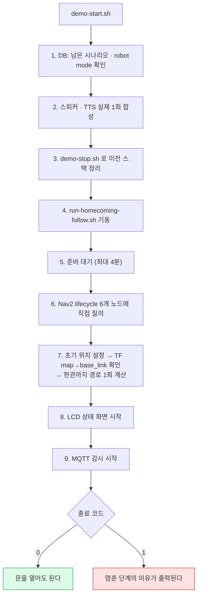

# 시연 실행 순서

젯슨에서 시연 시나리오를 돌리는 방법과, 실기에서 실제로 겪은 함정들.

시연 범위는 네 개다 — 보미야 호출, 현관 인사, 복약 알림, 온습도 안부. 이 중
현관·온습도는 §2 의 귀가 대본 한 줄로 함께 돌고, 보미야 호출은 별도 launch 로
돌린다. 복약 알림은 로봇 쪽 실행이 따로 없다 — 백엔드 스케줄러가 시각을 보고
`NAVIGATE(LIVING_ROOM)` 을 쏘므로, 시연 5분 전에 `care_record` 슬롯을 시드해
두면 같은 스택에서 그대로 탄다.

`.env`·가상환경·PulseAudio 설정은 저장소에 들어가지 않는다. 젯슨을 새로
설치했거나 다른 체크아웃에서 돌린다면 **§3 을 먼저** 실행해야 한다.

---

## 1. 실행 전 (매번)

EC2의 `production.env`에는 아래 값을 넣고 백엔드 컨테이너를 재시작한다. 센서
관측은 계속 저장되지만 독립 온습도 시나리오가 먼저 로봇을 가져가지 않으며,
최신 값은 귀가 추종 후 대화에서 사용한다.

```bash
# EC2 에서
WELLNESS_SCENARIO_ENABLED=false
```

```bash
# 젯슨에서
cd ~/S15P11E102
export MQTT_PASSWORD=$(grep -m1 '^MQTT_PASSWORD=' robot/ai_chat/.env | cut -d= -f2-)
export AI_VISION_PYTHON=/home/ssafy/S15P11E102/robot/ai_vision/venv/bin/python
export AI_CHAT_PYTHON=/home/ssafy/S15P11E102/robot/ai_chat/.venv/bin/python
export LD_LIBRARY_PATH=/home/ssafy/S15P11E102/robot/ai_vision/venv/lib/python3.10/site-packages/nvidia/cu12/lib:/usr/local/cuda/lib64:/usr/lib/aarch64-linux-gnu
```

각 줄이 왜 필요한가

| 변수 | 없으면 | 비고 |
|---|---|---|
| `MQTT_PASSWORD` | 브릿지와 ai_chat 이 브로커에 못 붙는다 | `demo-start.sh` 는 `.env` 에서 스스로 읽는다 |
| `AI_CHAT_PYTHON` | `run-homecoming-voice.sh` 의 기본값이 `venv` 인데 젯슨은 `.venv` 라 "가상환경이 없습니다"로 종료 | `demo-start.sh` 는 `.venv` 를 먼저 찾아 자동으로 넣는다 |
| `LD_LIBRARY_PATH` | GPU 용 torch 가 CUDA·aarch64 라이브러리를 못 찾는다 | `run-homecoming-follow.sh` 가 `nvidia/cu12/lib` 는 스스로 붙인다. 여기서 더하는 것은 `/usr/local/cuda/lib64` 와 `/usr/lib/aarch64-linux-gnu` 두 개다 |
| `AI_VISION_PYTHON` | 셸에 다른 체크아웃 값이 남아 있으면 CPU 전용 venv 를 잡아 추론이 0.04초 → 0.75초가 되고 추종이 끊긴다 | 값이 없으면 스크립트가 같은 체크아웃에서 알아서 만든다 |

> `PYTHONPATH` 는 **설정하지 않는다.** ai_vision 은 venv 에 설치된 패키지라
> 필요 없고, 이 값은 ai_chat 프로세스까지 상속돼 의존성이 깨질 수 있다.
> ROS 를 source 한 셸에서 ai_chat 을 직접 돌릴 일이 있으면
> `env -u PYTHONPATH` 로 감싼다(`demo-start.sh` 가 그렇게 한다).

실행 전 자가진단이 필요하면 `bash robot/scripts/preflight.sh` 를 먼저 돌린다 —
USB 장치·워크스페이스 설치본·파이썬 환경·모델과 `.env`·UDP 포트 다섯 갈래를
한 번에 본다.

---

## 2. 시나리오별 실행

### 권장 — 원클릭 준비

```bash
bash robot/scripts/demo-start.sh     # 로봇을 출발점에 놓고 실행
bash robot/scripts/demo-stop.sh      # 전부 내린다
```

`demo-start.sh` 는 9단계를 **보고가 아니라 실제 상태로** 확인한다. DB 의 남은
시나리오와 로봇 mode 를 먼저 보고, 스피커·TTS 를 실제로 1회 합성해 보고,
스택을 띄운 뒤 Nav2 lifecycle 을 노드에 직접 묻고, 초기 위치를 TF 로 확인하고,
현관까지 경로를 한 번 계산해 본다. 종료 코드 0 이면 문을 열어도 된다.

2026-08-09 실기에서 이 확인들을 손으로 하다 세 번 헛돌았다 — 스택이 뜨기 전에
문을 열어 시나리오가 고착됐고, 로봇을 옮긴 뒤 초기 위치를 다시 안 잡아 엉뚱한
곳으로 갔고, "Nav2 준비 완료"가 떴는데 map_server 와 amcl 이 inactive 였다.



시연 직전 Typecast 가 죽어 TTS 점검(2단계)에서 막히면 `SKIP_SPEECH_CHECK=1` 로
그 단계만 건너뛴다 — 로봇은 무음이 되지만 주행은 그대로 보여 줄 수 있다.

**시연 사이에는 반드시 `demo-stop.sh` 로 내린다.** 안 내리면 `/dev/video*` 와
시리얼 포트가 물린 채 남아 다음 실행이 조용히 실패한다.

아래의 개별 스크립트는 **한 시나리오만 떼어 볼 때** 쓴다.

### 현관 출입 → 추종 → 온습도 → 복귀

```bash
bash robot/scripts/run-homecoming-follow.sh
```

`HOMECOMING_FOLLOW_SECONDS` 를 손으로 주지 않는다. 기본값 20초는 2026-08-10에
정한 값이다 — 10초로 두면 어르신이 따라올 새도 없이 추종이 끝나고 온습도
대화로 넘어가 버린다.

이 대본이 도는 동안에는 "보미야"가 막힌다(`WAKE_BLOCK_DURING_HOMECOMING`,
기본 300초). 현관으로 가는 사이에 웨이크워드가 잡히면 귀가 대본을 버리고 거실
호출 시나리오가 새로 시작되기 때문이다. 시연 중 "보미야가 안 먹는다"는 대개
고장이 아니라 이것이다.

`[4/4] Nav2 준비 완료` 가 뜬 뒤 문을 연다. 인사에 **실제로 대답**해야 다음
단계로 넘어간다(무응답 15초면 대화가 끝난다).

### "보미야" 호출 → 방향 탐색 → 접근

```bash
source /opt/ros/humble/setup.bash && source robot/ros2_ws/install/setup.bash
ros2 launch core bomi_wake_search.launch.py \
    ai_chat_python:="$AI_CHAT_PYTHON" \
    use_mqtt_bridge:=true robot_id:=bomi-AA001 \
    broker_host:=i15e102.p.ssafy.io broker_port:=8883 use_tls:=true \
    mqtt_username:=bomi-jetson mqtt_password:="$MQTT_PASSWORD"
```

⚠️ `use_mqtt_bridge:=true` 를 빼면 안 된다. `MQTT_ENABLED=true` 상태에서
"보미야"는 백엔드 시나리오를 시작하는데, 브릿지가 없으면 아무도 응답하지
않아 시나리오가 타임아웃되고 **로봇이 SAFE_STOP 으로 잠긴다**(§4 참고).

백엔드 없이 로봇만 볼 때는 `robot/scripts/run-wake-search.sh` 를 쓴다.

---

## 3. 젯슨 최초 설정 (한 번만)

### 스피커

PulseAudio 가 기본 출력을 젯슨 내장 HDMI 로 잡는다. TTS 는 정상인데
스피커에서 아무 소리도 안 난다.

```bash
mkdir -p ~/.config/pulse
cat > ~/.config/pulse/default.pa <<'EOF'
.include /etc/pulse/default.pa
set-default-sink alsa_output.usb-Jieli_Technology_USB_Composite_Device_433135383532342E-00.analog-stereo
EOF
pulseaudio -k   # 다시 시작
```

확인: `pactl info | grep "Default Sink"` 가 `usb-Jieli...` 여야 한다.

### GPU (YOLO 추론 0.75초 → 0.04초)

pip 기본 저장소의 torch 는 Jetson 에서 GPU 를 못 잡는다. JetPack 6.2 용
wheel 을 ai_vision venv 안에만 설치한다.

```bash
V=~/S15P11E102/robot/ai_vision/venv
$V/bin/pip install --no-cache-dir --ignore-installed \
  --index-url https://pypi.jetson-ai-lab.io/jp6/cu126 \
  torch==2.11.0 torchvision==0.26.0
$V/bin/pip install --no-cache-dir \
  --index-url https://pypi.jetson-ai-lab.io/jp6/cu126 \
  nvidia-cudss-cu12 nvidia-cudnn-cu12
$V/bin/pip uninstall -y nvidia-cublas-cu12   # ★ Tegra 는 JetPack cuBLAS 를 써야 한다
$V/bin/pip install --no-cache-dir "numpy<2"  # numpy 2 는 시스템 matplotlib 을 깬다
```

확인:

```bash
PYTHONPATH= LD_LIBRARY_PATH=$V/lib/python3.10/site-packages/nvidia/cu12/lib:/usr/local/cuda/lib64:/usr/lib/aarch64-linux-gnu \
  $V/bin/python -c "import torch; print(torch.cuda.is_available())"   # True
```

주의: 인덱스 도메인은 `.io` 다(`.dev` 는 없는 주소). 설치 후 pip 캐시가 수
GB 쌓이니 `rm -rf ~/.cache/pip` 로 비운다 — 실제로 디스크가 99% 까지 찼다.

### 지도

`~/.bomi_demo_state` 의 `MAP` 이 가리키는 지도 파일이 체크아웃에 있어야 한다.
없으면 "지도 파일이 없습니다"로 즉시 종료한다.

`~/.bomi_demo_state` 는 `bomi_map.sh` 가 매핑을 마칠 때 남기는 두 줄
(`MAP=<지도이름>` 과 `START="x y yaw"`)이다. 젯슨 홈에만 있는 런타임 산출물이라
재부팅이나 브랜치 전환으로 사라진다.

```bash
cat ~/.bomi_demo_state          # 예: MAP=bomi_real_30
ls robot/ros2_ws/src/mapping/maps/$(sed -n 's/^MAP=//p' ~/.bomi_demo_state).yaml
```

상태 파일이 없으면 `robot/scripts/demo_defaults.sh` 의 `MAP` 값이 폴백으로
쓰인다. 재매핑한 지도로 시연한다면 그쪽도 같이 고친다 — 두 곳이 어긋나면
"어제는 됐는데" 가 된다.

### `.env` 오디오 값

`robot/ai_chat/.env.example` 기준으로 맞춘다. 특히:

| 키 | 값 | 틀리면 |
|---|---|---|
| `AUDIO_SILENCE_THRESHOLD` | `150` | 300 이면 목소리를 무음으로 처리해 "말 안 함"으로 끝난다 |
| `AUDIO_SILENCE_LIMIT_SECONDS` | `.env.example` 은 `3`. 실기에서 응답 판정이 느리면 `1.5` 까지 내려 본다 | 크면 말이 끝난 뒤에도 계속 듣고 있다 |
| `AUDIO_INPUT_DEVICE` | `reSpeaker` | 마이크가 안 잡힌다 |
| `AUDIO_OUTPUT_DEVICE` | `pulse` | 장치 번호는 재부팅마다 바뀐다 |

---

## 4. 안 될 때

| 증상 | 원인 | 조치 |
|---|---|---|
| 문을 열어도 로봇이 안 움직인다 | 이전 시나리오가 안 끝났거나 `SAFE_STOP` | ① `bash robot/scripts/demo-start.sh` 1단계가 이 상태를 먼저 잡아 준다 ② 그래도 남으면 `scripts/dev/reset-demo.sql` 을 실행한다(리허설 사이마다 돌리면 `SAFE_STOP` 과 `ACTIVE_SCENARIO_EXISTS` 가 함께 풀린다) ③ 운영자 콘솔(`backend/tools/operator_console/README.md`)은 `OPERATOR_SHARED_SECRET` 이 설정돼 있을 때만 쓸 수 있다 |
| 두 번째 실행부터 추종이 안 붙는다 | 이전 스택의 UDP 5005 수신 노드가 고아로 남았다 | `demo-stop.sh` 를 먼저 돌린다. `lib/cleanup.sh` 의 노드 패턴에 `vision_udp_bridge` 가 빠져 있어 이 노드는 자동 정리에서 새므로, 남아 있으면 손으로 죽인다 |
| 말은 하는데 안 들린다 | 기본 출력이 HDMI | §3 스피커 |
| 대답해도 "no speech within 15s" | `AUDIO_SILENCE_THRESHOLD` 가 높다 | §3 `.env` |
| ai_vision 이 뜨자마자 죽는다 | `LD_LIBRARY_PATH` 없음, 또는 이전 실행이 카메라 점유 | §1 export / `fuser -k /dev/video0` |
| `pico_driver` 구독자 0 | ROS 2 디스커버리가 늦다 | 10초 뒤 재실행하면 대개 붙는다 |
| 추종이 자꾸 끊긴다 | CPU 추론으로 돌고 있다 | 로그에 `CUDA initialization` 경고가 있는지 확인 → §3 GPU |

### 운영자 대시보드

두 갈래로 연다. 공개 경로는 HTTPS 의 `/operator-console/` 이며 Nginx Basic
인증이 걸려 있다. 인증 정보가 없으면 EC2 의 `127.0.0.1:8501` 로 터널을 뚫는다
— **운영자 PC 에서** 열어야 한다(EC2 안에서 실행하면 안 된다).

```bash
ssh -N -L 8501:127.0.0.1:8501 <EC2 별칭>
# 브라우저: http://localhost:8501
```

---

## 5. 로그

```bash
tail -f /tmp/bomi_ai_chat.log                        # 대화·웨이크워드·방향
tail -f /tmp/bomi_homecoming_follow/*.log            # 추종·탐색·비전
tail -f /tmp/bomi_wake_search.log                    # run-wake-search.sh 쪽
grep -E 'error|abort|failed' /tmp/bomi_navigation.log | tail -50
```

로봇이 안 움직일 때 먼저 볼 줄:

```
추종 속도 판단: reason=...
```

`person_distance_unavailable`(LiDAR 가 사람을 못 봄) ·
`lidar_not_ready` · `waiting_for_person_resume_distance`(이미 가까움) ·
`movement_not_allowed`(대상 미확정) 이 각각 다른 곳을 가리킨다.
