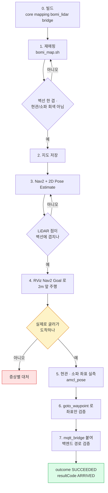

# 현관 waypoint 실측과 Nav2 주행 확인 (실기 절차)

로봇 앞에서 명령을 찾느라 시간을 쓰지 않도록, 순서대로 복사해 쓰는 시트다.
목표는 하나다 — **재매핑 → 현관 좌표 실측 → 그 좌표로 실제 주행.**

각 단계에 성공 판정 기준이 있다. 판정을 통과하지 못하면 다음 단계로 넘어가지
않는다. 앞 단계가 틀린 채로 진행하면 마지막에 실패하고 원인을 찾느라 시간을
날린다.

> 지도를 다시 그려야 하면 0~7단계를. 주행만 이상하면 "증상별 대처"부터.



3~6단계를 한 번에 하는 스크립트가 있다 — `robot/scripts/bomi_goto.sh` 는 Nav2
기동부터 lifecycle 대기, 초기 위치 설정, 경로 사전 검사, `goto_waypoint` 까지
이어서 돌린다. 아래 손 절차는 그 스크립트가 무엇을 하는지 이해하고, 실패
지점을 하나씩 가를 때 쓴다.

전제: 로봇(Pico + X4-PRO LiDAR)과 조이스틱이 연결돼 있고, 시리얼 포트는
`/dev/ttyACM0`(Pico), `/dev/ttyUSB0`(LiDAR)이다. 다르면 각 명령의 포트 인자를
바꾼다.

## 접속과 화면

작업은 Jetson(`ssafy-desktop`, aarch64)에서 한다. 노트북에서 SSH로 붙는다.

```bash
ssh ssafy@192.168.30.30
```

RViz를 노트북 화면에 띄우려면 `-X`를 붙인다. Jetson이 렌더링하고 화면만
넘어온다 (소프트웨어 렌더링이라 느리지만 동작한다).

```bash
ssh -X ssafy@192.168.30.30
```

> DDS로 노트북에서 rviz2를 직접 돌리는 방식은 **안 된다.** Jetson → 노트북
> 방향이 Windows 방화벽에 막혀 있어(ping 100% 손실) 토픽이 보이지 않는다.
> 굳이 그 방식을 쓰려면 Windows에서 관리자 권한으로 인바운드 UDP
> 7400–7500을 열고, `~/bomi_fastdds_wsl.xml`의 IP를 현재 네트워크 값으로
> 맞춰야 한다. 로봇 IP 는 장소마다 바뀐다 — 저장소 기본값은
> `robot/scripts/lib/remote.sh` 의 별칭 `ssafy`(= `192.168.30.30`)다.

```bash
# 모든 터미널에서 먼저 실행
export WS=~/S15P11E102/robot/ros2_ws
cd $WS
source /opt/ros/humble/setup.bash
source install/setup.bash
```

> 젯슨에 워크스페이스가 여럿 있을 수 있다. 이 절차는 `~/S15P11E102` 에서
> 한다. 시작 전에 `git -C ~/S15P11E102 status` 로 어느 브랜치인지 확인하고,
> 다른 디렉터리는 팀원 작업일 수 있으니 건드리지 않는다.

---

## 0. 빌드

```bash
cd $WS
colcon build --packages-select core mapping bomi_lidar bridge
source install/setup.bash
```

**판정:** 에러 없이 완료. 실패하면 여기서 멈춘다.

> Jetson에는 `robot_localization`이 이미 설치돼 있다(확인함). `use_ekf`
> 기본값(true)을 그대로 쓴다. 개발 PC(WSL)에는 없으므로 거기서 Nav2를 돌리려면
> `sudo apt install ros-humble-robot-localization` 또는 `use_ekf:=false`가
> 필요하다.

**시작 전 확인 — 시리얼 포트를 다른 사람이 쓰고 있지 않은지:**

```bash
pgrep -a -f "pico_driver|slam_toolbox|nav2"
```

`pico_driver`가 떠 있으면 `/dev/ttyACM0`이 점유된 상태다. 그대로 매핑을
시작하면 포트 충돌로 실패한다. 팀원에게 확인한 뒤 종료하고 시작한다.

---

## 1. 재매핑

> ⚠️ **이 단계에서 반드시 지킬 것 두 가지.** 2026-08-07 의 `bomi_real_11` 이
> 여기서 실패했다.
>
> 1. **로봇을 충전소에 도킹한 상태로 시작한다.** 그러면 지도 원점이 곧
>    충전소가 되어 `charging` 웨이포인트 `(0, 0, 0)`이 자동으로 맞는다.
> 2. **현관과 소파를 모두 스캔에 포함시킨다.** `bomi_real_11`은 현관 방향을
>    안 찍어서 `entrance`가 미탐색 영역이었고 `sofa`는 지도 밖이었다. 그
>    상태로는 Nav2가 목표를 거부해서 무슨 짓을 해도 주행이 안 된다.

```bash
bash robot/scripts/bomi_map.sh <지도이름>
```

이 스크립트가 LiDAR 실측 장착값(`0.135 / 0.0 / 0.466`)을 넘겨 매핑 스택을
띄우고, Enter 를 누르면 현관·출발 좌표를 읽어 `room_waypoints.yaml` 을
갱신한 다음 지도를 저장하고 `~/.bomi_demo_state` 에 기록까지 한다. 2·5단계를
함께 해 주므로 이 절차의 손 작업이 크게 줄어든다.

launch 를 직접 부를 이유가 있다면 장착값을 **반드시 함께** 넘긴다. 기본값은
셋 다 0 이고, 그 상태로 그린 지도는 주행에 못 쓴다.

```bash
ros2 launch core joystick_slam_robot.launch.py \
  pico_port:=/dev/ttyACM0 \
  lidar_port:=/dev/ttyUSB0 \
  laser_x:=0.135 laser_y:=0.0 laser_z:=0.466 \
  do_loop_closing:=true
```

WSL에서 RViz가 깨지면 앞에 `LIBGL_ALWAYS_SOFTWARE=1`을 붙인다.

조이스틱으로 **천천히** 공간을 돈다. 빠르면 벽선이 두 겹으로 찍힌다.

**판정:** RViz 지도에서
- 벽선이 한 겹으로 나온다 (두 겹이면 더 천천히 다시)
- **현관 쪽이 회색(미탐색)이 아니다**
- **소파 쪽도 회색이 아니다**

이 세 개를 눈으로 확인한 다음 저장한다.

---

## 2. 지도 저장

```bash
cd $WS
ros2 run nav2_map_server map_saver_cli -f src/mapping/maps/bomi_real_<다음번호>
```

기존 지도는 덮지 말고 새 이름으로 남긴다 (비교용).

```bash
colcon build --packages-select mapping && source install/setup.bash
```

**판정:** `src/mapping/maps/bomi_real_<다음번호>.pgm`과 `.yaml`이 생겼다.

---

## 3. Nav2 실행과 위치 잡기

1단계 launch를 끄고 실행한다.

```bash
ros2 launch core bomi_navigation_real.launch.py \
  map:=$WS/install/mapping/share/mapping/maps/bomi_real_<다음번호>.yaml \
  pico_port:=/dev/ttyACM0 \
  lidar_port:=/dev/ttyUSB0
```

`robot_localization`이 없으면 `use_ekf:=false`를 추가한다.

RViz가 뜨면 **초기 위치는 사람이 알려줘야 한다** (launch가 자동으로 넣지
않는다):

1. 로봇을 지도에 찍힌 실제 공간에 놓는다 (충전소 자리가 가장 쉽다)
2. RViz 상단 **"2D Pose Estimate"** 클릭
3. 지도에서 로봇이 있는 자리를 클릭하고, 로봇이 보는 방향으로 드래그

**판정:** **LiDAR 점이 지도의 벽선에 겹친다.** 이것이 유일한 기준이다.
어긋나면 2번을 다시 한다. 좁고 네모난 공간에서는 AMCL이 벽을 착각하므로,
구석이나 문 앞처럼 특징이 있는 위치에 로봇을 두고 다시 찍으면 잘 잡힌다.

RViz 없이 초기 위치를 넣어야 하면 `robot/scripts/lib/set_initpose.py` 를 쓴다.
`/initialpose` 를 TRANSIENT_LOCAL + RELIABLE QoS 로 8초간 반복 발행한다 —
평범한 `ros2 topic pub` 으로는 왜 안 잡히는지가 그 파일 docstring 에 있다.

---

## 4. 좌표 없이 주행부터 확인

RViz 상단 **"Nav2 Goal"** 클릭 → 2m 앞 아무 데나 찍는다. 코드는 필요 없다.

**판정:** 로봇이 실제로 굴러가서 도착한다.

여기가 진짜 관문이다. 통과하면 나머지는 거의 자동으로 된다. 안 되면 아래
"증상별 대처"를 본다.

주행이 아예 시작되지 않으면 원인이 "출발 지점이 막혔는지 / 목표가 막혔는지 /
둘 다 성한데 경로가 없는지" 중 어느 쪽인지부터 가른다.
`robot/scripts/lib/precheck_path.py` 가 실제 global costmap 위에서 출발셀 →
현관셀 BFS 를 돌려 "출발 막힘 / 목표 막힘 / 경로 없음"을 종료 코드 0·1·2 로
구분한다(`bomi_goto.sh` 가 이것을 쓴다). RViz 를 못 쓰는 상황이라면
`lib/costmap_snapshot.py` 로 코스트맵을 PNG 와 칸 통계로 떠서 본다.

---

## 5. 현관 좌표 실측

조이스틱으로 로봇을 **현관 앞에, 문을 바라보게** 세운다. 그 자리에서:

```bash
ros2 topic echo /amcl_pose --once
```

출력에서 `position.x`, `position.y`, `orientation.z`, `orientation.w`를 본다.
yaw는 다음으로 계산한다:

```bash
python3 -c "import math; z=<orientation.z>; w=<orientation.w>; print(2*math.atan2(z,w))"
```

손으로 옮겨 적다 부호를 틀리는 일이 잦다. `robot/scripts/lib/read_pose.py` 는
`map → base_link` TF 를 읽어 `"x y yaw"` 한 줄로 주므로 그쪽이 안전하다.

`src/core/config/room_waypoints.yaml`의 `entrance` 세 값을 교체한다:

```yaml
  - name: entrance
    x: <측정한 x>
    y: <측정한 y>
    yaw: <계산한 yaw>
```

소파도 같은 방법으로 측정해 `sofa`를 교체한다 — `NAVIGATE(LIVING_ROOM)`이
`sofa`를 가리키므로 보미야 호출·복약·온습도 시나리오가 여기에 달려 있다.

> 현재 `sofa` 와 `charging` 의 좌표는 완전히 같다(x=-0.0754, y=1.2050,
> yaw=0.2072). `bomi_map.sh` 가 출발 좌표 하나로 두 블록을 함께 갱신하기
> 때문이며, 그래서 지금은 `LIVING_ROOM` 과 `DEFAULT` 가 같은 지점이다.
> 여기서 `sofa` 만 따로 측정해 넣으면 둘이 갈라지지만, **다음 재매핑에서
> `bomi_map.sh` 가 다시 하나로 합친다.** 갈라둔 값을 유지해야 한다면
> 재매핑 뒤에 `sofa` 를 매번 다시 넣어야 한다.

**판정:** 측정한 x, y가 지도의 주행 가능 영역 안이다. 벽에 너무 붙으면
`robot_radius`(0.20) 때문에 목표가 거부되므로, 벽에서 최소 25cm는 떨어진
지점을 고른다. 거부되면 더 띄우기 전에 RViz 의 코스트맵에서 그 셀이 실제로
막혀 있는지 먼저 본다 — `inflation_radius` 0.4 의 비용은 통행 불가가 아니다.

---

## 6. 좌표만 따로 확인 (MQTT·백엔드 없이)

`goto_waypoint`는 이름 하나로 그 지점까지 한 번만 주행한다. **Nav2만 떠 있으면
되고 브로커·백엔드·AI는 필요 없다.** 좌표가 틀린 것인지 배선이 틀린 것인지
분리해서 보는 것이 목적이다.

```bash
ros2 run core goto_waypoint --ros-args \
  -p waypoint_name:=entrance \
  -p waypoint_file:=$WS/src/core/config/room_waypoints.yaml
```

`waypoint_file`로 **소스 트리**를 가리키므로 좌표를 고칠 때마다 다시 빌드하지
않아도 된다. 좌표를 바꿔가며 반복할 때 이 인자를 꼭 쓴다.

같은 명령으로 다른 지점도 확인한다 (코드 수정 불필요):

```bash
ros2 run core goto_waypoint --ros-args -p waypoint_name:=charging  -p waypoint_file:=...
ros2 run core goto_waypoint --ros-args -p waypoint_name:=sofa      -p waypoint_file:=...
```

**판정:** `도착: entrance` 로그가 뜨고 프로세스가 스스로 끝난다. 종료 코드는
도착이면 `0`, 실패면 `1` 이므로 스크립트로 감쌀 때 그대로 쓸 수 있다.

실패하면 이유를 찍고 바로 끝난다 (재시도하지 않는다):

| 로그 | 뜻 |
|---|---|
| `Nav2가 목표를 거부했다...` | 좌표가 미탐색 영역이나 장애물 위다. 5단계로 |
| `주행 실패: status=...` | 목표는 받았으나 도달 못 함. 경로가 막혔거나 파라미터 문제 |
| `Nav2가 30초 안에 활성화되지...` | 3단계 launch가 안 떠 있다 |
| `'xxx' 웨이포인트가 없다. 사용 가능: ...` | 이름 오타 |

---

## 7. 백엔드 명령 경로 확인

6단계가 되면 브릿지를 붙인다.

```bash
ros2 launch bridge mqtt_bridge.launch.py \
  driver_type:=nav2 \
  broker_host:=<브로커 호스트> \
  waypoint_file:=$WS/src/core/config/room_waypoints.yaml
```

> `waypoint_file`을 주지 않으면 **설치본**(`share/core/config`)의 좌표를 읽는다.
> 소스 YAML만 고치고 빌드를 빼먹으면 옛 좌표로 주행하면서도 원인이 로그에
> 드러나지 않는다.

실브로커(`8883`)에 붙을 때는 `use_tls:=true ca_certs:=<경로>`가 함께 필요하다.
launch 의 `ca_certs` 기본값은 빈 문자열이라 반드시 줘야 하며, 젯슨에서는
`robot/scripts/lib/navigation_runtime.sh` 가 쓰는
`/etc/ssl/certs/ca-certificates.crt` 가 그 값이다.

백엔드가 `NAVIGATE(ENTRANCE)`를 발행하면 로봇이 현관으로 가고 결과가
`SUCCEEDED/ARRIVED`로 돌아온다.

**판정:** 결과 토픽에 `outcome: SUCCEEDED`, `resultCode: ARRIVED`.

---

## 증상별 대처

| 증상 | 먼저 볼 곳 |
|---|---|
| launch가 바로 죽음 (`robot_localization`) | 0단계 — 설치하거나 `use_ekf:=false` |
| LiDAR 점이 벽선과 안 겹침 | 3단계 2D Pose Estimate 다시. 특징 있는 위치에서 |
| 목표를 거부함 | 좌표가 미탐색/장애물. 5단계 재측정. 그다음 `robot_radius` |
| "경로를 찾을 수 없음" | `nav2_safe_params_real.yaml`의 `robot_radius`(현재 0.20, local·global 양쪽)와 `inflation_radius`(0.4)를 본다. 0.31 은 **시뮬레이션** launch 가 덮어쓰는 값이니 실기와 헷갈리지 않는다 |
| 아예 안 움직임 | `nav2_safe_params_real.yaml` 의 `FollowPath.max_vel_x`(0.10)·`max_vel_theta`(0.36)와 `velocity_smoother.max_velocity`. 실측 튜닝을 거친 값이니 바꾸기 전에 주석의 근거를 먼저 읽는다 |
| 빙글빙글 돌기만 함 | 3단계 정위치가 실은 안 된 것. 3단계로 복귀 |
| 좌표를 고쳤는데 옛 자리로 감 | `waypoint_file` 인자를 줬는지. 안 줬으면 `colcon build` |
| 지도가 두 겹으로 찍힘 | 1단계 더 천천히. 스캔 위생 노드가 걸러도 속도에는 한계 |
| 조이스틱이 안 먹음 | `pico_driver`가 죽었는지. 1단계가 `pico_driver OK (/cmd_vel 구독자 N)`를 찍어야 정상 |
| 같은 방이 조금씩 돌아간 채 여러 겹 | 아래 "회전마다 지도가 틀어질 때" |

---

## 회전마다 지도가 틀어질 때

증상: 같은 방이 10~20°씩 돌아간 채 여러 겹으로 쌓인다. 90° 오정합과는
다르다. **겹마다 벽선 자체는 깨끗하다** — 스캔은 멀쩡하고 자세 추정의
yaw만 누적으로 흐른다는 뜻이다. 직진에서는 드러나지 않고 회전에서만
드러난다.

yaw는 자이로 하나로만 만든다 (`core/config/ekf.yaml`의 `imu0_config`에서
`vyaw`만 true). 그래서 자이로 바이어스가 안 잡히면 yaw는 회전량이 아니라
**흐른 시간에 비례해** 어긋난다. 제자리 회전은 시간이 오래 걸리므로 가장
크게 드러난다.

순서대로 확인한다. 위에서 걸리면 아래는 볼 필요 없다.

1. **자이로 바이어스** — 매핑 스택이 뜬 상태에서 다른 터미널로:

   ```bash
   python3 ~/S15P11E102/robot/scripts/lib/check_yaw.py
   ```

   로봇을 가만히 둔 채 `정지 중 표류`를 30초 본다. 0.5 °/분 미만이면
   정상이다. 그보다 크면 바이어스를 잘못 잡은 것이므로, **로봇을 완전히
   세운 채** 매핑 스택을 다시 띄운다. 기동 중에 로봇이 움직이면 바이어스
   추정이 틀어진다.

2. **주행 중 표류 (바닥 재질이 바뀌었다면 여기)** — 회전 없이 직진으로만
   2 m 갔다가 멈춘다. `누적 회전`이 2° 이내로 유지돼야 한다.

   직진만 했는데 yaw가 흐르면 바닥 진동이 만든 바이어스이거나 자이로 축이
   기울어 장착된 것이다. 자이로는 각속도를 직접 재므로 바퀴가 미끄러져도
   yaw는 안 틀리지만(그래서 스키드 스티어에서 yaw를 자이로로 만든다),
   진동은 MEMS 자이로의 바이어스를 실제로 밀어낸다. **1번(정지 표류)으로는
   안 걸러진다** — 주행 중에만 나타나기 때문이다.

   바퀴 미끄러짐은 엔코더 직진거리(x·y)만 오염시키므로, 지도가 *돌아가서*
   겹치면 미끄러짐이 아니고 *밀려서* 겹치면 미끄러짐이다.

3. **자이로 스케일** — 조이스틱으로 제자리 한 바퀴(360°)를 돌리고 멈춘 뒤
   `누적 회전`을 읽는다. 360 ± 5°면 정상이다. 340°나 385°처럼 일정 비율로
   어긋나면 스케일 오차이므로, SLAM 설정이 아니라 `pico_driver.yaml`의
   실측값을 먼저 고친다.

4. **SLAM 정합** — 1~3이 정상인데도 틀어지면 그때 SLAM을 본다.
   `do_loop_closing`이 누적 오차를 되돌리는 유일한 장치다. 파일을 고치고
   `colcon build`를 다시 하지 않아도 launch 인자로 바로 비교할 수 있다.

   `demo-map.sh` 는 **개발 PC(WSL)에서** 실행한다 — 최신 스크립트를 로봇에
   배포한 뒤 원격으로 매핑을 돌리고 RViz 를 이쪽 화면에 띄운다. 지금까지의
   명령처럼 젯슨 SSH 세션 안에서 실행하면 안 된다.

   ```bash
   # 개발 PC(WSL)에서
   robot/scripts/demo-map.sh bomi_demo do_loop_closing:=false
   robot/scripts/demo-map.sh bomi_demo use_scan_matching:=false
   ```

   젯슨에 이미 들어와 있다면 같은 인자를 `bomi_map.sh` 에 그대로 준다.

   ```bash
   bash robot/scripts/bomi_map.sh bomi_demo do_loop_closing:=false
   ```

   `do_loop_closing`은 켜고 쓰는 것을 권한다. 껐을 때 위 증상이 났고, 끈
   이유였던 "거의 정사각형이라 90° 후보가 채택된다"는 전제가 실측
   2.73 m x 2.21 m(비율 1.24)로 약해졌기 때문이다. 90° 겹침이 다시
   나오면 위 첫 줄로 즉시 되돌린다.

   ⚠️ 다만 **launch 의 기본값은 아직 `false`** 다
   (`joystick_slam_robot.launch.py`). 켜려면 매번 `do_loop_closing:=true`
   를 명시해야 한다. 이 권고가 확정되면 launch 기본값도 함께 바꾼다.

주행 습관도 영향이 크다. 스키드 스티어는 제자리 회전에서 바퀴가 옆으로
긁혀 오차가 가장 크므로, 급회전 대신 넓은 호를 그리며 돈다.

---

## 커밋할 것

- 새 지도: `src/mapping/maps/bomi_real_<번호>.{pgm,yaml}`
- 시연에 쓸 지도라면 `robot/scripts/demo_defaults.sh` 의 `MAP` 도 같은 번호로
- 실측 좌표: `src/core/config/room_waypoints.yaml`
- 튜닝한 파라미터: `src/core/config/nav2_safe_params_real.yaml`

세 개를 따로 커밋하면 나중에 어느 값이 왜 바뀌었는지 추적하기 쉽다.

---

## 참고

- 매핑 상세: `robot-joystick-slam.md`, `handheld-lidar-mapping.md`
- Nav2 문제 해결: `nav2-troubleshooting.md`
- 순찰(여러 지점 순회): `waypoint-patrol.md`
