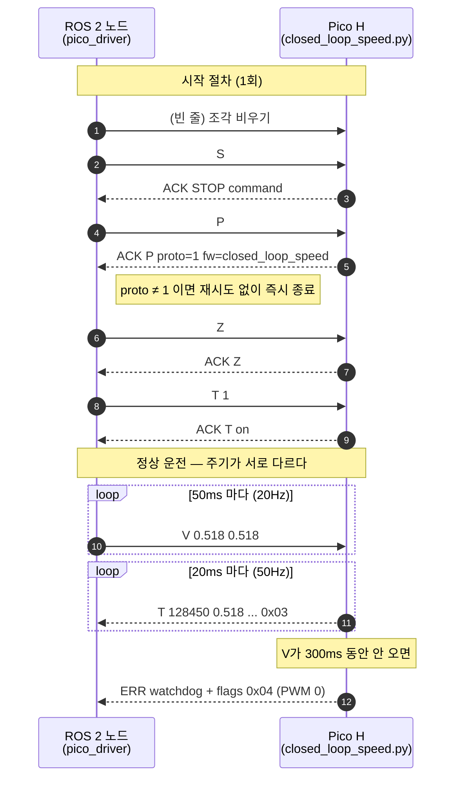

# Jetson↔Pico 시리얼 프로토콜

Jetson의 ROS 2 노드와 Pico H 펌웨어가 USB 시리얼로 주고받는 형식을 정한다.
양쪽은 이 문서만 근거로 각각 구현하며, 한쪽을 바꿀 때는 이 문서를 먼저 고친다.

> `## 9`의 잠정값이 검증되기 전에는 확정본이 아니다.
> 프로토콜 버전 `1`은 2026-08-04 이후 바뀌지 않았다. 필드를 늘릴 때만 올린다.

프로토콜 버전: `1`

```text
Nav2 · 사용자 추종
  ↓ /cmd_vel  (m/s, rad/s)
[ROS 2 노드]
  ↓ "V 0.518 0.518"       20Hz    목표 바퀴 속도 (rev/s)
  ↑ "T 128450 0.518 ..."  50Hz    실측 속도·엔코더·자이로
[Pico H]
  ↓ PWM + 방향
MDD10A → 모터 4개
```

여기서 **노드**는 Jetson에서 도는 ROS 2 프로그램(`robot/ros2_ws/src/core`)이고,
**텔레메트리**는 Pico가 주기적으로 올려보내는 상태 한 줄(`## 4`)이다.

명령 주기와 텔레메트리 주기는 서로 다르다. 이 문서에서 가장 자주 틀리는 지점이라
한 장으로 못박는다.



## 1. 통로

| 항목 | 값 |
| --- | --- |
| 장치 | `/dev/ttyACM0` (`dialout` 그룹) |
| 방식 | USB CDC. 통신 속도(baud) 설정은 의미가 없다 |
| 글자 | ASCII |
| 줄 끝 | Pico→Jetson은 `\n`. Jetson→Pico는 `\n` 또는 `\r` |
| 빈 줄 | 무시한다 |

장치 이름 고정(`/dev/bomi-pico`)이 필요하면 `robot/scripts/99-bomi-devices.rules`를
쓴다. 그 파일의 VID/PID는 아직 예시값이므로 실기에서 `udevadm info`로 확인해
바꿔야 한다.

## 2. 줄 종류 구분

텔레메트리와 사람이 읽는 출력이 같은 통로로 나오므로, Pico가 보내는 모든 줄은
첫 낱말로 종류를 밝힌다.

| 첫 낱말 | 종류 | 노드가 하는 일 |
| --- | --- | --- |
| `T` | 텔레메트리. 필드 개수 고정 | 숫자를 뽑아 발행한다 |
| `ACK` | 명령을 받아들였다 | 기록한다 |
| `ERR` | 명령 거부 또는 오류 | 오류 로그로 남긴다. 현재 노드는 `ERR`만으로 정지시키지 않는다 — 정지는 워치독과 `cmd_vel_timeout_sec`이 담당한다 |
| `WARN` | 경고. 동작은 계속된다 | 기록한다 |
| `#` | 사람이 읽는 글. 배너, 도움말, 요약 | 버린다 |
| 그 외 | 규칙 위반 | 버리고 위반 횟수를 센다 |

`T`는 방향에 따라 뜻이 다르다. Jetson→Pico의 `T 1`은 명령이고, Pico→Jetson의
`T 128450 ...`은 텔레메트리다.

`WARN`이 나오는 자리는 세 곳이다 — 기동 시 IMU 미검출·초기화 실패, 주행 중 IMU
읽기 연속 실패, `D` 시연의 한 단계 시간 초과. 앞의 둘은 `flags`의 `0x02`가
내려가는 것과 짝이라 "경고지만 계속된다"로 넘길 신호가 아니다. 그 뒤로 `yaw`와
`rate`는 갱신되지 않는다.

## 3. 명령: Jetson → Pico

낱말은 공백 하나로 구분한다. 펌웨어는 줄 전체를 대문자로 바꿔 해석하므로
대소문자를 가리지 않지만, 로그를 눈으로 읽을 때 명령과 텔레메트리가 섞이지
않도록 **대문자로 보내는 것을 규약으로 한다.**

### 노드가 쓰는 명령

| 명령 | 인자 | 뜻 |
| --- | --- | --- |
| `V <좌> <우>` | rev/s, 각각 `-0.8`~`0.8` | 좌우 목표 속도. 보낼 때마다 워치독을 다시 감는다 |
| `S` | 없음 | 즉시 정지. 좌우 PWM을 0으로 |
| `T <0\|1>` | 0 또는 1 | 텔레메트리 끄기/켜기 |

`V`의 부호가 방향, 크기가 속도다. 좌우 부호가 반대면 제자리 회전이 된다.

### 사람이 쓰는 명령

실기에서 손으로 시험할 때만 쓴다. 노드는 보내지 않는다.

| 명령 | 인자 | 뜻 |
| --- | --- | --- |
| `F <속도>` | rev/s | 양쪽 같은 속도. 응답은 `ACK F`가 아니라 `V`와 같은 `ACK V <좌> <우> for <초>s`다 |
| `R <좌> <우> <초>` | rev/s, 초 | 지정 시간만 주행하고 자동 정지. 누적값을 리셋한다. 초는 `0` 초과 `20.0` 이하만 받는다 |
| `G <kp> <ki>` | 게인 | 속도 PI 게인 변경 |
| `Y <kp> <ki>` | 게인 | 방향 유지 PI 게인 변경. `0 0`이면 끈다 |
| `W` | 없음 | 엔코더 누적 카운트 1회 출력 |
| `C` | 없음 | 엔코더 누적 카운트를 0으로 |
| `Z` | 없음 | 주행 거리와 yaw를 0으로 |
| `E` | 없음 | 현재 상태 1회 출력 |
| `P` | 없음 | 프로토콜 버전과 펌웨어 이름 응답 |
| `H` | 없음 | 도움말 |
| `D` | 없음 | 시연 시퀀스 9단계 자동 주행(전진 1m → 정지 → 우 90° → … → 좌 360°). 아래 주의 참고 |

> ⚠️ `D`는 로봇을 **스스로 움직이게 한다.** 반드시 바퀴를 띄운 받침대 위에서만
> 쓴다. 또 `D`는 텔레메트리를 강제로 끄고(`telemetry_on = False`), 시연이 도는
> 동안에는 `S`·워치독·`R` 종료가 나와도 `ACK STOP`·`ERR watchdog`·RUN SUMMARY를
> 한 줄도 내지 않는다. 중단은 `S`(`# DEMO ABORTED` 뒤 정지)로 한다.

### 잘못된 명령

- 인자 개수가 안 맞으면 `ERR usage: ...`
- 숫자로 바꿀 수 없으면 `ERR`
- 목표 속도가 `±0.8`을 넘으면 `ERR`. 잘라내지 않고 거부한다
- 게인이 음수면 `ERR`

거부된 명령은 목표 속도를 바꾸지 않고 워치독도 다시 감기지 않는다.

## 4. 텔레메트리: Pico → Jetson

`T 1`인 동안 20ms(50Hz) 주기로 보낸다. 주행 여부와는 무관하지만, `D` 시연
명령은 `T 1` 상태여도 텔레메트리를 꺼 버린다. 시연이 끝나면 `T 1`을 다시
보낸다.

```text
T <ms> <l_tgt> <l_act> <r_tgt> <r_act> <lf> <lr> <rf> <rr> <l_pwm> <r_pwm> <yaw> <rate> <dist> <flags>
```

```text
T 128450 0.518 0.515 0.518 0.521 1937 1948 1935 1921 34.2 31.8 -1.24 -0.35 0.42 0x03
```

낱말 16개로 항상 고정한다. 필드를 늘리면 프로토콜 버전을 올린다. 이 규칙을
코드에서 강제하는 곳은 노드의 `core/pico_protocol.py` 상수
`TELEMETRY_WORD_COUNT = 16`이다 — 필드를 늘릴 때는 펌웨어·이 문서와 함께 그
상수도 고쳐야 한다.

| 자리 | 필드 | 단위 | 뜻 |
| --- | --- | --- | --- |
| 1 | `ms` | ms | Pico 기동 후 경과. 32비트에서 순환한다 |
| 2 | `l_tgt` | rev/s | 왼쪽 목표. 부호 있음 |
| 3 | `l_act` | rev/s | 왼쪽 실측. 부호 있음. 이상치 제거 후 |
| 4 | `r_tgt` | rev/s | 오른쪽 목표 |
| 5 | `r_act` | rev/s | 오른쪽 실측 |
| 6~9 | `lf` `lr` `rf` `rr` | 카운트 | 바퀴별 누적 엣지. 부호 있는 정수 |
| 10 | `l_pwm` | % | 왼쪽 출력. `0`~`70` |
| 11 | `r_pwm` | % | 오른쪽 출력 |
| 12 | `yaw` | deg | 자이로 적분 각도. 오른쪽 회전이 양수 |
| 13 | `rate` | deg/s | 자이로 z축 각속도 |
| 14 | `dist` | m | 누적 주행 거리. 후진하면 줄어든다 |
| 15 | `flags` | 16진수 | 아래 표 |

속도와 누적 카운트를 둘 다 싣는다. 속도는 그대로 쓰고, 줄이 유실된 구간은
카운트 차분으로 복구한다.

### 상태 플래그

| 비트 | 값 | 뜻 |
| --- | --- | --- |
| 0 | `0x01` | 주행 중 |
| 1 | `0x02` | IMU 정상 |
| 2 | `0x04` | 워치독으로 멈췄다 |
| 3 | `0x08` | PIO FIFO가 넘쳤다 |
| 4 | `0x10` | 이상치로 버린 엔코더 표본이 있다 |

`0x02`가 내려가면 `yaw`와 `rate`는 갱신되지 않는다. 노드는 자세를 믿지 않는다.

`0x08`과 `0x10`은 **읽으면서 지워지는 래치**다. 지난 텔레메트리 이후 있었던
일을 모아 한 줄에 실어 보내고 그 자리에서 지우므로, 다음 줄에서 사라지는 것이
정상이다. 로그에서 한 번만 찍혔다고 무시할 신호가 아니다.

## 5. 명령이 끊겼을 때

| 항목 | 값 |
| --- | --- |
| 노드의 `V` 전송 주기 | 50ms (20Hz) |
| 워치독 | 300ms (연속 5회 유실까지 견딘다 = 6주기) |
| 걸렸을 때 | 좌우 PWM 0, `flags` 비트 2, `ERR watchdog` 1회 |

명령을 텔레메트리보다 느리게 보내는 이유는 펌웨어가 메인 루프 한 바퀴에 문자
하나만 읽기 때문이다. `V` 한 줄이 18자쯤이라 50Hz로 올리면 펌웨어가 배출하는
속도를 넘어서고, 그때부터 USB 버퍼에 명령이 쌓여 조작 지연이 계속 누적된다.
읽기(50Hz)와 전송(20Hz)을 분리한 근거는 `core/config/pico_driver.yaml`의
`control_hz`·`command_hz` 주석에 있다.

Pico는 아래 모든 경우에 좌우 PWM을 0으로 만든다.

- 시작 직후, 정상 종료, 예외 종료, `Ctrl-C`
- 워치독 만료, `S` 명령
- `R` 명령의 지정 시간 경과

## 6. 시작과 종료 절차

```text
시작
1. /dev/ttyACM0 열기
2. 빈 줄 1개  이전에 끊긴 명령 조각을 흘려보낸다
3. S          먼저 안전 정지
4. P          → ACK P proto=1 fw=<이름>
              proto가 1이 아니면 노드를 오류로 종료한다
5. Z          누적값 초기화
6. T 1        텔레메트리 시작
7. 50ms 주기로 V 전송 시작

종료
1. S
2. T 0
3. 포트 닫기
```

핸드셰이크가 실패하면 노드는 1초 간격으로 5번까지 다시 시도한다. 다만 `P`의
프로토콜 버전이 다를 때만은 재시도 없이 즉시 오류로 끝낸다 — 버전 불일치는
기다린다고 낫지 않기 때문이다.

## 7. 펌웨어 자동 실행

노드는 포트를 열고 명령을 보낼 뿐 펌웨어를 실행시킬 수 없다. 전원을 넣으면
사람 개입 없이 제어 루프가 돌고 있어야 한다.

MicroPython은 `main.py`라는 이름의 파일만 부팅 때 자동 실행한다. 그런데
[`../pico/README.md`](../pico/README.md)의 세 절차는 모두 `closed_loop_speed.py`
이름 그대로 올린다 — 그 상태로는 전원을 넣어도 제어 루프가 돌지 않고,
`mpremote ... run` 으로 사람이 매번 띄워야 한다.

시연처럼 사람 개입 없이 살아 있어야 하는 자리에서는 플래시에 올릴 때 이름을
바꾼다.

    mpremote connect /dev/ttyACM0 cp closed_loop_speed.py :main.py

저장소의 파일 이름은 `closed_loop_speed.py` 그대로 둔다. 바꾸는 것은 Pico
플래시 안의 이름뿐이다.

## 8. 노드가 하는 변환

Pico는 바퀴 회전 속도(rev/s)로만 명령을 받는다. 로봇 좌표계의 속도를 좌우 바퀴
속도로 바꾸는 일은 노드가 한다.

```text
/cmd_vel (m/s, rad/s)
→ 좌우 바퀴 목표 속도 (m/s)
     왼쪽  = linear.x - angular.z × 0.278 ÷ 2      [m/s]
     오른쪽 = linear.x + angular.z × 0.278 ÷ 2      [m/s]
→ rev/s   ( ÷ 0.1929 m/rev )                       [rev/s]
→ V <좌> <우>
```

| 변환 | 값 |
| --- | --- |
| 바퀴 1회전 거리 | 0.1929 m (실측) |
| 좌우 바퀴 간 거리(기하) | 0.257 m (줄자 실측) |
| 회전 변환에 쓰는 유효 트레드 | 0.278 m (2026-08-06 자이로 실측). 스키드 스티어는 회전에서 바퀴가 옆으로 긁혀 기하값보다 크다 |
| 카운트 → 회전수 | 바퀴별 CPR로 나눈다. LF 979 / LR 984 / RF 979 / RR 970 (실측) |
| 최대 선속도 | 0.8 rev/s × 0.1929 = 약 0.154 m/s |
| 최대 각속도 | 0.308 ÷ 0.278 = 약 1.11 rad/s (63°/s) |

노드는 변환 결과가 `±0.8 rev/s`를 넘지 않게 **좌우를 같은 비율로 줄여** 제한한다.
각각 따로 잘라내면 좌우 비율이 바뀌어 곡률이 명령과 달라지기 때문이다. 즉 두
계층의 정책이 다르다 — 펌웨어는 범위를 넘은 `V`를 `ERR`로 거부하고, 노드는
거부당할 값을 애초에 만들지 않도록 비례 축소한다.

### 부호

Pico의 `yaw`와 `rate`는 오른쪽 회전이 양수다. ROS 2(REP-103)는 반시계 방향이
양수이므로 노드가 부호를 뒤집어 발행한다.

### 발행할 토픽

| 토픽 | 형식 | 만드는 방법 |
| --- | --- | --- |
| `/odom` | `nav_msgs/Odometry` | 위치(x·y)는 앞바퀴(`lf`, `rf`) 카운트 차분과 yaw로 적분한다. 속도(`twist.linear.x`)는 카운트가 아니라 `l_act`·`r_act`의 평균에서 만든다 |
| `/imu` | `sensor_msgs/Imu` | `rate`만 채운다 |

뒷바퀴 카운트(`lr`, `rr`)는 쓰지 않는다. 텔레메트리에는 그대로 실어 보내되 노드가
무시한다. 근거는 [`hardware-control.md`](hardware-control.md)에 있다.

Pico는 주행 거리(스칼라)와 yaw만 누적하고 x·y 좌표가 없다. 평면 좌표 적분은
노드가 한다.

`sensor_msgs/Imu`의 선가속도와 자세 4원수는 채울 수 없다. MPU-9250에는 가속도계와
자력계도 있지만 펌웨어가 자이로 z축만 읽기 때문이다. 해당 필드의 공분산은 사용
불가로 표시한다.

## 9. 잠정값

아래는 검증 상태를 적는다. 확정되면 이 문서를 고친다.

| 항목 | 상태 |
| --- | --- |
| 텔레메트리 50Hz | **실기로 확인**. 재부팅 직후 로그에서 텔레메트리 `ms` 필드가 20ms 간격으로 안정적으로 찍혔다. (펌웨어 `closed_loop_speed.py`의 "아직 실기에서 재보지 않았다" 주석은 이 확인 이전에 쓰인 것이라 아직 남아 있다 — 그 파일을 고칠 때 함께 지운다) |
| 워치독 300ms | 계산으로 잡은 값. 짧은 시험 주행에서는 오탐 정지가 없었지만, 장시간 전송에서도 그런지는 더 봐야 한다 |
| 유효 트레드 | **확정.** 2026-08-06 자이로 실측으로 0.278m를 얻어 `config/pico_driver.yaml`에 반영했다(좌우 ±0.352 rev/s 제자리 회전에서 28.0°/s 관측 → 2 × 0.352 × 0.1929 ÷ 0.489 = 0.278). 정지 후 관성으로 약 38° 더 도는 여분은 별개 항목으로 남아 있다 |
| 명령 종료 후 관성 회전 | 육안 관측(자이로 아님)에서 약 38°. 감속 제한으로 줄일지 아직 정하지 않았다 |

## 10. 부록: 프로토콜이 의존하는 펌웨어 값

출처는 `closed_loop_speed.py`다. 이 값이 바뀌면 프로토콜도 바뀐다.

| 항목 | 값 | 프로토콜에 미치는 영향 |
| --- | --- | --- |
| 제어 주기 | 20ms | 텔레메트리 주기의 기준. 명령(`V`) 주기는 이와 별개로 50ms다 (`## 5`) |
| 최대 목표 | 0.8 rev/s | `V` 인자 범위 |
| 최대 출력 | 70% | `l_pwm`·`r_pwm` 범위 |
| 자이로 | z축만, ±250°/s | `rate`·`yaw`의 단위와 `/imu`로 채울 수 있는 필드 |
