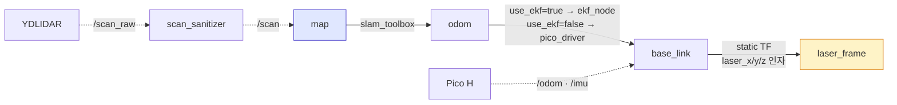

# 실물 로봇 조이스틱 구동과 지도 생성

이 문서는 Pico H, Xbox 계열 조이스틱, YDLIDAR X4-PRO를 연결한 실물 BOMI의
구동을 먼저 안전하게 확인하고, 같은 구성으로 SLAM 지도를 만드는 절차다.

> 시연 준비로 지도를 그릴 때는 `robot/scripts/bomi_map.sh` 를 쓴다. 이 문서는
> 그 스크립트가 무엇을 왜 하는지 이해하고, 처음 조립한 로봇을 안전하게
> 확인하기 위한 절차서다. launch 를 맨손으로 부르면 LiDAR 실측 장착값과
> 루프 클로저 같은 인자가 기본값(각각 0, 꺼짐)으로 돌아간다.

## 1. 최초 환경 준비

Ubuntu 22.04와 ROS 2 Humble 설치 후 워크스페이스에서 의존성을 설치하고
빌드한다. ROS 설치 자체는 [`ros2-humble-setup.md`](ros2-humble-setup.md)를
따른다.

```bash
cd ~/S15P11E102/robot/ros2_ws
source /opt/ros/humble/setup.bash
sudo rosdep init  # 이미 초기화했다면 생략
rosdep update
rosdep install --from-paths src --ignore-src -r -y
colcon build --symlink-install --packages-select core mapping bomi_lidar bridge
source install/setup.bash
```

`mapping` 은 `core` 를 의존하지 않으므로 `--packages-up-to mapping` 으로는
`core` 가 빌드되지 않는다. 그러면 이 문서가 §3 부터 쓰는 `ros2 launch core ...`
가 전부 "package not found" 로 죽는다. 그래서 네 패키지를 이름으로 지정한다.

새 터미널마다 마지막 두 `source` 명령을 다시 실행한다. 아래 명령에서
`mapping`, `core`, `bomi_lidar`가 보여야 한다.

```bash
ros2 pkg prefix mapping
ros2 pkg prefix core
ros2 pkg prefix bomi_lidar
```

## 2. 장치 이름과 권한 확인

모터 전원을 끈 상태에서 Pico, LiDAR, 조이스틱을 연결한다.

```bash
ls -l /dev/ttyACM* /dev/ttyUSB* /dev/input/js*
groups
```

기본값은 Pico `/dev/ttyACM0`, LiDAR `/dev/ttyUSB0`, 조이스틱
`/dev/input/js0`이다. 번호가 다르면 실제 경로를 launch 인자로 전달한다.
권한 오류가 나면 사용자를 `dialout`과 `input` 그룹에 추가한 뒤 로그아웃하고
다시 로그인한다.

```bash
sudo usermod -aG dialout,input "$USER"
```

여러 USB 장치를 반복 연결할 때 번호가 바뀌면 `/dev/serial/by-id/`의 고정
경로를 우선 사용한다.

## 3. 조이스틱 입력만 확인

아직 모터 전원을 켜지 않는다.

```bash
ros2 launch core joystick_teleop.launch.py cmd_vel_topic:=/cmd_vel_test
```

다른 터미널에서 다음을 확인한다.

```bash
ros2 topic hz /joy
ros2 topic echo /joy
ros2 topic echo /cmd_vel_test
```

현재 기본 매핑은 왼쪽 스틱 세로축이 `linear.x`, 가로축이 `angular.z`다.
스틱을 놓았을 때 두 값이 0이어야 한다. 축이 다르면
`core/config/xbox360_sim.yaml`의 축 번호를 `ros2 topic echo /joy` 결과에 맞춰
수정한다. 현재 설정(`scale_linear.x=0.10`, `scale_angular.yaw=0.35`)은 스틱을
대각선 끝까지 밀어도 바퀴 목표가 0.77 rev/s 로 한계 0.8 을 넘지 않도록 계산해
정한 값이다. 넘어서면 노드가 좌우를 같은 비율로 줄이므로(곡률은 보존되지만
크기가 달라진다) 명령한 만큼 안 나가는 것처럼 느껴진다. 지도 생성 때는 스틱을
조금만 움직여 저속으로 주행한다.

## 4. Pico와 바퀴 구동 확인

로봇을 받침대에 올려 네 바퀴가 바닥에서 떨어지고 주변에 사람과 케이블이 없는지
확인한다. 모터 전원을 켠 뒤 Pico만 실행한다.

```bash
ros2 launch core pico_driver.launch.py serial_port:=/dev/ttyACM0
```

다른 터미널에서 작은 명령을 한 번씩 보내 바퀴 방향을 확인한다. 각 명령은
`Ctrl+C`로 종료하면 timeout에 의해 정지해야 한다.

```bash
ros2 topic pub -r 10 /cmd_vel geometry_msgs/msg/Twist \
  '{linear: {x: 0.03}, angular: {z: 0.0}}'
ros2 topic pub -r 10 /cmd_vel geometry_msgs/msg/Twist \
  '{linear: {x: -0.03}, angular: {z: 0.0}}'
ros2 topic pub -r 10 /cmd_vel geometry_msgs/msg/Twist \
  '{linear: {x: 0.0}, angular: {z: 0.2}}'
```

전진에서 네 바퀴가 모두 차체 전진 방향이고, 회전에서는 좌우가 반대 방향이어야
한다. 명령 발행을 끊은 뒤 0.5초 안에 정지하지 않으면 실험을 중단한다 —
Pico 워치독이 300ms, 노드의 `cmd_vel_timeout_sec` 이 0.5초이므로 둘 중 하나만
살아 있어도 이 안에 멈춰야 한다. 안 멈추면 두 장치가 모두 죽은 것이다.

이상이 없을 때 통합 조이스틱 구동을 실행한다. 처음에는 계속 받침대 위에서
확인하고, 그 다음 넓고 평평한 바닥에서 최소 스틱 입력으로 확인한다.

```bash
ros2 launch core joystick_slam_robot.launch.py \
  use_rviz:=false \
  pico_port:=/dev/ttyACM0 \
  lidar_port:=/dev/ttyUSB0 \
  laser_x:=0.135 laser_y:=0.0 laser_z:=0.466
```

⚠️ `laser_*` 를 빼면 안 된다. launch 기본값은 셋 다 0 이라 LiDAR 가 로봇
원점에 붙어 있다고 가정한 지도가 나온다. 위 값은 현재 실측값이며, 단일
출처는 `robot/scripts/bomi_map.sh` 의 `LASER_X/Y/Z` 다 — 마운트를 바꿨다면
그 파일과 `bomi_navigation_real.launch.py` 의 기본값을 함께 고친다(두 값이
같은지 `test_lidar_mount_consistency.py` 가 검사한다).

## 5. 지도 전 센서와 odometry 확인

지도를 그리기 전에 아래 네 연결이 모두 연속적이어야 한다.

```text
map → odom → base_link → laser_frame
```

누가 각 변환을 발행하는지가 진단의 절반이다.



`use_ekf` 의 launch 기본값은 `true` 이고, 켜지면 `pico_driver` 의 `publish_tf`
가 자동으로 꺼진다. 두 노드가 같은 `odom → base_link` 를 발행하면 TF 가
충돌하기 때문이다. "TF 가 두 군데서 나온다/아예 안 나온다"는 대개 이 짝이
어긋난 것이다.

```bash
ros2 topic hz /scan
ros2 topic hz /odom
ros2 topic echo /imu --once
ros2 run tf2_ros tf2_echo odom base_link
ros2 run tf2_ros tf2_echo base_link laser_frame
```

| 확인 명령 | 정상 | 안 나오면 |
| --- | --- | --- |
| `ros2 topic hz /scan` | 주기가 일정 | LiDAR 드라이버 또는 `scan_sanitizer` 폐기 |
| `ros2 topic hz /odom` | 주기가 일정 | `pico_driver` 시리얼 |
| `ros2 topic echo /imu --once` | 값이 나옴 | Pico `flags` `0x02` 하강(IMU) |
| `tf2_echo odom base_link` | 끊기지 않음 | `use_ekf` 와 `publish_tf` 가 둘 다 켜졌거나 둘 다 꺼짐 |
| `tf2_echo base_link laser_frame` | 실측값과 일치 | `laser_*` 인자 누락 |

직선 1 m를 천천히 왕복해 RViz와 `/odom`의 거리·방향을 비교한다. 이어서 바닥에
각도를 표시하고 90°와 360° 제자리 회전을 반복해 odometry yaw 오차와 명령 종료
뒤 추가 회전을 기록한다. 직선 거리나 회전각이 반복적으로 틀리면 SLAM 설정을
바꾸기 전에 `pico_driver.yaml`의 실측값이 현재 로봇과 맞는지 확인한다.
유효 트레드는 2026-08-06 자이로 실측으로 0.278 m 로 확정돼 있으므로, 회전각이
일정 비율로 어긋난다면 그 값이 아니라 `gyro_scale` 을 먼저 의심한다
(`robot/scripts/lib/calibrate_gyro.py` 가 권장값을 계산해 준다. 1m 직선과 360°
회전 오차는 `robot/scripts/lib/check_yaw.py` 로 자동으로 잴 수 있다).

LiDAR 중심의 `base_link` 기준 전방(x), 좌측(y), 높이(z)를 m로 재고, 센서의
roll, pitch, yaw를 rad로 측정한다. launch 기본값 0은 "아직 안 쟀다"는 뜻이므로
그대로 쓰지 않는다. 현재 실측값은 x=0.135, y=0.0, z=0.466 이다(z 는 2026-08-10
마운트 변경 반영, x·y 는 2026-08-07 실측이라 마운트를 바꿨으면 다시 재야 한다).

```bash
ros2 launch core joystick_slam_robot.launch.py \
  pico_port:=/dev/ttyACM0 lidar_port:=/dev/ttyUSB0 \
  laser_x:=0.135 laser_y:=0.0 laser_z:=0.466 \
  laser_roll:=0.0 laser_pitch:=0.0 laser_yaw:=0.0
```

z 를 바꾸면 **지도를 반드시 다시 그려야 한다.** 지도는 그 높이의 단면이기
때문이다 — 24cm 에서 그린 지도는 소파 하단과 의자 다리를 담고, 46.6cm 에서
그린 지도는 좌석과 좌탁 상판을 담는다. 같은 방인데도 실루엣이 달라 서로
매칭되지 않고, AMCL 이 조용히 위치를 놓친다.

## 6. 지도 생성 주행

RViz Fixed Frame을 `map`으로 두고 LaserScan과 Map을 함께 표시한다.

- 사람이 적고 문이 움직이지 않는 시간에 진행한다.
- LiDAR 높이의 유리, 거울, 커튼과 반사 물체를 먼저 확인한다.
- 긴 직선만 계속 달리지 말고 모서리와 형태가 뚜렷한 구간을 포함한다.
- 급가속·급정지·제자리 급회전을 피하고 일정한 저속으로 움직인다.
- 한 구역을 작은 고리 형태로 돌고 출발점으로 돌아와 loop closure를 만든다.
- 벽이 두 겹이 되는 순간 계속 확장하지 말고 그 직전 원인을 먼저 확인한다.

좋지 않은 지도의 증상별 우선 점검 순서는 다음과 같다.

| 증상 | 먼저 확인할 항목 |
| --- | --- |
| 회전할수록 벽이 부채꼴·이중으로 보임 | 기동 시 자이로 영점 보정(1순위), `gyro_scale`, 추가 회전, `laser_yaw` |
| 공간 전체가 여러 장으로 돌아가 겹치고 지도 크기가 실제보다 커짐 | `/scan_raw`의 스캔당 점 개수와 각도 범위, `scan_sanitizer` 폐기 개수 |
| 직선 벽이 평행한 두 줄로 누적됨 | 바퀴 미끄러짐, odometry 거리, TF 시간 끊김 |
| 로봇을 돌리면 스캔이 벽에서 벗어남 | LiDAR x/y/yaw와 장착 강성 |
| 지도가 순간 이동하거나 찢어짐 | `/scan`·`/odom` 주기, TF 누락, USB 통신 |
| 특정 재질만 비거나 번짐 | 유리·거울·검은 물체와 LiDAR 반사 특성 |

yaw 는 전적으로 자이로에서 온다. 그래서 `pico_driver` 는 기동할 때마다 정지
상태에서 자이로 영점을 다시 잰다(10초 상한). 2026-08-07 실기에서 멈춰 있는
로봇의 자이로가 93°/분을 보고했고, 40초 회전이면 그것만으로 62°가 쌓였다.
**기동 중에 로봇을 움직이면 잘못된 영점이 박힌다** — 회전마다 지도가 겹치는
증상의 1순위 원인이다.

LiDAR 드라이버는 `/scan_raw`로 내고 `scan_sanitizer`가 성한 스캔만 `/scan`으로
넘긴다. 모터가 돌면 드라이버가 한 바퀴의 경계를 놓쳐 각도 범위가 360°를 넘는
스캔을 섞어 보내고, 그 겹친 각도만큼 벽이 엉뚱한 방향에 그려진다. "성하다"의
기준은 두 가지다 — 각도 범위가 360°에서 `span_tolerance_deg`(기본 5.0°) 이상
벗어나지 않을 것, 직전 스캔에서 `minimum_interval_sec`(기본 0.07초) 이상
지났을 것. 위생 노드는 버린 개수를 주기적으로 로그에 남기므로, 지도가 나빠지면
그 숫자를 먼저 본다.

원시 스캔이 실제로 흐트러지는지는 점 개수로 확인한다. 정지 중과 주행 중을 각각
본다. 주행 중에만 점 개수가 여러 값으로 갈라지면 이 현상이다.

```bash
ros2 topic echo /scan_raw --field ranges --once | head -1
ros2 topic hz /scan_raw
ros2 topic hz /scan
```

스캔 매칭과 루프 클로저는 launch 인자로 끄고 켤 수 있다. 좁은 공간에서 지도가
돌아가 겹칠 때 원인을 나누는 데 쓴다. 값의 뜻과 기본값 근거는
`mapping/config/slam_toolbox_real.yaml`에 있다.

```bash
ros2 launch core joystick_slam_robot.launch.py \
  use_scan_matching:=false do_loop_closing:=false
```

⚠️ `do_loop_closing` 의 launch 기본값은 **`false`** 다(정사각형에 가까운 방에서
90° 돌아간 후보가 잘못 채택되던 사고 때문). 루프 클로저는 누적 오차를 되돌리는
유일한 장치이므로, 일반적인 매핑에서는 켜고 시작한다.

```bash
ros2 launch core joystick_slam_robot.launch.py do_loop_closing:=true
```

켠 상태에서 같은 방이 90°씩 겹치면 그때만 다시 끈다.

## 7. 저장과 결과 보존

`bomi_map.sh` 로 매핑했다면 이 절의 일이 대부분 자동이다. 그 스크립트는
slam_toolbox 기동을 기다렸다가, Enter 를 누르면 `lib/read_pose.py` 로 현관과
출발 지점 좌표를 읽어 `room_waypoints.yaml` 의 세 블록을 갱신하고,
`map_saver_cli` 로 지도를 저장한 뒤 `~/.bomi_demo_state` 에 지도 이름과 출발
좌표를 남긴다. 좌표 기록이 빠지면 지도만 있고 주행은 못 한다. 현관과 출발점이
`MIN_START_GAP_M`(1.0 m) 보다 가까우면 경고한다 — 두 지점이 너무 붙으면 주행
계획이 서지 않는다.

아래는 손으로 저장할 때의 절차다. 기존 지도를 덮어쓰지 않도록 매번 새 이름으로
저장한다.

```bash
cd ~/S15P11E102/robot/ros2_ws
ros2 run nav2_map_server map_saver_cli \
  -f src/mapping/maps/bomi_real_01
```

PGM과 YAML이 함께 생기고 YAML의 `image:`가 생성한 PGM을 가리키는지 확인한다.

```bash
ls -lh src/mapping/maps/bomi_real_01.{pgm,yaml}
grep '^image:' src/mapping/maps/bomi_real_01.yaml
```

첫 결과에는 LiDAR 실측 TF, 1 m 직선 오차, 360° 회전 오차, `/scan`과 `/odom`
주기를 함께 기록한다. 이 측정값을 확보한 뒤에만 SLAM Toolbox의 해상도와 scan
matching/loop closure 파라미터를 한 항목씩 바꾸고 같은 경로로 비교한다.
