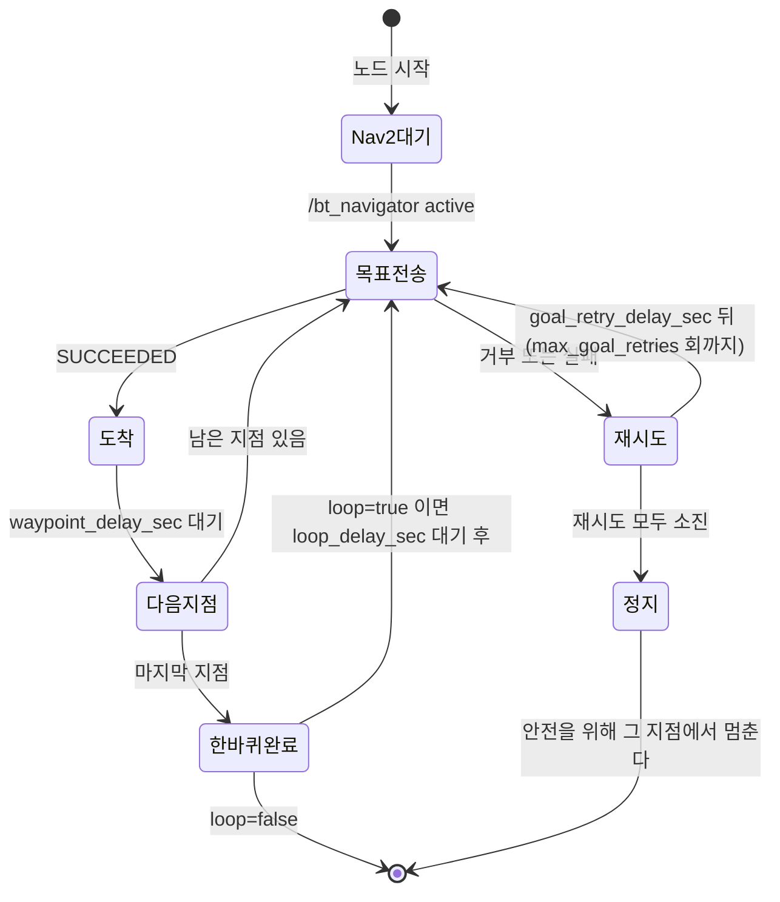

# SLAM 지도 기반 waypoint 순찰

`nav2_waypoint_patrol`은 SLAM으로 생성한 지도 위의 고정 지점들을 Nav2 목표로
순서대로 보내는 노드입니다. 이 노드는 모터를 직접 제어하지 않고, Nav2의
`navigate_to_pose` 액션 서버에 목표 pose만 전달합니다. 전역 경로는 NavFn
Planner의 A* 탐색으로 계산하며, 실제 `/cmd_vel` 생성과 장애물 회피는 Nav2가
담당합니다.

## waypoint 파일

waypoint 파일은 `ros2_ws/src/core/config/room_waypoints.yaml`이며 스키마는
다음과 같습니다.

```yaml
waypoints:                    # 필수. 순찰은 이 순서대로 돕니다
  - name: <이름>              # 없으면 waypoint_<번호>
    x: <m>                    # 필수
    y: <m>                    # 필수
    yaw: <rad>                # 필수
loop: true                    # 기본 true
waypoint_delay_sec: 5.0       # 기본 0.0
loop_delay_sec: 30.0          # 기본 0.0
max_goal_retries: 3           # 기본 3
goal_retry_delay_sec: 5.0     # 기본 5.0 (retries>0 이면 0 불가)
```

현재 등록된 이름은 `sofa`, `charging`, `entrance` 세 개입니다. 이 세 이름은
순찰용이 아니라 **시나리오 계약의 일부**입니다 — 백엔드의 `LIVING_ROOM` 이
`sofa`, `DEFAULT` 가 `charging`, `ENTRANCE` 가 `entrance` 를 가리킵니다.
좌표는 `robot/scripts/bomi_map.sh` 가 재매핑할 때 갱신하므로 손으로 고칠 때는
그쪽과 어긋나지 않는지 확인합니다.

좌표를 지도 위에서 클릭해 찍고 싶다면 `robot/tools/waypoint_editor`(Streamlit)
를 씁니다. 다만 운영 배포에서는 서버 저장이 막혀 있습니다
(`WAYPOINT_EDITOR_ALLOW_SERVER_WRITE=false`).

지점 하나만 빠르게 확인할 때는 순찰 대신 `goto_waypoint` 를 씁니다 — 이름 하나로
한 번만 주행하고, 도착이면 종료 코드 `0`, 실패면 `1` 을 줍니다.

Nav2 목표가 실패하거나 거부되면 같은 waypoint를 `goal_retry_delay_sec` 간격으로
`max_goal_retries`회까지 재시도하며, 모두 실패하면 안전을 위해 해당 지점에서
순찰을 정지합니다.



## 실행

실행 전에는 SLAM으로 만든 `map.yaml`, `map.pgm`을 Nav2에 로드하고, 로봇의
위치 추정과 `navigate_to_pose` 액션 서버가 준비되어 있어야 합니다. 노드는
`/bt_navigator/get_state` 서비스를 직접 물어 `active` 가 될 때까지 기다리므로,
준비 여부는 그 서비스로 확인할 수 있습니다.

이름이 비슷한 `person_search_patrol` 은 다른 노드입니다 — 순찰 중 사람을
찾으면 Nav2 목표를 취소하고 추종으로 넘어갑니다. 고정 지점을 순서대로만 도는
것은 이 문서의 `nav2_waypoint_patrol` 쪽입니다.

```bash
ros2 run core nav2_waypoint_patrol
```

Jetson 실기에서는 Nav2 시작, 초기 위치 입력, 순찰 노드 실행을 한 번에 처리하는
스크립트를 사용할 수 있습니다. 실행 중에는 다른 Nav2·MQTT 브리지·순찰
프로세스를 함께 띄우지 않습니다 — 하나의 `robotId` 에 명령 소비자가 둘이면
같은 명령을 두 번 실행하고, `/cmd_vel` 을 두 곳에서 쓰면 서로를 짓밟습니다.

```bash
cd ~/S15P11E102
bash robot/scripts/run-waypoint-patrol.sh
```

문 센서 이벤트를 EC2 백엔드와 MQTT로 받아 현관 이동 명령을 실행할 때는 다음
스크립트를 사용합니다. MQTT 비밀번호는 저장소에 기록하지 않고 현재 셸의
환경변수로 전달합니다.

```bash
cd ~/S15P11E102
export MQTT_PASSWORD='<bomi-jetson 비밀번호>'
bash robot/scripts/run-entrance-mqtt.sh
```

두 스크립트 모두 `~/.bomi_demo_state`의 지도와 초기 위치를 사용하고, 소스 트리의
`ros2_ws/src/core/config/room_waypoints.yaml`을 직접 읽습니다. Streamlit으로
웨이포인트를 저장한 뒤 다시 빌드할 필요는 없습니다. 상태 파일이 없으면
`robot/scripts/demo_defaults.sh` 의 값이 폴백으로 쓰입니다 — 그 파일은 재부팅과
브랜치 전환으로 사라지는 런타임 산출물이라 저장소 쪽 폴백이 따로 있습니다.
종료할 때는 `Ctrl+C`를 누르면 관련 주행 프로세스와 모터 명령을 정리합니다.

현관 도착 후 백엔드의 `START_CONVERSATION` 명령을 받아 실제 음성 대화까지
시험하려면 AI Chat의 `venv`와 `.env`를 준비한 뒤 통합 스크립트를 실행합니다.

```bash
cd ~/S15P11E102/robot/ai_chat
source .venv/bin/activate     # 젯슨은 .venv 다. 노트북에서 venv 를 썼다면 그 이름으로
python -m pip install -e '.[mqtt]'
deactivate
```

`run-homecoming-voice.sh` 의 기본값은 아직 `venv` 이므로, 젯슨에서는
`AI_CHAT_PYTHON` 을 함께 넘깁니다.

```bash
export AI_CHAT_PYTHON=~/S15P11E102/robot/ai_chat/.venv/bin/python
```

```bash
cd ~/S15P11E102
export MQTT_PASSWORD='<bomi-jetson 비밀번호>'
bash robot/scripts/run-homecoming-voice.sh
```

> 시연 전체를 준비할 때는 이 절 대신 [`demo-runbook.md`](demo-runbook.md) 를
> 봅니다. 그쪽이 시연 실행의 정본이며 `demo-start.sh` 하나로 이 스크립트들을
> 순서와 검증까지 묶어 돌립니다. 여기 남긴 개별 실행은 한 갈래만 떼어
> 확인할 때 씁니다.

이 스크립트는 AI Chat 설정과 오디오 구성을 먼저 검사하고, Nav2와 AI Chat을
기동한 다음 MQTT 주행 브리지를 실행합니다. AI Chat의 상세 로그는
`/tmp/bomi_ai_chat.log`에 기록됩니다.

다른 waypoint 파일을 사용하려면 다음처럼 파라미터를 넘깁니다.

```bash
ros2 run core nav2_waypoint_patrol --ros-args \
  -p waypoint_file:=/path/to/room_waypoints.yaml
```

## 시뮬레이션 없이 검증

시뮬레이션 없이 waypoint 파일 검증, 순찰 순서, 목표 재시도와 yaw 변환을
확인할 수 있습니다.

```bash
cd <저장소>/robot/ros2_ws
source /opt/ros/humble/setup.bash
rosdep install --from-paths src --ignore-src -r -y
colcon build --symlink-install --packages-select core
colcon test --packages-select core
colcon test-result --verbose
```

## TurtleBot3로 통합 확인

Gazebo Classic의 TurtleBot3 Waffle과 함께 순찰을 확인하는 launch가 있습니다.
[`turtlebot3-nav2-sim.md`](turtlebot3-nav2-sim.md)를 참고하세요.
