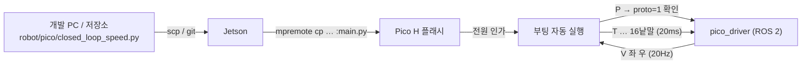

# Pico H 펌웨어

`closed_loop_speed.py`는 목표 회전 속도(rev/s)를 받아 엔코더 피드백으로 PWM을
맞추는 폐루프 속도 제어 펌웨어입니다. MicroPython으로 작성했습니다.

한 파일(1648줄)에 다음이 모두 들어 있습니다.

- 20ms 제어 루프와 좌우 독립 PI 제어 + 피드포워드
- PIO 엔코더 4채널 읽기와 이상치 필터
- IMU(자이로) 적분 기반 직진 방향 유지
- 시리얼 명령 해석(`V` 속도 지정, `T` 텔레메트리 on/off, `P` 프로토콜 확인,
  `S` 정지, `D` 시연 시퀀스 등)
- **워치독 300ms** — 명령이 끊기면 스스로 멈춥니다
- 종료 경로 어디서든 `finally` 로 모터 PWM 0

워치독 300ms 는 실물 안전 규율("명령 발행을 끊고 0.5초 안에 정지하지 않으면
실험 중단", 루트 `CLAUDE.md` §3)의 근거값입니다. 이 README 는 모터를 실제로
돌리는 파일을 다루므로, 바퀴를 바닥에서 띄운 상태로 시작하고
[`../docs/robot-joystick-slam.md`](../docs/robot-joystick-slam.md)의 안전 절차를
먼저 읽으십시오.

Jetson의 ROS 2 노드와 주고받는 형식은
[`../docs/pico-serial-protocol.md`](../docs/pico-serial-protocol.md)가 정합니다.
한쪽을 바꿀 때는 그 문서를 먼저 고칩니다.

Jetson의 `~/test/closed_loop_speed.py`에서 반입했습니다. 앞으로는 이 파일을
기준으로 하고 Jetson 사본은 쓰지 않습니다.

## 올리기

Jetson에서 `mpremote`로 올립니다. Pico 는 기본적으로 `/dev/ttyACM0` 으로 잡힙니다.
udev 규칙(`../scripts/99-bomi-devices.rules`)을 등록했다면 `/dev/bomi-pico` 도
같은 장치를 가리키므로 어느 쪽을 써도 됩니다 — 젯슨 systemd 유닛
(`iot/jetson/bomi-robot.service`)은 `/dev/bomi-pico` 를 씁니다.

> USB 를 여러 개 꽂았다면 `/dev/ttyACM0` 이 LiDAR 나 다른 장치일 수 있습니다.
> ACM 번호는 꽂는 순서에 따라 바뀌므로 `ls -l /dev/serial/by-id/` 로 실제 대상을
> 먼저 확인하십시오.

| 목적 | 명령 |
| --- | --- |
| 한 번만 실행 (플래시에 남기지 않음) | `mpremote connect /dev/ttyACM0 run closed_loop_speed.py` |
| 플래시에 올리되 자동 실행은 안 함 | `mpremote connect /dev/ttyACM0 cp closed_loop_speed.py :` |
| **전원을 넣으면 자동 실행되게 올리기** | `mpremote connect /dev/ttyACM0 cp closed_loop_speed.py :main.py` |
| 시리얼 콘솔 열기 | `mpremote connect /dev/ttyACM0 repl` |

MicroPython 은 **`main.py` 라는 이름의 파일만** 부팅 때 자동 실행합니다. 젯슨의
ROS 2 노드는 포트를 열고 명령을 보낼 뿐 펌웨어를 실행시킬 수 없으므로,
사람 개입 없이 살아 있어야 하는 실기·시연에서는 반드시 `:main.py` 로 올려야
합니다([`../docs/pico-serial-protocol.md`](../docs/pico-serial-protocol.md) §7).

원본 이름으로도 함께 두고 싶으면 두 번 올립니다 — 그때는 **두 파일이 같은
내용인지** 확인하십시오. 갈라지면 어느 쪽이 도는지 알 수 없습니다. 저장소의
파일 이름은 `closed_loop_speed.py` 그대로 둡니다. 바꾸는 것은 Pico 플래시 안의
이름뿐입니다.

`run`은 RAM에서 실행하므로 `mpremote`를 끝내면 프로그램도 끝납니다.

플래시에 같은 이름의 파일이 있으면 `cp`는 그대로 덮어씁니다. 이전 시험에서 올린
파일이 남아 있을 수 있으니 확인하고 필요하면 백업합니다.

## 올린 뒤 확인

업로드 성공과 동작 성공은 다릅니다. `repl` 에서 두 줄을 확인합니다.

| 보낼 것 | 기대 응답 |
| --- | --- |
| `P` | `ACK P proto=1 fw=closed_loop_speed` |
| `T 1` | 텔레메트리 16낱말 줄이 흐르기 시작 |

`P` 를 먼저 보는 이유는 `pico_driver`(ROS 2)가 시작할 때 `proto=1` 이 아니면
`RuntimeError` 로 죽고, **이 오류만은 재시도하지 않기** 때문입니다. 펌웨어를
올린 뒤 첫 확인 명령이어야 합니다.

> `D`(시연 시퀀스) 명령은 텔레메트리를 **강제로 끕니다.** 시연 중 텔레메트리가
> 끊기는 것을 모르면 "펌웨어가 죽었다"고 오판하게 됩니다. 다시 켜려면 `T 1`.

