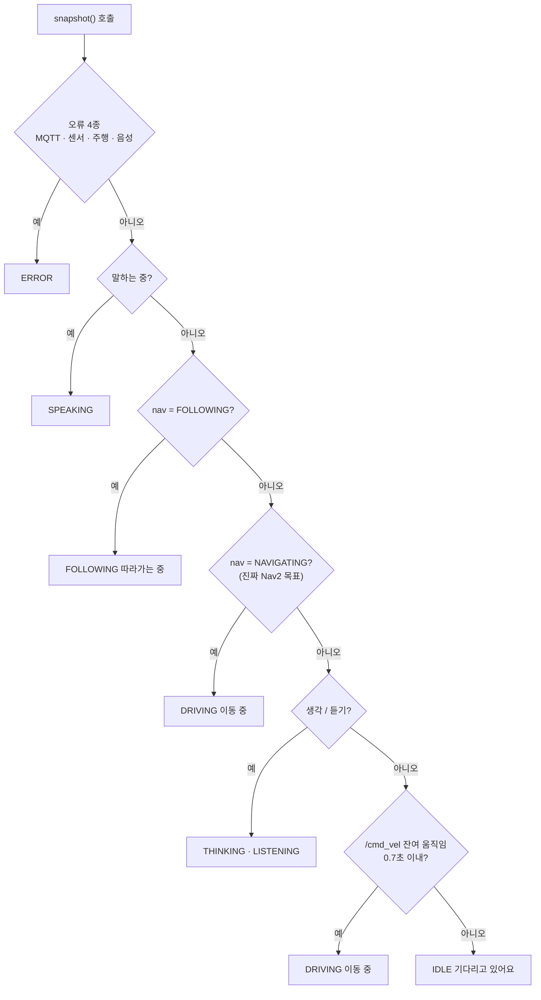

# BOMI LCD 상태 화면

PySide6 전체 화면 UI가 ROS 2 토픽과 AI Chat 상태 파일을 읽어 로봇이 지금 무엇을
하는지 한 문장으로 보여 줍니다.

눈·입 같은 표정은 **그리지 않습니다.** 작은 LCD 에서는 표정보다 글자가 훨씬 빨리
읽히고, 시연에서 사람이 알고 싶은 것은 "로봇이 지금 무엇을 하는가" 하나이기
때문입니다. 대신 끝을 기다리는 상태(듣기·생각·발화·이동·추종)에는 움직이는 점
다섯 개를 붙여 "멈춘 것"과 "진행 중인 것"을 구분합니다. 이 설계 근거는
`bomi_display/face_widget.py` 첫머리 주석에 더 자세히 남아 있습니다.

화면 상태는 `FaceState` 7개입니다 — 대기(IDLE)·주행(DRIVING)·추종(FOLLOWING)·
듣기(LISTENING)·생각(THINKING)·발화(SPEAKING)·오류(ERROR).

## 표시 우선순위

위에서부터 먼저 검사하고, 가장 먼저 걸리는 것을 화면에 띄웁니다
(`bomi_display/state.py` 의 `snapshot`).

| 순위 | 조건 | 화면 |
| --- | --- | --- |
| 1 | `/bomi/mqtt_connected` = false | 오류 · "연결 오류" |
| 2 | 센서 생존 신호 만료 | 오류 · "센서 확인" |
| 3 | `nav_status` ∈ FAILED / ABORTED / ERROR | 오류 · "주행 오류" |
| 4 | `tts_status` ∈ FAILED / ERROR | 오류 · "음성 오류" |
| 5 | `tts_status` ∈ SPEAKING / PLAYING | 발화 · "말하는 중" |
| 6 | `nav_status` ∈ FOLLOWING / FOLLOW / TRACKING | 추종 · "따라가는 중" |
| 7 | `nav_status` ∈ NAVIGATING / DRIVING / MOVING / ACTIVE | 주행 · "이동 중" |
| 8 | `tts_status` ∈ THINKING / PROCESSING / GENERATING | 생각 · "생각하는 중" |
| 9 | `tts_status` ∈ LISTENING / RECOGNIZING | 듣기 · "듣고 있어요" |
| 10 | `/cmd_vel` 잔여 움직임 (0.7초 유지) | 주행 · "이동 중" |
| 11 | 그 외 | 대기 · "기다리고 있어요" |

**주행이 두 자리(7·10)로 갈라진 이유** — "보미야" 대본에서는 로봇이 굴러가는 동안
ai_chat 이 마이크를 열기 때문에, 예전 순서(대화 > 주행)에서는 다가오는 내내 화면에
"생각하는 중"이 떴습니다. 그렇다고 움직임을 무조건 위로 올리면 대화 중 추종의 미세
보정 때마다 "듣고 있어요"가 "이동 중"으로 덮입니다. 그래서 **진짜 Nav2 목표
수행(7)은 대화보다 위**, **`/cmd_vel`이 잠깐 움직인 것(10)은 대화보다 아래**로
갈랐습니다(2026-08-10, 회귀 테스트 `test/test_state.py`).



센서 만료 감시는 첫 생존 신호를 받은 뒤에야 켜집니다 — 발행자가 없어도 화면이
"센서 확인" 오류로 고착되지 않는 이유입니다. 기본 만료 시간은 3초이고
`--sensor-timeout 5.0` 처럼 바꿀 수 있습니다.

## 빠른 화면 테스트

Jetson의 Ubuntu 데스크톱 세션에서 실행합니다.

```bash
python3 -m pip install PySide6
cd ~/bomi/robot/ros2_ws/src/bomi_display
python3 -m bomi_display.face_display --demo
```

창 모드로 확인하려면 `--windowed`를 추가합니다. 종료는 `Esc` 대신 `Alt+F4`를 사용합니다
(`Esc` 키 처리는 구현돼 있지 않습니다).

> ⚠️ **알려진 결함: `--demo` 는 약 5초 뒤 `KeyError` 로 종료됩니다.**
> 데모 코드가 `FaceState` 7개를 순회하는데 문구 딕셔너리에는 6개(`FOLLOWING`
> 누락)만 있습니다(`bomi_display/face_display.py` 의 `_start_demo`). 세 번째
> 상태에서 터집니다. 화면 배치만 볼 목적이면 처음 2개 상태(약 5초)까지는
> 정상입니다. 실제 상태 표시를 확인하려면 아래 ROS 2 실행 + `ros2 topic pub`
> 예시를 쓰십시오. (정적 대조로 확인한 결함이며, 실기 재현은 아직 못 했습니다.)

## ROS 2 실행

```bash
cd ~/bomi/robot/ros2_ws
source /opt/ros/humble/setup.bash
colcon build --symlink-install --packages-select bomi_display
source install/setup.bash
ros2 launch bomi_display display.launch.py
```

> `display.launch.py` 는 인자를 하나도 선언하지 않으므로 `--ai-status-file` 등
> UI 인자를 넘길 수 없습니다. 그래서 실제 시연은 launch 가 아니라 `ros2 run` 을
> 씁니다(`robot/scripts/demo-start.sh`).
>
> ```bash
> env DISPLAY=:0 ros2 run bomi_display face_display \
>   --ai-status-file /tmp/bomi_ai_status
> ```

| 토픽 | 타입 | 입력 예시 | 저장소 안 발행자 |
| --- | --- | --- | --- |
| `/bomi/nav_status` | `std_msgs/String` | `IDLE`, `NAVIGATING` | 있음 — `bridge`(`mqtt_bridge_node`). **두 값만 보냅니다** |
| `/cmd_vel` | `geometry_msgs/Twist` | 실제 속도 명령이 있으면 `이동 중` | 있음 — Nav2 · `person_follower` · 조이스틱 |
| `/bomi/tts_status` | `std_msgs/String` | `IDLE`, `LISTENING`, `SPEAKING`, `FAILED` | 없음 — 아래 파일 경로로 대체 |
| `/bomi/mqtt_connected` | `std_msgs/Bool` | `true`, `false` | 없음 (수동 발행 전용) |
| `/bomi/sensor_heartbeat` | `std_msgs/Empty` | 센서 데이터 수신 때마다 발행 | 없음 (수동 발행 전용) |

`/bomi/nav_status` 발행자인 bridge 는 `NAVIGATING` 과 `IDLE` 두 값만 보냅니다
(`bridge/contract.py` 의 `NAV_STATE_*`). 따라서 우선순위 표의 3번(주행 오류)과
6번(추종)은 **현재 실기에서 발동하지 않습니다** — 코드는 있지만 그 값을 보내는
쪽이 없습니다.

대화 상태는 토픽이 아니라 **파일**로 옵니다. AI Chat 이 `/tmp/bomi_ai_status` 에
`LISTENING`/`THINKING`/`SPEAKING`/`IDLE` 을 쓰고, 이 노드가 mtime 이 바뀔 때만
읽습니다. `demo-start.sh` 로 실행하면 이 경로가 자동으로 연결됩니다.

테스트 발행 예시:

```bash
ros2 topic pub --once /bomi/nav_status std_msgs/msg/String "{data: NAVIGATING}"
ros2 topic pub --once /bomi/tts_status std_msgs/msg/String "{data: SPEAKING}"
ros2 topic pub --once /bomi/mqtt_connected std_msgs/msg/Bool "{data: false}"
ros2 topic pub --once /bomi/sensor_heartbeat std_msgs/msg/Empty "{}"
```

우선순위를 바꾸려면 `test/test_state.py` 를 먼저 보십시오 — 위 표의 순서를
고정하는 회귀 테스트가 그 파일에 있습니다.
