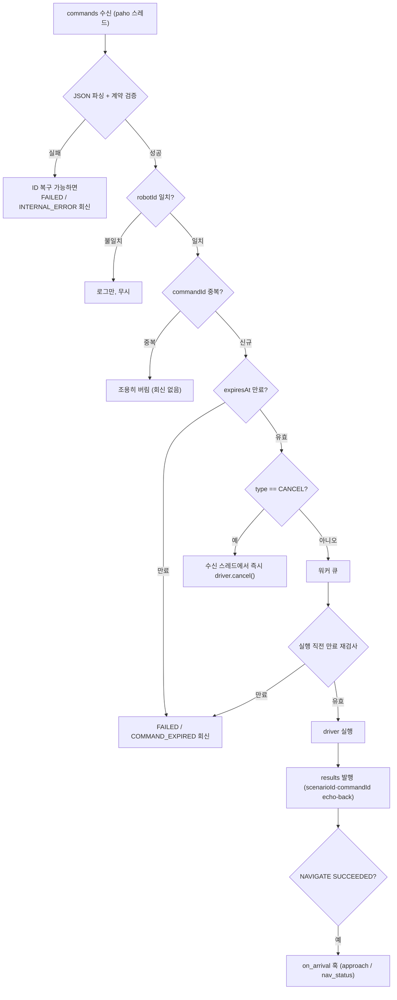

# bridge

백엔드 MQTT와 로봇 내부 동작을 잇는 통역 브릿지 패키지입니다. 백엔드가 발행하는
로봇 명령 5종(`NAVIGATE` `SPEAK` `CANCEL` `FOLLOW_START` `FOLLOW_STOP`)을 받아
실행하고, 그 결과를 다시 MQTT로 백엔드에 발행합니다.

계약 근거는 **`docs/mqtt/scenario-contract-v1.md`가 정본이고, 최종 권위는 백엔드
파서 코드(`MqttInboundMessageParser.java`)**입니다. 파서가 문서보다 좁은 곳이
있으므로 둘이 다르면 코드를 따릅니다(`bridge/contract.py` 첫머리 참고).
`topic-convention.md`는 토픽 이름 규칙만 담당합니다.

## 구조

```text
bridge/
├── bridge/
│   ├── contract.py                  # 토픽 규칙·명령 파싱/검증·결과/상태 envelope (순수 Python)
│   ├── mqtt_bridge.py               # 브릿지 코어: 명령→driver→결과 발행 (전송 무관)
│   ├── mqtt_client.py               # paho-mqtt 러너: 코어를 실제 브로커에 연결
│   ├── mqtt_bridge_node.py          # ROS 2 노드 래퍼 (파라미터 32개)
│   ├── robot_driver.py              # 주행 실행 경계 RobotDriver + MockRobotDriver + 드라이버 선택
│   ├── nav2_robot_driver.py         # 실제 Nav2 주행 (NavigateToPose / NavigateThroughPoses)
│   ├── timed_drive_driver.py        # 지도 없이 정해진 시간만 직진 (Nav2 우회)
│   ├── forward_test_robot_driver.py # 전용 토픽으로 저속 전진 (배선 확인)
│   ├── waypoint_lookup.py           # 목적지 이름 → room_waypoints.yaml 좌표 (순수 Python)
│   ├── zigzag.py                    # 현관 진입 지그재그 경유 좌표 생성 (순수 기하)
│   └── approach.py                  # 거실 도착 후 사람 추종을 짧게 켜는 제어기
├── launch/                          # mqtt_bridge.launch.py, backend_drive_test.launch.py
├── test/                            # 단위 테스트 18파일 153개 + 실브로커 E2E
└── docs/decisions/                  # 설계 결정 기록
```

계층: `mqtt_bridge_node`(ROS 2) → `mqtt_client`(paho) → `mqtt_bridge`(코어) →
`robot_driver`(주행). 코어와 계약은 ROS 2·MQTT에 의존하지 않아 브로커/ROS 없이도
단위 테스트됩니다.

## 흐름



만료 검사가 두 번 나오는 것은 실수가 아닙니다 — 큐에 넣기 전과 실행 직전에 한 번씩
봅니다. 그리고 중복 검사가 만료 검사보다 **먼저**이므로, 만료된 명령을 같은
`commandId` 로 재전송하면 회신조차 오지 않습니다. 재전송 정책을 세울 때 이 순서를
전제로 삼으십시오.

`CANCEL` 은 payload 를 읽지 않습니다. 계약 문서는 `{targetCommandId, reasonCode}`
를 정의하지만 브릿지는 무조건 현재 진행 중인 목표를 취소하므로, 백엔드가 특정
명령만 골라 취소할 수는 없습니다.

로봇 → 백엔드 토픽: 결과는 `bomi/v1/robot/{id}/results`. 인바운드/아웃바운드
모두 QoS 1, retain=false.

> `bomi/v1/robot/{id}/status` 는 계약과 발행 함수(`publish_rest_state`,
> `publish_navigation_status`)가 있지만 **운영 경로에서 부르는 곳이 없습니다.**
> 지금 이 토픽으로 나가는 메시지는 없고, 호출자는 `test/test_status.py` 뿐입니다.
> "이동 중" 표시는 MQTT 가 아니라 ROS 2 토픽 `/bomi/nav_status`
> (`std_msgs/String`, `NAVIGATING`/`IDLE`)로 나가며 LCD(`bomi_display`)가
> 그것을 구독합니다.

결과 조합은 코드가 내는 그대로 아래와 같습니다.

| 상황 | type | outcome | resultCode | reasonCode |
| --- | --- | --- | --- | --- |
| 도착 | NAVIGATION_RESULT | SUCCEEDED | ARRIVED | `null` |
| 주행 실패 | NAVIGATION_RESULT | FAILED | NOT_ARRIVED | 드라이버 값 (없으면 INTERNAL_ERROR) |
| 주행 취소 | NAVIGATION_RESULT | CANCELLED | NOT_ARRIVED | **SAFETY_STOP 고정** |
| 계약 밖 target | NAVIGATION_RESULT | FAILED | NOT_ARRIVED | UNKNOWN_TARGET |
| 만료 | (타입별) | FAILED | (타입별 부정형) | COMMAND_EXPIRED |
| FOLLOW ACK | FOLLOW_RESULT | SUCCEEDED | STARTED / STOPPED | `null` |

## 개발 환경 (WSL)

이 패키지는 **WSL Ubuntu 22.04 + ROS 2 Humble**에서 실행합니다. Windows에서 WSL
우분투 터미널을 열고 진행하세요. Windows의 `C:\...` 저장소는 WSL에서 `/mnt/c/...`
아래에 보입니다. 아래 예시는 저장소가 `C:\S15P11E102\robot`인 경우이며, 위치가
다르면 경로만 바꾸세요.

```bash
cd /mnt/c/S15P11E102/robot/ros2_ws
```

`ros2 run`/`ros2 launch`로 브릿지를 실행하려면 **최초 1회(그리고 코드가 바뀔
때마다)** 워크스페이스를 빌드해야 합니다.

```bash
colcon build --packages-select core bridge --symlink-install
```

`core`를 함께 빌드하는 것은 편의가 아니라 필수입니다. `package.xml`이
`<depend>core</depend>`를 선언하고, 좌표 로더가 `core` 패키지의 share 디렉터리
에서 `room_waypoints.yaml`을 찾습니다. `core`가 설치돼 있지 않으면 nav2
드라이버의 주행이 전부 실패합니다.

그리고 ROS 2를 쓰는 터미널마다 아래 두 줄을 먼저 실행합니다(새 터미널마다 반복).
`install/setup.bash`는 위 빌드 이후에 생깁니다.

```bash
cd /mnt/c/S15P11E102/robot/ros2_ws
source /opt/ros/humble/setup.bash
source install/setup.bash
```

`bridge` 패키지가 보이는지 확인합니다.

```bash
ros2 pkg list | grep bridge
```

> `Package 'bridge' not found`가 나오면 → 빌드를 안 했거나 `source
> install/setup.bash`를 안 한 것입니다. 위 빌드 + source 두 줄을 실행하세요.
> (순수 paho 러너 `python3 -m bridge.mqtt_client`는 빌드 없이 실행됩니다. 빌드·
> 소싱은 `ros2 run`/`ros2 launch`로 주행 드라이버를 실행할 때만 필요합니다.)

MQTT 테스트 도구는 한 번만 설치합니다(비밀번호 입력이 필요하면 입력).

```bash
sudo apt install -y mosquitto mosquitto-clients   # 브로커 + mosquitto_pub/sub
pip3 install 'paho-mqtt>=2.1,<3'
```

> ⚠️ **bridge 는 paho-mqtt 2.x 가 필요합니다.** `mqtt_client.py`가
> `CallbackAPIVersion.VERSION2`를 쓰므로 1.x 에서는 생성자부터 깨집니다.
> 루트 `CLAUDE.md` §6 의 "`paho-mqtt>=1.6,<2` 통일"은 **`robot/ai_chat`** 쪽
> 이야기입니다 — 두 프로세스가 서로 다른 메이저 버전을 요구하므로 같은
> 인터프리터를 공유하지 않습니다(ai_chat 은 자체 가상환경).
> `robot/scripts/preflight.sh`가 시스템 python3 과 ai_chat 가상환경의 버전을
> 각각 확인합니다.

## 1. 단위 테스트 (병합 전 확인)

pull 받은 뒤, WSL 터미널에서 **아래 한 덩어리**로 빌드 + 전체 단위 테스트를
실행합니다. 모두 통과하면 병합해도 됩니다. Nav2·로봇·브로커 없어도 됩니다.

```bash
cd /mnt/c/S15P11E102/robot/ros2_ws
source /opt/ros/humble/setup.bash
colcon build --packages-select core bridge --symlink-install
source install/setup.bash
colcon test --packages-select core bridge
colcon test-result --verbose
```

- Nav2 드라이버 테스트(`test_nav2_robot_driver.py`)는 액션 클라이언트를 Fake로
  대체하므로 실제 Nav2 서버 없이 위 명령으로 함께 검증됩니다.
- 실제 브로커가 필요한 E2E 테스트(`test_e2e_broker.py`)는 브로커가 없으면
  자동으로 건너뜁니다(skip).

## 2. 실제 백엔드와 통신 테스트 (WSL)

백엔드와 브릿지는 **같은 MQTT 브로커**를 통해 통신합니다(직접 연결이 아닙니다).
브릿지를 그 브로커에 붙이고, 백엔드가 명령을 보내면 브릿지가 결과를 돌려주는지
확인합니다. 통신 확인은 로봇이 움직일 필요가 없어 **mock 드라이버로 충분**합니다.

- 현재 개발 브로커: `i15e102.p.ssafy.io:8883` (TLS). 평문 `1883`은 방화벽으로
  막혀 있어 TLS(`8883`)로만 붙습니다.
- 팀원에게 다음 3가지를 받으세요. 하나라도 다르면 명령이 안 들어오거나 접속이
  거부됩니다.
  1. **robot_id** — 브릿지가 구독할 이름표(예: `bomi-AA001`). 백엔드가 보내는
     명령의 `robotId`와 정확히 같아야 하며, 다르면 브릿지가 명령을 조용히
     무시합니다.
  2. **접속 계정** — username과 password(또는 토큰 문자열). 이 브로커는 계정
     없이(익명) 접속하면 거부되거나 계속 끊겼다 재접속을 반복할 수 있습니다.
  3. 그 외 특이사항(포트 변경, 인증서 등)이 있는지.

WSL 터미널 1개로 충분합니다.

**브릿지를 개발 브로커에 붙이기 (mock, TLS)**

```bash
cd /mnt/c/S15P11E102/robot/ros2_ws/src/bridge
ROBOT_ID=<받은 robot_id> \
MQTT_BROKER_HOST=i15e102.p.ssafy.io MQTT_BROKER_PORT=8883 MQTT_TLS=true \
MQTT_USERNAME=<받은 계정> \
MQTT_PASSWORD='<받은 비밀번호/토큰>' \
python3 -m bridge.mqtt_client
```

> 비밀번호는 특수문자가 셸에 의해 깨질 수 있으니 **반드시 작은따옴표로
> 감싸세요.** 브로커가 익명 접속을 허용한다고 확인됐다면
> `MQTT_USERNAME`/`MQTT_PASSWORD` 줄은 빼도 됩니다.

정상이면 아래 로그가 **딱 한 번** 뜨고 그대로 유지됩니다.

```text
브로커 연결됨, 명령 구독: bomi/v1/robot/<robot_id>/commands
```

이 로그가 짧은 간격으로 **반복해서 여러 번** 뜨면 정상이 아닙니다. 흔한 원인은
같은 robot_id로 접속하는 클라이언트가 **동시에 둘 이상**이라 브로커가 서로 밀어내는
것입니다(내가 브릿지를 여러 터미널에 띄웠거나, 다른 팀원이 같은 robot_id로 이미
접속 중). 켜둔 브릿지를 하나만 남기고 다시 시도하세요. 그래도 반복되면 계정
(익명/비밀번호)이 맞는지 다시 확인하세요.

팀원에게 **백엔드에서 명령을 보내달라고 요청**하면, 정상 처리 시 이런 로그가
남습니다.

```text
결과 발행: type=NAVIGATION_RESULT, scenarioId=..., commandId=..., outcome=SUCCEEDED/ARRIVED/None
결과 발행: type=SPEAK_RESULT,      scenarioId=..., commandId=..., outcome=SUCCEEDED/SPOKEN/None
```

- 같은 `scenarioId`와 `commandId`가 그대로 돌아오면(echo-back, 둘 다 **최상위**
  필드) 계약이 맞다는 뜻입니다. (v1 정합 이전에는 `payload.scenarioId` +
  `payload.status` 형태였습니다 — 그 형식은 더 이상 나가지 않습니다.)
- **주의:** 지금은 mock 드라이버이므로 성공은 실제 이동·발화가 아니라 즉시
  성공을 흉내 낸 값입니다. 단, mock 도 v1 계약의 세 목적지(`ENTRANCE`/
  `LIVING_ROOM`/`DEFAULT`) 밖의 target 은 `FAILED`를 돌려줍니다 — 아무
  target 에나 성공하던 예전 동작이 아닙니다. 이 테스트가 확인하는 건
  "백엔드 ↔ 브릿지 통신 배선과 메시지 형식이 맞는가"이며, 실제 이동은
  아래 3번에서 확인합니다.

**ROS2 노드 경로(`ros2 launch bridge mqtt_bridge.launch.py`)로 실브로커에
붙이려면** `use_tls:=true ca_certs:=... tls_insecure:=...` 인자를 추가하세요.
과거에는 이 launch 경로가 TLS 파라미터를 아예 선언하지 않아 실브로커 접속이
원천적으로 불가능했습니다(위 `python3 -m bridge.mqtt_client` 경로만 가능).

보안 주의: 여기서 받은 계정/비밀번호는 로그인 정보입니다. Git 저장소나 공개
채팅에 올리지 말고, 실행 명령에도 직접 입력하지 말고 필요할 때마다 각자
터미널에서 입력하세요.

## 3. 주행 드라이버 (Mock / Nav2 / Timed / Forward-test)

주행 실행 드라이버는 ROS 2 노드의 `driver_type` 파라미터로 고릅니다.

| driver_type | 동작 |
| --- | --- |
| `mock` (기본값) | 실제 주행 없이 즉시 `ARRIVED` 반환. 통신·상태 검증용 |
| `nav2` | 목적지 이름을 좌표로 바꿔 Nav2 `NavigateToPose`로 실제 주행 |
| `timed` | 지도 없이 `/cmd_vel`로 정해진 시간(기본 2초)만 직진. Nav2 병목 우회용 임시 수단 |
| `forward_test` | 유효한 NAVIGATE마다 `/cmd_vel_backend_test`로 0.08 m/s를 2초간 발행한 뒤 정지 |

- `timed`와 `forward_test`는 **목적지를 구분하지 않습니다.** 계약 왕복·대화·DB
  종결 검증 전용이며, 주행 품질의 근거로 쓰면 안 됩니다. 둘의 차이는 출력
  토픽입니다 — `timed`는 `/cmd_vel`로 곧장, `forward_test`는 전용 토픽으로 보내
  `twist_mux` 우선순위 아래에 둡니다(조이스틱이 항상 이깁니다).

- 기본값은 `mock`입니다. 잘못된 값이면 조용히 넘어가지 않고 노드 시작이 실패합니다.
- `nav2`는 ROS 2 노드 실행 경로에서만 쓰이며, Nav2가 먼저 활성화돼 있어야 합니다.
- 좌표는 `core/config/room_waypoints.yaml`을 단일 출처로 씁니다. 목적지 3개가
  모두 매핑돼 있습니다.

  | 백엔드 target | 웨이포인트 이름 | 비고 |
  | --- | --- | --- |
  | `ENTRANCE` | `entrance` | 현관 |
  | `LIVING_ROOM` | `sofa` | 어르신이 앉는 소파 앞 |
  | `DEFAULT` | `charging` | 대기 위치. **현재 `sofa`와 좌표가 완전히 같습니다** |

  `sofa`와 `charging`이 같은 좌표인 것은 사고가 아닙니다 — `robot/scripts/bomi_map.sh`
  가 매핑 단계에서 출발 좌표 하나로 두 이름을 함께 갱신합니다. 시연 대본에서
  어르신이 소파에 앉으므로 "거실 도착"과 "대기 위치 복귀"가 같은 지점입니다.
- 도착 타임아웃은 `goal_timeout_seconds`(초, 기본 120)로 설정합니다. 이 값은
  액션 서버 대기·목표 접수·결과 대기 전체의 공통 마감시각입니다.

설계 근거는 `docs/decisions/0001-nav2-driver-owns-action-client.md`를 참고하세요.

### FOLLOW_START / FOLLOW_STOP (회전 탐색 배선)

`FOLLOW_*`는 "실패만 돌려주는 스텁"이 아닙니다. ROS 2 노드 경로에서
`search_enabled:=true`이면 `FOLLOW_START`가 `/wake_search/start`에
`std_msgs/Bool(True)`를 발행하고, **회신은 훅 실행보다 먼저** 나갑니다
(`SUCCEEDED` / `STARTED`). `FOLLOW_STOP`은 `False`를 발행하고 `STOPPED`로
답합니다. 회신을 먼저 내는 이유는 백엔드의 FOLLOW ACK 타임아웃이 10초인데
회전 탐색은 그보다 오래 걸릴 수 있기 때문입니다.

`FAILED` / `UNCHANGED` / `INTERNAL_ERROR`가 나오는 경우는 훅이 없는 실행뿐입니다
— 순수 paho 러너(`python3 -m bridge.mqtt_client`)이거나 `search_enabled=false`일 때.

| 파라미터 | 기본값 | 의미 |
| --- | --- | --- |
| `search_enabled` | `false` | 킬 스위치 |
| `search_start_topic` | `/wake_search/start` | 시작 신호를 보낼 토픽 |

> ⚠️ **`mqtt_bridge.launch.py`로는 이 두 파라미터를 넘길 수 없습니다.** launch
> 파일에 선언이 빠져 있습니다(노드가 선언하는 파라미터 32개 중 launch 인자로
> 노출된 것이 30개). 회귀 테스트 `test/test_launch_exposes_node_parameters.py`
> 가 바로 이 종류를 잡도록 만들어져 있고, 두 이름이 빠져 있으므로 그 테스트는
> 현재 실패합니다. 켜는 경로는
> `ros2 run bridge mqtt_bridge --ros-args -p search_enabled:=true` 이거나
> `core/launch/bomi_wake_search.launch.py` 입니다.

### 도착 후 사람 접근 (선택, 킬 스위치 — CLAUDE.md §3a)

보미야 호출로 거실 waypoint 에 도착한 뒤, 어르신 앞까지 마지막 몇 걸음을
좁히는 기능입니다. 어디서 멈출지는 `core/config/person_following.yaml` 의
`person_stop_distance_m`(현재 **0.6m**)이 정하며, 이 값은 bridge 가 아니라
`person_follower` 소관입니다(`bridge/approach.py` docstring 의 "약 0.5m" 는
코드 기본값 시절의 표기라 배포값과 어긋납니다). 기본값은 **꺼짐**입니다 —
V4 실기에서 처음 검증되므로, 불안정하면 파라미터 하나로 "거실 좌표 도착까지"의
검증된 동작으로 되돌릴 수 있어야 합니다.

| 파라미터 | 기본값 | 의미 |
| --- | --- | --- |
| `approach_enabled` | `false` | 킬 스위치. 꺼져 있으면 도착 훅이 아무 일도 하지 않습니다 |
| `approach_duration_seconds` | `15.0` | 추종을 켜 두는 시간 상한(초) |
| `approach_enable_topic` | `/person_following/enable` | `person_follower`(core) 를 켜고 끄는 `std_msgs/Bool` 토픽 |

`LIVING_ROOM` NAVIGATE 가 `SUCCEEDED`/`ARRIVED` 로 끝난 직후에만 발동합니다
(`ENTRANCE`·`DEFAULT` 는 대상이 아닙니다 — `bridge/approach.py` 참고).
`person_follower`(core) 는 이 스위치와 무관하게 항상 떠 있어야 하며, 접근
대본에서는 `output_topic:=/cmd_vel start_enabled:=false` 로 띄워
Nav2 유휴 시간에만 bridge 가 짧게 켭니다:

```bash
ros2 launch core person_following.launch.py \
  output_topic:=/cmd_vel start_enabled:=false

ros2 launch bridge mqtt_bridge.launch.py \
  driver_type:=nav2 approach_enabled:=true
```

`vision_udp_bridge`(core, UDP:5005 수신)와 `bomi_vision.udp_main`(ai_vision,
카메라 → UDP 송신)도 이 체인에 필요합니다 — 둘 다 별도 실행입니다.

### 시뮬레이션에서 실제 이동 확인 (선택, WSL)

로봇이 실제로 현관으로 가는지 보고 싶을 때만 진행합니다. 이 테스트는 **WSL 안의
로컬 평문 브로커(1883)** 로 하며, 명령은 `mosquitto_pub`으로 직접 발행합니다. 순찰
노드 `nav2_waypoint_patrol`과 동시에 실행하지 않습니다.

WSL 터미널 4개를 씁니다. ROS 터미널(2·3번)은 **위 "개발 환경"의 빌드(최초 1회)와
`source` 두 줄**을 먼저 실행해야 `ros2 launch`가 동작합니다.

```bash
# 터미널 1) 로컬 브로커
mosquitto

# 터미널 2) Nav2 스택 (지도·AMCL·Nav2·RViz, WSLg 필요)
ros2 launch core bomi_navigation_sim.launch.py

# 터미널 3) 브릿지(nav2) — 로컬 브로커로
ros2 launch bridge mqtt_bridge.launch.py driver_type:=nav2 broker_host:=localhost

# 터미널 4) 결과 구독 + 명령 발행
mosquitto_sub -h localhost -t 'bomi/v1/robot/robot-01/results' -v

# 다른 탭에서
mosquitto_pub -h localhost -t 'bomi/v1/robot/robot-01/commands' -m '{
  "commandId":"cmd-1","scenarioId":"s-1","robotId":"robot-01","type":"NAVIGATE",
  "occurredAt":"2026-08-03T10:00:00+09:00","expiresAt":"2026-08-03T10:02:00+09:00",
  "payload":{"target":"ENTRANCE"}}'
```

RViz에서 로봇이 `entrance`로 이동하고, `.../results`에 `payload.outcome`이
`SUCCEEDED`(성공, `resultCode: ARRIVED`) 또는 `FAILED`(`resultCode: NOT_ARRIVED`
+ `reasonCode`)로 발행되면 정상입니다.

## 4. Raspberry Pi → Backend → Robot 통신 주행 테스트

이 기능은 MQTT 명령 전달 경로와 실제 모터 연결만 확인하는 임시 테스트입니다.
Nav2나 목적지 좌표는 사용하지 않습니다. `ENTRANCE`, `DEFAULT`, `LIVING_ROOM`을
target으로 가진 NAVIGATE만 0.08 m/s로 2초간 전진하고 반드시 정지합니다.
SPEAK, CANCEL, FOLLOW_START, FOLLOW_STOP은 새 전진을 시작하지 않습니다.

테스트 launch는 MQTT 브릿지와 `twist_mux`를 실행하며, Pico 드라이버는 안전을
위해 자동 실행하지 않습니다.

```bash
ros2 launch bridge backend_drive_test.launch.py \
  robot_id:=robot-01 broker_host:=localhost broker_port:=1883
```

속도 명령을 먼저 확인합니다.

```bash
ros2 topic echo /cmd_vel_backend_test
ros2 topic echo /cmd_vel
```

다른 터미널에서 로컬 MQTT 명령을 보냅니다.

```bash
mosquitto_pub -h localhost -t 'bomi/v1/robot/robot-01/commands' -q 1 -m '{
  "commandId":"drive-test-1","scenarioId":"scenario-drive-test",
  "robotId":"robot-01","type":"NAVIGATE",
  "occurredAt":"2026-08-06T10:00:00+09:00",
  "expiresAt":"2099-12-31T23:59:59+09:00",
  "payload":{"target":"LIVING_ROOM"}}'
```

`linear.x=0.08`, `angular.z=0.0`이 약 10Hz로 2초간 보이고 마지막에 둘 다
0인 메시지가 나와야 합니다. 결과 토픽에는 `NAVIGATION_RESULT`가 최상위
`scenarioId`/`commandId` echo-back과 함께
`payload: {"outcome":"SUCCEEDED","resultCode":"ARRIVED","reasonCode":null}`
형태로 발행됩니다.

실차에서는 로봇 바퀴를 바닥에서 띄우고 위 토픽을 먼저 확인한 뒤에만 다음
드라이버를 별도 터미널에서 실행합니다.

```bash
ros2 launch core pico_driver.launch.py
```

조이스틱은 mux 우선순위가 더 높아 테스트 중에도 즉시 개입할 수 있습니다.
실차 테스트 중에는 Nav2, 사람 추종, 키보드 주행 등 다른 명령원을 함께 실행하지
않고 전방 공간과 물리적인 전원 차단 수단을 확보합니다.

## 범위

- 담당: 백엔드 MQTT ↔ 로봇 동작 통역, 계약 검증, 결과/상태 발행.
- 범위 밖: SLAM, 모터 드라이버, AI 비전. Nav2 자율주행 스택 자체는 `core`가
  소유하며, 이 패키지는 그 액션 서버에 목표만 보냅니다.
