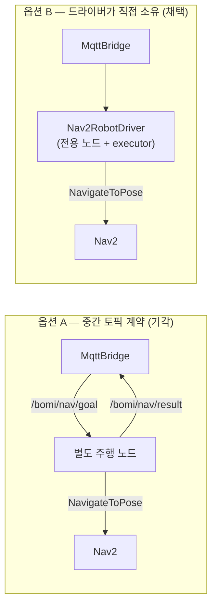

# 0001. Nav2RobotDriver가 NavigateToPose 액션 클라이언트를 직접 소유한다

- 상태: 채택 (Accepted) — 결정 2026-07-30, 구현 완료 확인 2026-08-15
- 관련: S15P11E102-164 (MQTT 브릿지), S15P11E102-79 (Nav2 waypoint 순찰)
- 구현: `bridge/nav2_robot_driver.py`

## 문제 상황

브릿지의 `RobotDriver` 실물 구현이 실제 로봇 주행을 어떻게 실행할지 결정해야 한다.
백엔드 명령(NAVIGATE target=ENTRANCE/DEFAULT)을 실제 Nav2 이동으로 옮기는 방법에
두 가지 선택지가 있었다.

## 검토한 선택지

- **옵션 A**: 브릿지가 `/bomi/nav/goal`(이름)을 발행하고 `/bomi/nav/result`를
  구독한다. 별도의 주행 노드(강현 소유)가 이 토픽을 받아 Nav2를 호출한다.
  두 노드 사이에 ROS 2 토픽 계약을 새로 합의해야 한다.
- **옵션 B**: 브릿지의 `Nav2RobotDriver`가 `NavigateToPose` 액션 클라이언트를
  직접 소유한다. 강현 `S15P11E102-79`의 검증된 패턴(`nav2_waypoint_patrol.py`,
  `waypoint_route.py`)을 이식하고, target 이름을 좌표로 변환해 Nav2에 바로 목표를
  보낸다. 별도 토픽 핸드셰이크가 없다.

## 결정

**옵션 B를 채택한다.**

## 이유

- 강현 코드에 `NavigateToPose` 액션 클라이언트, pose/quaternion 생성, YAML 좌표
  로딩이 이미 검증된 형태로 존재한다. 이식 대상이 명확하다.
- 중간 토픽 계약(A)을 새로 정의·유지하지 않아 결합면이 줄고, 브릿지가 도착 상태를
  직접 받으므로 결과 발행 흐름이 단순하다.
- 강현이 하드웨어 조립 중이라, 노드 간 토픽 합의를 기다리지 않고 독립적으로
  진행할 수 있다.

## 남는 조율 사항 (강현과)

- ENTRANCE/DEFAULT의 실제 좌표는 `room_waypoints.yaml`(강현 소유)이 기준이다.
  해당 값 또는 파일을 공유받아 이름→좌표 변환에 사용한다.
- 브릿지 드라이버와 강현 순찰 노드가 동시에 Nav2에 상반된 목표를 보내지 않도록
  실행 시점을 정리한다.

## 결정 당시(2026-07-30)의 범위

- 그때는 `MockRobotDriver`만 사용했다. 실물 `Nav2RobotDriver`는 하드웨어와 Nav2가
  준비된 시점에 이 결정에 따라 구현하기로 하고, 그전까지 빈 골격을 두지 않았다
  (로봇 `AGENTS.md`: 미래 기능 선구현 금지).
- 전환 지점은 브릿지에 주입하는 드라이버 한 줄(`MockRobotDriver()` →
  `Nav2RobotDriver()`)로 보았고, 브릿지 코어·계약 코드는 바뀌지 않을 것으로
  예상했다.

## 이후 경과 (2026-08-15 기준)

결정은 유효하다 — `Nav2RobotDriver`(577줄)가 전용 노드와 전용
`SingleThreadedExecutor`를 만들어 `NavigateToPose` 액션 클라이언트를 직접
소유한다. 옵션 A가 요구하던 중간 토픽 계약은 끝내 필요하지 않았다.

예상과 달라진 점 세 가지를 적어 둔다.

1. **드라이버는 두 종이 아니라 네 종이 됐다.** `mock` / `nav2` / `timed`(지도 없이
   시간 주행) / `forward_test`(전용 토픽 저속 전진). 전환은 "한 줄 교체"가 아니라
   ROS 2 파라미터 `driver_type` 이고, 팩터리 `create_driver`가 고른다. 잘못된 값이면
   조용히 mock 으로 떨어지지 않고 `ValueError`로 노드 시작이 실패한다
   (`bridge/robot_driver.py`).
2. **목적지는 3개다.** `ENTRANCE`→`entrance`, `LIVING_ROOM`→`sofa`,
   `DEFAULT`→`charging` (`bridge/waypoint_lookup.py`). 좌표 파일은 예상대로
   `room_waypoints.yaml`이며, 기본 경로는 `core` 패키지의 **share** 디렉터리다.
3. **"동시에 상반된 목표를 보내지 않도록 정리한다"는 조율 사항은 실행 규율로 남았다.**
   순찰 노드(`nav2_waypoint_patrol`)와 브릿지를 함께 띄우지 않는다는 규칙이며,
   `bridge/README.md` §3 시뮬레이션 절이 이를 명시한다.

옵션 B가 치른 대가도 함께 남긴다. 전용 노드와 전용 executor 를 따로 돌리므로
브릿지 프로세스 안에 rclpy 컨텍스트가 둘이고, `cancel()`은 spin 없이 취소 요청만
던지므로 취소가 즉시 반영되지 않을 수 있다. 다음 사람이 이 결정을 재검토할 때
필요한 정보다.
