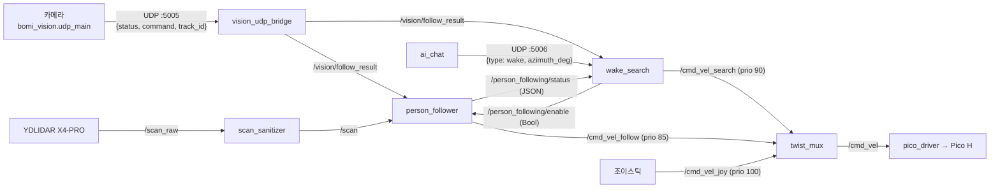

# core — BOMI 로봇의 ROS 2 주행·추종·탐색 패키지

로봇이 "움직이는" 일은 전부 이 패키지에 있다. 바퀴를 도는 시리얼 드라이버부터
사람을 따라가는 상태기계, "보미야" 호출 후 제자리에서 사람을 찾는 회전 탐색,
Nav2 웨이포인트 주행까지가 여기 소속이다. MQTT·백엔드 계약은 `bridge` 패키지,
카메라 추론은 `robot/ai_vision`, 대화는 `robot/ai_chat` 이 맡는다.

> ⚠️ **패키지 루트에 죽은 사본이 있다.** 2026-08-12 복구 머지(`4e7e990c`)로
> `src/core/` 직하에 `core/core/`·`core/config/` 와 **바이트 동일한 파일 29개**
> (py 19 + yaml 9 + `.gitignore`)가 들어왔다. 빌드·설치되는 것은 `setup.py` 의
> `find_packages()` 가 찾는 `core/core/` 와 `data_files` 가 설치하는
> `core/config/` 뿐이다.
> **고칠 파일은 언제나 `core/core/…` 와 `core/config/…` 다.**
> `src/core/person_follower.py`(루트 사본)를 고치면 아무 일도 일어나지 않는다.
> `git grep` 결과가 두 벌로 보이는 이유도 이것이다.

## 이 패키지에 무엇이 있나

`setup.py` 의 `console_scripts` 에 등록된 실행 파일 12개다.

| 실행 이름(`ros2 run core …`) | 하는 일 |
| --- | --- |
| `pico_driver` | `/cmd_vel` → Pico H 시리얼(`V <좌> <우>`), 텔레메트리 → `/odom`·`/imu`·TF |
| `person_follower` | 비전 JSON + LiDAR → 추종 속도. LiDAR 안전 정지 내장 |
| `wake_search` | "보미야" 후 제자리 회전으로 사람 찾기 |
| `person_search_patrol` | Nav2 웨이포인트를 돌며 사람 찾기 |
| `nav2_waypoint_patrol` | `room_waypoints.yaml` 전체 순찰 |
| `goto_waypoint` | 지정한 한 지점만 주행하고 종료(도착 0 / 실패 1) |
| `vision_udp_bridge` | UDP:5005 → `/vision/follow_result` 중계 |
| `scan_sanitizer` | 손상된 `LaserScan` 을 버리고 성한 것만 재발행 |
| `joy_cmd_filter` | 조이스틱 중립 구간에서 발행을 멈춰 twist_mux 자리를 비움 |
| `keyboard_teleop` | 터미널 키 입력 → `/cmd_vel` |
| `status_publisher` / `mock_motor_driver` | 하드웨어 없는 확인용 스텁 |

진입점 없는 순수 모듈: `search_policy` `follow_state_machine`
`person_following_controller` `person_search_state_machine` `pico_protocol`
`waypoint_route`. ROS 없이 단위 테스트된다.

## 노드 사이 배선



## 속도 명령 우선순위 — 안전에 직결된다

`/cmd_vel` 은 하나뿐이라 `twist_mux` 가 중재한다(`config/twist_mux.yaml`).
숫자가 큰 쪽이 이기고, `timeout`(모두 0.5초) 안에 새 메시지가 오지 않으면 그
입력은 자리를 비운다 — 명령원은 "안 보내는 것"만으로 양보한다.

| 우선순위 | 입력 | 토픽 |
| --- | --- | --- |
| 100 | 조이스틱 (사람의 수동 개입) | `/cmd_vel_joy` |
| 90 | `wake_search` 회전 탐색 | `/cmd_vel_search` |
| 85 | `person_follower` 사람 추종 | `/cmd_vel_follow` |
| 75 | 백엔드 배선 확인용 저속 전진 | `/cmd_vel_backend_test` |
| 50 | 키보드 주행 | `/cmd_vel_keyboard` |

> ⚠️ 탐색(90)이 추종(85)보다 위이므로 **탐색 회전 중에는 추종기의 LiDAR
> 긴급 정지가 이기지 않는다.** 이 순서는 2026-08-09 실기 사고(아직 사람을 못
> 찾은 추종기가 정지 0을 계속 내보내 탐색 회전을 덮었다)를 고치며 의도적으로
> 정한 것이고, 맞바꾼 대가를 `config/twist_mux.yaml` 주석이 기록하고 있다.

## 목적지 웨이포인트

`config/room_waypoints.yaml` 에 등록된 이름은 `sofa`·`charging`·`entrance`
셋뿐이고, **`sofa` 와 `charging` 의 좌표는 완전히 같다**(x=-0.0754, y=1.2050,
yaw=0.2072). 시연 대본에서 어르신이 소파에 앉으므로 "거실 도착"(`LIVING_ROOM`)과
"대기 위치 복귀"(`DEFAULT`)가 같은 지점이며, `robot/scripts/bomi_map.sh` 가
매핑할 때 출발 좌표 하나로 두 이름을 함께 갱신한다. 백엔드 목적지 이름
(`ENTRANCE`/`LIVING_ROOM`/`DEFAULT`)과의 대응은 `bridge/waypoint_lookup.py` 가
갖는다.

---

## 검증 절차서 — 비전 기반 사용자 추종과 실제 LiDAR 안전 정지 (2026-08-03 기록)

아래는 WSL2 + Gazebo 로봇 + 노트북 카메라 + 실물 X4 Pro LiDAR 조합으로
`person_follower` 를 확인했던 17단계 절차다. 실기에서 실제로 쓰인 기록이라
그대로 남긴다. 다만 **그때의 세계**를 전제한다는 점을 먼저 밝힌다 — 지금 실기
경로는 LiDAR 가 `/scan_raw` 로 내고 `scan_sanitizer` 가 성한 스캔만 `/scan` 으로
다시 내는 구조이고(`/scan_real` 을 기본값으로 쓰는 곳은
`launch/person_search_patrol.launch.py` 하나뿐이다), 실행 진입점도
`bomi_wake_search.launch.py` 한 줄로 바뀌었다.

실제 노트북 카메라의 사람 추적 결과와 실제 X4 Pro LiDAR 거리 정보를 이용해
Gazebo 로봇의 전진, 좌회전, 우회전, 정지를 확인한다.

```text
실제 노트북 카메라
→ AI 비전 모델
→ UDP
→ core/vision_udp_bridge
→ /vision/follow_result
→ person_follower
   + 실제 X4 Pro LiDAR /scan_real
→ /cmd_vel
→ Gazebo 로봇
```

> 실제 카메라와 실제 X4 Pro LiDAR를 사용한다.
> 최종 이동은 실제 모터가 아니라 Gazebo 로봇으로 확인한다.
> Gazebo의 가상 LiDAR는 `/scan`, 실제 X4 Pro는 `/scan_real`로 분리한다.

---

## 1. 실행 전 준비

필요한 것:

- Windows 11
- WSL2 Ubuntu 22.04
- ROS 2 Humble
- Git Bash
- X4 Pro LiDAR
- 노트북 카메라
- `usbipd-win`
- Gazebo 및 `ros_gz` 패키지

로컬에서 따로 만들어야 하는 파일은 **없다.** 예전에는 카메라 AI 송신기를
`bomi_ai_udp_live.py` 라는 이름으로 손수 만들었지만, 지금은 같은 일을 하는
코드가 저장소에 있다(§8 참고).

> 문서의 `Windows사용자이름`은 각 팀원의 실제 Windows 계정명으로 바꾼다.
> `본인_BUSID`도 `usbipd list`에서 확인한 값으로 바꾼다.

`vision_udp_bridge.py`를 로컬에 따로 만들지 않는다.

비전 UDP 브리지는 Robot 패키지에 포함된 실행 파일을 사용한다.

```bash
ros2 run core vision_udp_bridge
```

### 사용되는 비전 상태값

```text
not_detected
tracking
temporarily_lost
multiple_pending
multiple_persons
single_recovery
invalid
```

목록에 없는 문자열이 오면 `person_follower` 는 그것을 `invalid` 로 강등해
정지 취급한다(`core/core/follow_state_machine.py` 의 `_convert_status`). 즉
오타 난 status 는 무시되는 것이 아니라 **멈춤**으로 해석된다.

### 사용되는 명령값

```text
stop
turn_left
turn_right
move_forward
```

### 비전 JSON 필드

`person_follower` 가 읽는 필드는 셋뿐이다(`core/core/person_follower.py` 의
`_parse_vision_payload`).

```text
status   : AI 사람 추적 상태 (필수, 빈 문자열 불가)
command  : 추종 명령 (필수, 빈 문자열 불가)
track_id : 추적 대상 ID. 대상이 명확하지 않으면 null
```

비전 쪽은 `reason`(판단 이유)도 함께 보내지만 로봇은 **읽지 않는다.** 사람이
로그를 볼 때만 쓰는 필드이므로, 여기에 값을 넣어 로봇 동작을 바꾸려는 시도는
조용히 무시된다.

---

## 2. Robot 브랜치 이동 및 빌드

### 2-1. Robot 브랜치 확인

[Git Bash]

```bash
cd ~/Desktop/bomi-robot
git fetch origin
```

#### 현재 (2026-08-06 이후)

로봇 라인은 `main` 에 통합됐다. 별도 브랜치로 옮길 필요가 없다.

```bash
git switch main
git pull
git status
```

정상 예시:

```text
On branch main
Your branch is up to date with 'origin/main'.
nothing to commit, working tree clean
```

> 이 절은 원래 `robot/feat/S15P11E102-165-person-following` 과 `robot-develop`
> 로 옮기라고 안내했다. 두 브랜치는 2026-08-06 통합으로 `main` 에 들어갔으므로,
> 옛 안내를 그대로 따르면 없는 브랜치를 찾거나 낡은 코드를 받는다.

### 2-2. Robot 코드 빌드

[Ubuntu]

```bash
cd /mnt/c/Users/Windows사용자이름/Desktop/bomi-robot/robot/ros2_ws

source /opt/ros/humble/setup.bash

colcon build --symlink-install

source install/setup.bash
```

정상 예시:

```text
Summary: ... packages finished
```

실행 파일 확인:

```bash
ros2 pkg executables core |
grep -E "person_follower|vision_udp_bridge"
```

정상:

```text
core person_follower
core vision_udp_bridge
```

### `Package 'core' not found`가 나올 때

```bash
cd /mnt/c/Users/Windows사용자이름/Desktop/bomi-robot/robot/ros2_ws

source /opt/ros/humble/setup.bash
source install/setup.bash
```

그래도 나오면 다시 빌드한다.

```bash
colcon build --symlink-install
source install/setup.bash
```

---

## 3. AI 코드 준비

Robot 코드와 AI 코드를 동시에 사용하기 위해 AI worktree를 사용한다.

### 3-1. AI worktree가 없는 경우

[Git Bash]

```bash
cd ~/Desktop/bomi-robot

git fetch origin ai-develop

git worktree add --detach \
  ~/Desktop/bomi-ai-run \
  origin/ai-develop
```

### 3-2. AI worktree가 이미 있는 경우

먼저 수정 파일이 없는지 확인한다.

```bash
git -C ~/Desktop/bomi-ai-run status --short
```

아무것도 출력되지 않을 때만 최신 `ai-develop`으로 맞춘다.

```bash
cd ~/Desktop/bomi-robot

git fetch origin ai-develop

git -C ~/Desktop/bomi-ai-run \
  checkout --detach origin/ai-develop
```

> `git -C ~/Desktop/bomi-ai-run status --short`에 파일이 출력되면
> 임의로 checkout하지 말고 변경 내용을 먼저 확인한다.

### 3-3. AI 가상환경 실행

```bash
cd ~/Desktop/bomi-ai-run/robot/ai_vision

source venv/Scripts/activate
```

정상 확인:

```bash
python --version

python -c \
  "import cv2; import ultralytics; print('AI 실행 준비 완료')"
```

정상:

```text
AI 실행 준비 완료
```

현재 AI 코드가 로컬 UDP 실행 파일에서 사용하는 API와 맞는지도 확인한다.

```bash
python -c "from bomi_vision.tracking import UserTrackingService; from bomi_vision.follow import FollowCommandGenerator; print('AI API 호환 확인 완료')"
```

정상:

```text
AI API 호환 확인 완료
```

### `venv/Scripts/activate: No such file or directory`가 나올 때

```bash
cd ~/Desktop/bomi-ai-run/robot/ai_vision

python -m venv venv
source venv/Scripts/activate
python -m pip install --upgrade pip
```

AI 폴더에 `requirements.txt`가 있으면 설치한다.

```bash
python -m pip install -r requirements.txt
```

> `requirements.txt`가 없다면 임의로 패키지 버전을 설치하지 말고
> AI 팀에서 사용하는 가상환경 설치 방법을 확인한다.

---

## 4. Gazebo 관련 패키지 확인

[Ubuntu]

```bash
source /opt/ros/humble/setup.bash

ros2 pkg executables ros_gz_sim
ros2 pkg executables ros_gz_bridge
```

### 패키지가 없을 때

```bash
sudo apt update

sudo apt install -y \
  ros-humble-ros-gz-sim \
  ros-humble-ros-gz-bridge
```

설치 후 환경을 다시 적용한다.

```bash
cd /mnt/c/Users/Windows사용자이름/Desktop/bomi-robot/robot/ros2_ws

source /opt/ros/humble/setup.bash
source install/setup.bash
```

---

## 5. X4 Pro LiDAR를 WSL에 연결

LiDAR USB를 노트북에 연결한다.

### 5-1. BUSID 확인

`usbipd`는 Ubuntu 명령이 아니라 Windows 명령이다.

[관리자 PowerShell]

```powershell
usbipd list
```

다음 장치를 찾는다.

```text
CP2102 USB to UART Bridge Controller
```

예시:

```text
BUSID 1-3
STATE Shared
```

### 5-2. 장치 공유

`Not shared`일 때만 실행한다.

```powershell
usbipd bind --busid 본인_BUSID
```

일반 bind가 실패하고 `--force` 사용 안내가 나올 때만:

```powershell
usbipd bind --busid 본인_BUSID --force
```

이미 `Shared`이면 bind를 다시 하지 않는다.

### 5-3. WSL에 연결

Ubuntu 창을 하나 먼저 열어 둔다.

[관리자 PowerShell]

```powershell
usbipd attach --wsl --busid 본인_BUSID
```

> 컴퓨터 재부팅 또는 `wsl --shutdown` 이후에는 attach를 다시 해야 한다.

[Ubuntu]

```bash
ls -l /dev/ttyUSB*
```

정상 예시:

```text
/dev/ttyUSB0
```

### 5-4. 시리얼 포트 권한 확인

```bash
groups
```

출력에 `dialout`이 있으면 정상이다.

없으면:

```bash
sudo usermod -aG dialout $USER
```

그다음 PowerShell에서 WSL을 종료한다.

```powershell
wsl --shutdown
```

Ubuntu를 다시 열고 `usbipd attach`부터 다시 진행한다.

---

## 6. Gazebo 실행

`bomi_sim.launch.py`가 다음 항목을 함께 실행한다.

- Gazebo 월드
- `bomi_robot` 생성
- `/cmd_vel` 브리지
- Gazebo 가상 LiDAR `/scan`
- `/odom`, `/tf`, `/clock` 브리지

따라서 로봇 생성 명령과 별도의 Gazebo 브리지를 추가로 실행하지 않는다.

[Ubuntu 창 1]

```bash
cd /mnt/c/Users/Windows사용자이름/Desktop/bomi-robot/robot/ros2_ws

source /opt/ros/humble/setup.bash
source install/setup.bash

unset GALLIUM_DRIVER
unset QT_QUICK_BACKEND
unset QT_OPENGL

export LIBGL_ALWAYS_SOFTWARE=1

ros2 launch simulation bomi_sim.launch.py
```

정상:

- Gazebo 창이 유지된다.
- `bomi_robot`이 나타난다.
- 월드의 바닥과 장애물이 보인다.
- 화면이 심하게 깜빡이지 않는다.

> 이 환경에서는 `LIBGL_ALWAYS_SOFTWARE=1`을 사용해 Gazebo를 실행했다.
> `ign gazebo`로 월드만 직접 열면 로봇과 브리지가 자동으로 실행되지 않는다.

---

## 7. 실제 X4 Pro LiDAR를 `/scan_real`로 실행

Gazebo 가상 LiDAR가 이미 `/scan`을 사용하므로
실제 X4 Pro는 `/scan_real`로 remap한다.

[Ubuntu 창 2]

```bash
cd /mnt/c/Users/Windows사용자이름/Desktop/bomi-robot/robot/ros2_ws

source /opt/ros/humble/setup.bash
source install/setup.bash

ros2 run ydlidar_ros2_driver ydlidar_ros2_driver_node \
  --ros-args \
  --params-file src/bomi_lidar/config/x4_pro.yaml \
  -p port:=/dev/ttyUSB0 \
  -r /scan:=/scan_real
```

정상 로그 예시:

```text
Lidar successfully connected [/dev/ttyUSB0:128000]
Lidar running correctly! The health status good
Lidar has started!
```

다음 경고가 반복되더라도 `/scan_real`이 정상 발행되면 테스트를 진행할 수 있다.

```text
Real points 441 > fixed points 440
```

### 7-1. 실제 LiDAR 주기 확인

[새 Ubuntu 창]

```bash
cd /mnt/c/Users/Windows사용자이름/Desktop/bomi-robot/robot/ros2_ws

source /opt/ros/humble/setup.bash
source install/setup.bash

ros2 topic hz /scan_real
```

정상 예시:

```text
average rate: 약 10~12 Hz
```

확인 후 `Ctrl+C`로 `hz` 명령만 종료한다.

### 7-2. 실제 LiDAR Publisher 확인

```bash
ros2 topic info /scan_real -v
```

정상:

```text
Publisher count: 1
Node name: ydlidar_ros2_driver_node
```

`person_follower` 실행 전에는 다음도 정상이다.

```text
Subscription count: 0
```

### 토픽 구분

```text
Gazebo 가상 LiDAR → /scan
실제 X4 Pro       → /scan_real
```

`person_follower`는 `/scan_real`만 사용한다.

---

## 8. 로컬 카메라 AI 실행

예전에는 이 절에서 `bomi_ai_udp_live.py` 를 `cat >` 로 155줄 만들어 썼다.
지금은 같은 일을 하는 코드가 저장소에 있으므로 그대로 쓴다 —
`robot/ai_vision/src/bomi_vision/udp_main.py` 다. 인라인 사본에는 없던 주 대상
선별(`--select-primary-person`)과 창 없는 실행(`--no-window`)까지 갖는다.
문서 안에 코드 사본을 두면 두 벌이 반드시 갈라지므로 사본은 지웠다.

[Git Bash]

```bash
cd ~/Desktop/bomi-ai-run/robot/ai_vision
source venv/Scripts/activate

export BOMI_ROBOT_HOST=$(wsl.exe hostname -I | tr -d '\r' | awk '{print $1}')
python -m bomi_vision.udp_main --select-primary-person
```

`--host`(환경변수 `BOMI_ROBOT_HOST` 로도 준다)는 UDP 수신측(WSL) 주소이고,
`--port` 기본값은 5005다. 화면 없이 돌리려면 `--no-window` 를 붙인다. 수신측
스키마·포트는 `core` 의 `vision_udp_bridge` 와 일치한다.

---

## 9. Robot 비전 UDP 브리지 실행

로컬 `vision_udp_bridge.py` 파일을 만들지 않는다.

[Ubuntu 창 3]

```bash
cd /mnt/c/Users/Windows사용자이름/Desktop/bomi-robot/robot/ros2_ws

source /opt/ros/humble/setup.bash
source install/setup.bash

ros2 run core vision_udp_bridge
```

정상 예시:

```text
비전 UDP 브리지를 시작했습니다.
수신=0.0.0.0:5005
ROS2 출력=/vision/follow_result
```

이 창은 종료하지 않는다.

---

## 10. 사람 추종 노드 실행

실제 LiDAR 토픽 `/scan_real`을 사용한다.

[Ubuntu 창 4]

```bash
cd /mnt/c/Users/Windows사용자이름/Desktop/bomi-robot/robot/ros2_ws

source /opt/ros/humble/setup.bash
source install/setup.bash

ros2 run core person_follower \
  --ros-args \
  --params-file src/core/config/person_following.yaml \
  -p use_lidar:=true \
  -p require_lidar_before_motion:=true \
  -p scan_topic:=/scan_real \
  -p output_topic:=/cmd_vel
```

정상 예시:

```text
사람 추종 노드를 시작했습니다.
비전 입력=/vision/follow_result
LiDAR 입력=/scan_real
속도 출력=/cmd_vel
```

`person_follower` 실행 후 확인:

```bash
ros2 topic info /scan_real -v
```

정상:

```text
Publisher count: 1
Subscription count: 1
```

---

## 11. 카메라 AI 실행

[Git Bash]

```bash
cd ~/Desktop/bomi-ai-run/robot/ai_vision

source venv/Scripts/activate
```

WSL IP 설정:

```bash
export BOMI_WSL_IP=$(
  wsl.exe hostname -I |
  tr -d '\r' |
  awk '{print $1}'
)

echo "WSL IP = $BOMI_WSL_IP"
```

실행:

```bash
python -m bomi_vision.udp_main \
  --select-primary-person \
  --model yolo11n.pt \
  --camera 0 \
  --confidence 0.5
```

카메라가 열리지 않으면 종료 후 카메라 번호를 바꾼다.

```bash
python -m bomi_vision.udp_main \
  --select-primary-person \
  --model yolo11n.pt \
  --camera 1 \
  --confidence 0.5
```

정상:

- 노트북 카메라 창이 열린다.
- 사람 감지 박스가 나타난다.
- 상태와 명령이 JSON 형태로 출력된다.

예시:

```text
{
  'status': 'tracking',
  'command': 'stop',
  'track_id': 24,
  'reason': 'safe_follow_distance_reached'
}
```

---

## 12. 토픽 확인

### 12-1. 비전 결과 확인

[새 Ubuntu 창]

```bash
cd /mnt/c/Users/Windows사용자이름/Desktop/bomi-robot/robot/ros2_ws

source /opt/ros/humble/setup.bash
source install/setup.bash

ros2 topic echo /vision/follow_result
```

정상 예시:

```text
data: '{"status":"tracking","command":"stop","track_id":24,"reason":"safe_follow_distance_reached"}'
```

### 12-2. 최종 속도 확인

[새 Ubuntu 창]

```bash
cd /mnt/c/Users/Windows사용자이름/Desktop/bomi-robot/robot/ros2_ws

source /opt/ros/humble/setup.bash
source install/setup.bash

ros2 topic echo /cmd_vel
```

판정 기준:

```text
turn_left 또는 turn_right
→ angular.z가 0이 아님

move_forward
→ linear.x가 0보다 큼

stop
→ linear.x와 angular.z가 모두 0
```

---

## 13. 최종 동작 확인

### 13-1. 사람 없음

카메라에서 사람이 보이지 않게 한다.

정상:

- AI 명령이 `stop`
- `/cmd_vel`의 `linear.x`, `angular.z`가 모두 `0.0`
- Gazebo 로봇이 정지

상태는 상황에 따라 다음 중 하나일 수 있다.

```text
temporarily_lost
not_detected
```

### 13-2. 한 명 좌우 회전

카메라 기준 왼쪽과 오른쪽으로 이동한다.

정상:

- `turn_left`, `turn_right`가 출력됨
- Gazebo 로봇이 서로 반대 방향으로 회전함

### 13-3. 한 명 전진

카메라 중앙에서 멀리 선다.

정상 예시:

```text
AI:
status=tracking
command=move_forward

/cmd_vel:
linear.x: 0.15
angular.z: 0.0
```

Gazebo 로봇이 전진하면 정상이다.

### 13-4. 두 명 감지 시 정지

1. 한 명만 보이게 해서 추종 상태를 만든다.
2. 카메라에 두 명 이상이 보이게 한다.

기대 순서:

```text
multiple_pending
→ multiple_persons
```

`multiple_pending`부터 즉시 정지해야 한다.

```text
linear.x: 0.0
angular.z: 0.0
```

### 13-5. 두 명에서 다시 한 명으로 복구

1. `multiple_persons` 상태를 유지한다.
2. 다시 한 명만 화면에 남긴다.

기대 순서:

```text
single_recovery
→ tracking
→ 같은 Track ID 확인
→ 추종 재개
```

정상 동작:

- `single_recovery` 동안 계속 정지
- 한 명이 보였다고 즉시 움직이지 않음
- 같은 Track ID가 복구 시간 동안 유지된 뒤 약 1초 후 이동 재개

### 13-6. 실제 LiDAR 장애물 안전 정지

1. 카메라에서 AI가 `move_forward`를 출력하도록 한다.
2. 실제 X4 Pro LiDAR 정면에 장애물이 없을 때 Gazebo 로봇이 전진하는지 확인한다.
3. LiDAR 정면을 넓게 가리거나 가까운 장애물을 둔다.

정상:

```text
AI 명령:
move_forward

최종 /cmd_vel:
linear.x: 0.0
angular.z: 0.0
```

즉, 카메라는 직진 명령을 보내더라도 실제 LiDAR가 가까운 장애물을 감지하면 Gazebo 로봇은 정지해야 한다.

### `/cmd_vel`은 나오지만 Gazebo 로봇이 움직이지 않을 때

```bash
ros2 topic info /cmd_vel -v
```

정상:

- Publisher에 `person_follower`
- Subscriber에 Gazebo 브리지

Subscriber가 없으면 Gazebo launch가 정상 실행 중인지 확인한다.

---

## 14. core 테스트

[Ubuntu]

```bash
cd /mnt/c/Users/Windows사용자이름/Desktop/bomi-robot/robot/ros2_ws

source /opt/ros/humble/setup.bash
source install/setup.bash

PYTHONPATH=$PWD/src/core:$PYTHONPATH python3 -m pytest \
  src/core/test/test_follow_state_machine.py \
  src/core/test/test_person_following_controller.py \
  src/core/test/test_person_follower.py \
  -v
```

검증 당시 정상 결과(2026-08-15 실측):

```text
60 passed
```

세 파일의 내역은 `test_follow_state_machine.py` 15개,
`test_person_following_controller.py` 23개, `test_person_follower.py` 22개다.
패키지 전체(`colcon test --packages-select core`)는 테스트 파일 20개에
205개다. 42는 2026-08-03 시점의 값이라 지금 그대로 두면 정상 결과를 실패로
읽게 된다.

추가로 ROS2 패키지 테스트를 실행할 수 있다.

```bash
colcon test --packages-select core

colcon test-result \
  --verbose \
  --test-result-base build/core
```

정상 기준:

```text
0 errors
0 failures
```

`SelectableGroups dict interface is deprecated`는 경고이며 테스트 실패가 아니다.

---

## 15. 다음 실행부터의 짧은 순서

```text
1. 관리자 PowerShell에서 X4 Pro BUSID 확인
2. usbipd attach --wsl 실행
3. Ubuntu에서 /dev/ttyUSB0 확인
4. LIBGL_ALWAYS_SOFTWARE=1 설정 후 bomi_sim.launch.py 실행
5. 실제 X4 Pro를 /scan_real로 실행
6. /scan_real 주기와 Publisher 확인
7. ros2 run core vision_udp_bridge 실행
8. person_follower를 scan_topic=/scan_real로 실행
9. Git Bash에서 WSL IP 설정
10. python -m bomi_vision.udp_main 실행
11. /vision/follow_result와 /cmd_vel 확인
12. 한 명, 두 명, 복구, LiDAR 장애물 정지 확인
```

작업 종료 시 각 실행 창에서 `Ctrl+C`를 누른다.

LiDAR를 WSL에서 분리할 때:

[관리자 PowerShell]

```powershell
usbipd detach --busid 본인_BUSID
```

정상:

```text
Attached → Shared
```

---

## 16. 최종 성공 체크리스트

```text
[ ] Robot 브랜치 확인
[ ] Robot 코드 빌드 성공
[ ] core person_follower 실행 파일 확인
[ ] core vision_udp_bridge 실행 파일 확인
[ ] AI worktree 최신 상태 확인
[ ] AI 가상환경 실행
[ ] ai_vision 가상환경에서 bomi_vision.udp_main 실행 가능
[ ] X4 Pro가 WSL에 연결됨
[ ] /dev/ttyUSB0 존재
[ ] Gazebo와 bomi_robot 정상 실행
[ ] Gazebo 가상 LiDAR가 /scan으로 존재
[ ] 실제 X4 Pro가 /scan_real로 약 10~12 Hz 출력
[ ] /scan_real Publisher가 ydlidar_ros2_driver_node 하나
[ ] vision_udp_bridge 실행
[ ] /vision/follow_result에 status, command, track_id, reason 출력
[ ] person_follower가 /scan_real 구독
[ ] 왼쪽·오른쪽 회전 확인
[ ] 한 명 전진 확인
[ ] 사람 없음 즉시 정지 확인
[ ] 두 명 감지 시 multiple_pending부터 즉시 정지 확인
[ ] multiple_persons 정지 유지 확인
[ ] single_recovery 동안 정지 확인
[ ] 같은 Track ID 확인 후 약 1초 뒤 추종 재개
[ ] AI가 move_forward여도 실제 LiDAR 장애물에서 정지
[ ] core pytest 60개 통과 (세 파일 기준)
[ ] 필요 시 colcon test 추가 확인
```

위 항목이 확인되면 다음 연결이 정상이다.

```text
실제 카메라 AI
→ UDP
→ core vision_udp_bridge
→ 사람 추종 상태 머신
→ 실제 X4 Pro LiDAR 안전 제어
→ /cmd_vel
→ Gazebo 로봇 이동
```

---

## 17. 이번 검증 범위

이번에 직접 확인한 항목:

- 카메라에서 한 명 인식 및 추종
- 왼쪽·오른쪽 회전
- 중앙의 먼 사람을 향한 전진
- 사람 없음 시 정지
- 두 명 감지 시 즉시 정지
- 두 명에서 한 명으로 돌아온 뒤 즉시 움직이지 않고 약 1초 후 재개
- 실제 X4 Pro `/scan_real` 약 11 Hz 발행
- 실제 LiDAR 장애물 감지 시 AI 직진 명령보다 안전 정지 우선
- Gazebo 로봇 이동
- 관련 pytest 통과 (당시 42개. 2026-08-15 재측정에서는 60개이며, 테스트가
  늘어난 것이지 실패가 생긴 것이 아니다)

이번 검증에 포함하지 않은 항목:

- 실제 모터 구동
- 카메라 AI 프로세스 강제 종료 시 타임아웃 정지
- LiDAR 노드 강제 종료 시 타임아웃 정지

---

## 관련 문서

- ROS 2 Humble 최초 설치 — [`robot/docs/ros2-humble-setup.md`](../../../docs/ros2-humble-setup.md)
- 조이스틱 연결과 `/cmd_vel` 확인 — [`robot/docs/turtlesim-teleop.md`](../../../docs/turtlesim-teleop.md)
- 실물 조이스틱 구동 + SLAM 지도 생성 — [`robot/docs/robot-joystick-slam.md`](../../../docs/robot-joystick-slam.md)
- Pico 시리얼 프로토콜 — [`robot/docs/pico-serial-protocol.md`](../../../docs/pico-serial-protocol.md)

> 이 자리에는 원래 "ROS2 Ubuntu 설치 및 조이스틱 연결 설치방법"이 **두 벌**
> (1889줄) 실려 있었다. 마지막 3줄을 뺀 나머지가 서로 바이트 동일한 사본이었고,
> 같은 내용을 위 문서들이 이미 관리하고 있어 삭제했다. 설치 절차를 찾아 이 파일에
> 왔다면 위 링크로 간다.
