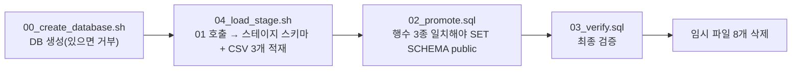

# 공공데이터 1회성 적재 (2026-07-27)

2026-07-27자 병원·의약품 허가·약국 스프레드시트를 **별도 PostgreSQL 데이터베이스
`public_health_temp`** 의 `public` 스키마로 적재하는 런북입니다. 한 번 수행하고 끝나는
작업이며, 정기 배치가 아닙니다.

BOMI 애플리케이션 DB는 계속 `bomi` 입니다. 이 스크립트들은 Backend의 `POSTGRES_DB`
설정을 바꾸지 않습니다.

> **주의 — 같은 이름의 테이블이 두 DB에 있을 수 있습니다.**
> `backend/tools/db_viewer/reset_actions.py`는 `hospital`·`drug_permit`·`pharmacy`를
> `bomi` DB의 삭제 금지 마스터 테이블로 등록해 두었습니다. 반면 이 런북은 세 테이블을
> `public_health_temp`에 만듭니다. 운영 `bomi` DB에 같은 테이블이 실제로 있는지는
> 이번 감사에서 확인하지 못했습니다(**미확인**). 적재 전에 어느 쪽이 권위인지 먼저
> 확정합니다.

## 안전 경계

- 원본 XLSX 파일은 읽기 전용으로 다루며 EC2에 올리거나 커밋하지 않습니다.
- EC2에는 생성된 UTF-8 CSV 3개와 적재 스크립트만 전달합니다.
- 데이터베이스를 만들기 전에 PostgreSQL을 백업합니다.
- `00_create_database.sh`는 이미 있는 데이터베이스를 덮어쓰기를 거부합니다.
- 데이터는 대상 데이터베이스 안의 `public_data_raw_load_20260727` 스키마로 먼저 들어갑니다.
- `02_promote.sql`은 세 테이블의 행 수가 모두 일치하지 않으면 승격을 거부합니다.
- 이미 있는 `public.hospital`·`public.drug_permit`·`public.pharmacy` 테이블은 절대
  덮어쓰지 않습니다.
- EC2의 적재 파일은 최종 검증에 성공한 뒤에만 삭제합니다.

## 최종 데이터베이스 구조

```text
database: public_health_temp
schema: public
tables:
  - hospital
  - drug_permit
  - pharmacy
```

## 원본 데이터 형태

| 데이터셋 | 원본 컬럼 수 | 데이터 행 수 |
| --- | ---: | ---: |
| 병원 | 30 | 79,777 |
| 의약품 허가 | 21 | 42,952 |
| 약국 | 15 | 25,759 |

모든 원본 컬럼은 PostgreSQL `text` 로 받습니다. 코드·식별자·우편번호와 `YYYYMMDD` 형태의
원본 값이 raw 적재 과정에서 변형되지 않도록 하기 위함입니다.

행 수는 `02_promote.sql`의 승격 조건이기도 합니다. 원본 스프레드시트가 바뀌면 이 표와
그 SQL을 함께 고쳐야 합니다.

## EC2 임시 경로

```text
/home/ubuntu/bomi/import/public-health-20260727/
```

## 실행 순서

CSV와 스크립트 파일을 임시 경로에 올린 뒤 EC2에서 아래 순서로 실행합니다.

**파일 번호와 실행 순서가 다릅니다.** `01_create_stage.sql`은 직접 실행하지 않고
`04_load_stage.sh`가 호출합니다. 실행 순서는 `00` → `04`(내부에서 `01`) → `02` → `03`
입니다.



```bash
bash /home/ubuntu/bomi/import/public-health-20260727/00_create_database.sh

bash /home/ubuntu/bomi/import/public-health-20260727/04_load_stage.sh

postgres_user="$(docker exec bomi-postgres printenv POSTGRES_USER)"

docker exec -i bomi-postgres \
  psql -v ON_ERROR_STOP=1 \
  -U "$postgres_user" \
  -d public_health_temp \
  < /home/ubuntu/bomi/import/public-health-20260727/02_promote.sql

docker exec -i bomi-postgres \
  psql -v ON_ERROR_STOP=1 \
  -U "$postgres_user" \
  -d public_health_temp \
  < /home/ubuntu/bomi/import/public-health-20260727/03_verify.sql
```

격리된 검증 실행에서는 데이터베이스 이름을 바꿀 수 있습니다.

```bash
PUBLIC_HEALTH_DB_NAME=public_health_script_test \
  bash /home/ubuntu/bomi/import/public-health-20260727/00_create_database.sh
```

검증에 성공한 뒤에는 알려진 임시 파일 8개만 지우고, 이어서 빈 적재 디렉터리를 지웁니다.

## 적재 후

`public_health_temp` 는 애플리케이션이 접속하는 DB가 아닙니다. 적재 결과를 어디에
쓰는지는 아직 이 문서에 기록되어 있지 않습니다 — 소비처가 정해지면 여기에 적습니다.
