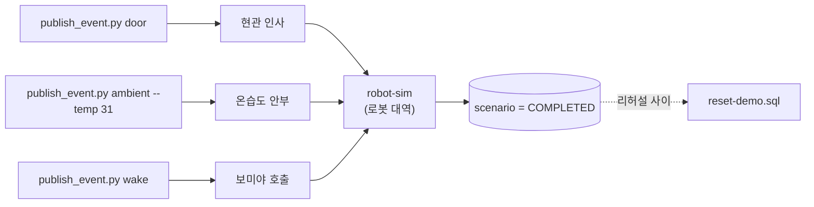

# 개발·시연 보조 스크립트

하드웨어 없이 시나리오를 돌리고, 리허설 사이에 DB 상태를 되돌리기 위한 도구입니다.
**운영 브로커·운영 DB에는 사용하지 않습니다.**

검증의 증거는 파서 통과가 아니라 **DB 종결 상태**입니다 — 시나리오가 `COMPLETED`,
robot mode가 `IDLE`이 되어야 그 시나리오가 돌았다고 말할 수 있습니다(루트 `CLAUDE.md` §4).

## MQTT 이벤트 발사기 — `publish_event.py`

센서·로봇 없이 계약(`docs/mqtt/`) 형식 그대로 이벤트를 발행합니다. IoT 발행 코드의
"실행 가능한 정답지"이자 시연 안전판입니다. 의존성은 `paho-mqtt` 하나입니다.

| 서브커맨드 | 발행 | 쓰는 곳 |
| --- | --- | --- |
| `door` | `DOOR_OPENED` | 현관 인사 시나리오 |
| `ambient --temp 31` | `AMBIENT_ENVIRONMENT_OBSERVED` | 온습도 안부 시나리오 |
| `wake` | `WAKE_WORD_DETECTED` | 보미야 호출 시나리오 |
| `walk-start` / `walk-stop` | `WALK_REQUESTED` | 산책(보류) |
| `follow-result` | `FOLLOW_RESULT` | 산책 결과 회신 |
| `conv-end` | `CONVERSATION_ENDED` | 대화 종료 → 복귀 유도 |
| `result` | `NAVIGATION_RESULT` 등 (**legacy 형식**) | 옛 계약 확인용 |
| `robot-sim` | 명령 구독 → v1 형식 결과 자동 회신 | 로봇 대역 |

기본값: `--host localhost --port 1883`, robotId `bomi-AA001`,
ambient 센서 `ambient-sensor-01`, door 센서 `door_sensor`. `--dry-run`은 발행 없이
메시지만 출력합니다.

> ⚠️ **`result`는 legacy 형식**(`payload:{scenarioId,status}`)을 발행합니다. 파서는
> 통과하지만 보미야 호출 오케스트레이터는 거부합니다. v1 결과가 필요하면 `robot-sim`을
> 씁니다.
>
> ⚠️ **하나의 `robotId`에 명령 소비자는 하나뿐입니다.** 실물 bridge와 `robot-sim`을
> 동시에 실행하지 않습니다. 이동 시나리오를 실물 브로커에서 시작하지 않습니다.

무엇을 쏘면 무엇이 도는지는 다음과 같습니다.

## 리허설 초기화 — `reset-demo.sql` (정본)

활성 시나리오를 `CANCELLED`로, robot mode를 `IDLE`로 되돌리고 복약 슬롯 영수증을
무효화합니다. **`SAFE_STOP` 잠금과 `ACTIVE_SCENARIO_EXISTS` 차단을 푸는 유일한 SQL
경로이며, 리허설 사이마다 실행합니다.**

이 파일은 `backend/tools/db_viewer/reset_actions.py`의 `STATE_RESET_STEPS`와 **문장 단위로
동일해야 합니다.** `backend/tools/db_viewer/tests/test_reset_actions.py`가 주석·공백을
제거한 뒤 문자열로 비교하므로, 여기를 고치면 그쪽도 같이 고쳐야 테스트가 통과합니다.
(DB 뷰어의 "상태 리셋" 버튼이 실행하는 것이 그 복사본입니다.)

## 데모 데이터 SQL

| 파일 | 하는 일 | 주의 |
| --- | --- | --- |
| `seed-kim-sunja.sql` | 김순자 가구 데모 데이터 13개 테이블 | 대상 테이블이 **하나라도 비어 있지 않으면 예외로 전체 중단**합니다 |
| `seed-reminiscence.sql` | 회상 씨앗 memory 10행 + known_person 3행 | `seed-kim-sunja.sql`과 둘 다 실행하면 "아들"이 둘이 됩니다 |
| `backfill-kim-sunja-profile.sql` | 이미 시드된 DB의 프로필 NULL 칸 채우기(멱등) | |
| `dedupe-schedules.sql` | 중복 일정을 `SUPERSEDED`로 접기 | |
| `forget-knee-topic.sql` | "무릎" 화제 제거 | **되돌릴 수 없는 DELETE 2건**을 포함합니다 |

작업 트리에 `scripts/dev/__pycache__/`가 남아 있으면 지웁니다(`rm -rf scripts/dev/__pycache__`).
Git에는 추적되지 않지만, 소스가 없는 `.pyc`가 남아 사람을 헷갈리게 합니다.
